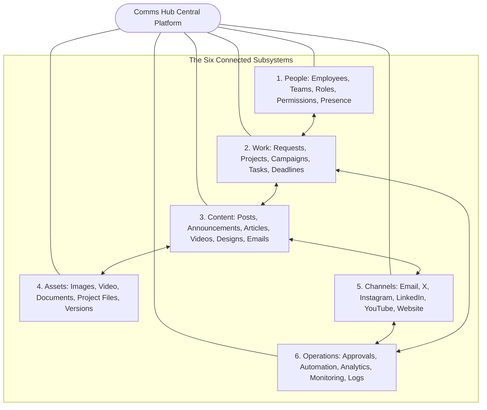
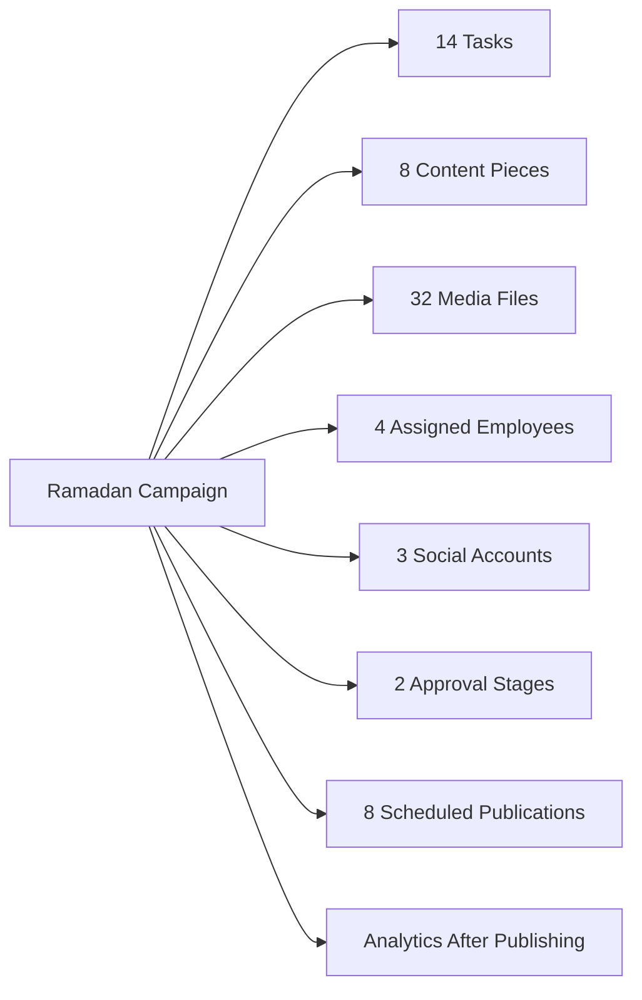
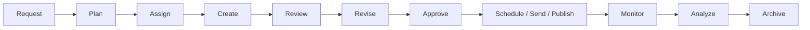
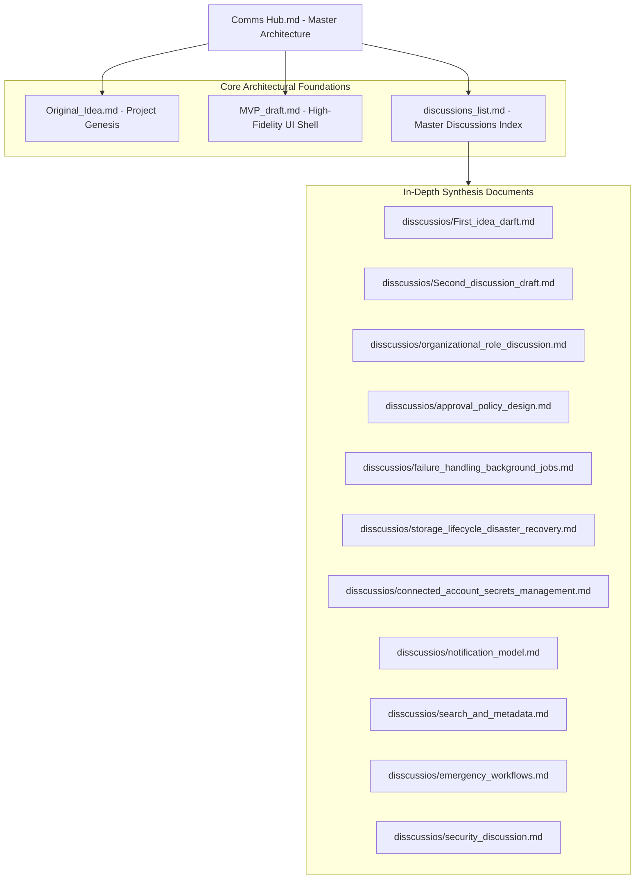

[[Original_Idea|Original Concept Genesis]] | [[MVP_draft|MVP UI Shell Draft]] | [[discussions_list|Master Discussions Index]]

---

## Structure Tree & Document Map

- [[#Communication Department Hub — Master Architecture|Overview & Core Platform Definition]]
- [[#The Six Foundational Subsystems|The Six Foundational Subsystems]]
  - [[#Hexagonal System Architecture Diagram|Hexagonal System Architecture Diagram]]
- [[#Cross-Referential Entity Model|Cross-Referential Entity Model]]
  - [[#Entity Relationship Topology Diagram|Entity Relationship Topology Diagram]]
- [[#Operational Lifecycle Pipeline|Operational Lifecycle Pipeline]]
  - [[#Lifecycle Workflow State Diagram|Lifecycle Workflow State Diagram]]
- [[#Application Pages & Functional Views|Application Pages & Functional Views]]
  - [[#Page Navigation & Functional Matrix|Page Navigation & Functional Matrix]]
- [[#Vault Architecture & Companion Documents|Vault Architecture & Companion Documents]]
  - [[#Master Vault Document Map|Master Vault Document Map]]

---

# Communication Department Hub — Master Architecture

> [!note] Platform Mission & Executive Summary
> A centralized operational platform for a communication department to manage people, requests, tasks, content, media, approvals, communication channels, publishing, analytics, and automation from one system.

A centralized operational platform for a communication department to manage people, requests, tasks, content, media, approvals, communication channels, publishing, analytics, and automation from one system.

## The Six Foundational Subsystems

There are really six systems inside it:

- **People** — Employees, teams, roles, permissions, presence. (See [[disscussios/organizational_role_discussion|Organizational Role Discussion]])
- **Work** — Requests, projects, campaigns, tasks, deadlines. (See [[MVP_draft#15. Work Page|Work Management System]])
- **Content** — Posts, announcements, articles, videos, designs, emails, etc. (See [[MVP_draft#18. Create Page|Content Creation System]])
- **Assets** — Images, video, documents, project files and their versions. (See [[disscussios/storage_lifecycle_disaster_recovery|Storage Lifecycle & Media Library]])
- **Channels** — Email, X, Instagram, LinkedIn, YouTube, website, etc. (See [[disscussios/connected_account_secrets_management|Connected Account Secrets Management]])
- **Operations** — Approvals, automation, analytics, monitoring, audit logs. (See [[disscussios/approval_policy_design|Approval Policy Design]] and [[disscussios/failure_handling_background_jobs|Failure Handling & Background Jobs]])

### Hexagonal System Architecture Diagram

**People**  
Employees, teams, roles, permissions, presence.

**Work**  
Requests, projects, campaigns, tasks, deadlines.

**Content**  
Posts, announcements, articles, videos, designs, emails, etc.

**Assets**  
Images, video, documents, project files and their versions.

**Channels**  
Email, X, Instagram, LinkedIn, YouTube, website, etc.

**Operations**  
Approvals, automation, analytics, monitoring, audit logs.

## Cross-Referential Entity Model

> [!tip] Cross-Referential Value Proposition
> And the important part is that they all reference one another.
> That is what makes the system useful instead of just becoming another collection of disconnected tools.

And the important part is that they all reference one another.

For example:

> Ramadan Campaign  
> ↳ 14 tasks  
> ↳ 8 content pieces  
> ↳ 32 media files  
> ↳ assigned to 4 employees  
> ↳ 3 social accounts  
> ↳ 2 approval stages  
> ↳ 8 scheduled publications  
> ↳ analytics after publishing

That is what makes the system useful instead of just becoming another collection of disconnected tools.

### Entity Relationship Topology Diagram

## Operational Lifecycle Pipeline

A healthy workflow might look like:
**Request → Plan → Assign → Create → Review → Revise → Approve → Schedule/Send/Publish → Monitor → Analyze → Archive**

### Lifecycle Workflow State Diagram

Every page should simply provide a different view or set of tools over that lifecycle.

## Application Pages & Functional Views

> [!note] Page Specification Mapping
> Detailed UI layouts, wireframes, component hierarchies, and mock states for each screen are specified in [[MVP_draft|MVP UI Shell Draft]].

Pages:
- **Home** — [[MVP_draft#13. Home Page|Home Page Specification]]
- **Work** — [[MVP_draft#15. Work Page|Work Page Specification]]
- **Create** — [[MVP_draft#18. Create Page|Create Page Specification]]
- **Approvals / Publishing** — [[MVP_draft#22. Approvals / Publishing Page|Approvals and Publishing]]
- **Calendar** — [[MVP_draft#27. Calendar|Calendar Specification]]
- **Mail** — [[MVP_draft#31. Mail Page|Mail Page Specification]]
- **Media Library** — [[MVP_draft#28. Media Library|Media Library Specification]]
- **Ideas** — [[MVP_draft#32. Ideas Page|Ideas Page Specification]]
- **Analytics** — [[MVP_draft#33. Analytics Page|Analytics Page Specification]]
- **Monitoring** — [[MVP_draft#34. Monitoring Page|Monitoring Page Specification]]
- **Admin** — [[MVP_draft#35. Admin Page|Admin Page Specification]]
- **Settings** — [[MVP_draft#38. Settings Page|Settings Page Specification]]
- **Account** — [[MVP_draft#39. Account Page|Account Page Specification]]

Pages:
- **Home**
- **Work**
- **Create**
- **Approvals / Publishing**
- **Calendar**
- **Mail**
- **Media Library**
- **Ideas**
- **Analytics**
- **Monitoring**
- **Admin**
- **Settings**
- **Account**

---

## Vault Architecture & Companion Documents

### Master Vault Document Map

### External Technical References
- Modern Web Framework: [Next.js Documentation](https://nextjs.org/)
- Backend Infrastructure & RLS: [Supabase Architecture](https://supabase.com/)
- Design System Primitives: [Radix UI](https://www.radix-ui.com/)
- Responsive Styling: [Tailwind CSS](https://tailwindcss.com/)
- Diagrams & Visual Modeling: [Mermaid.js Documentation](https://mermaid.js.org/)

^comms-hub-root-index

