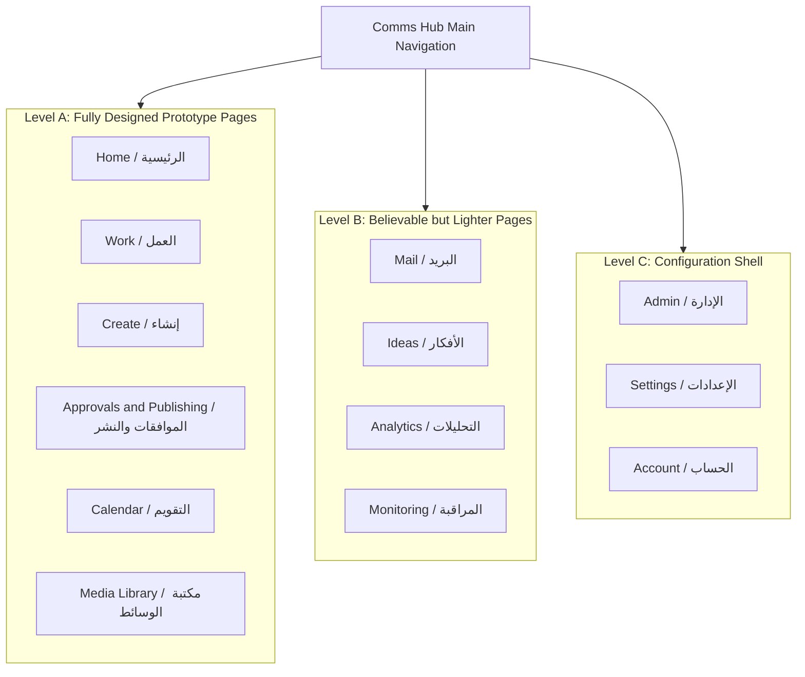
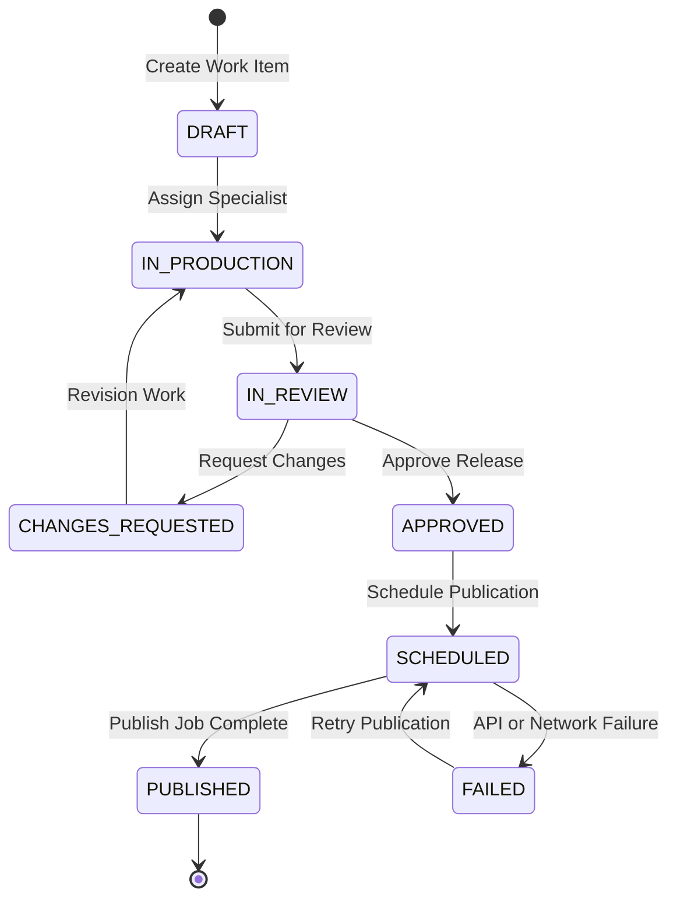
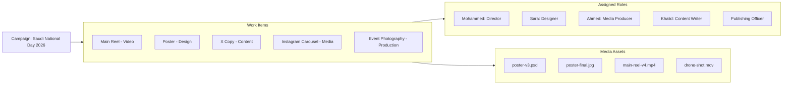
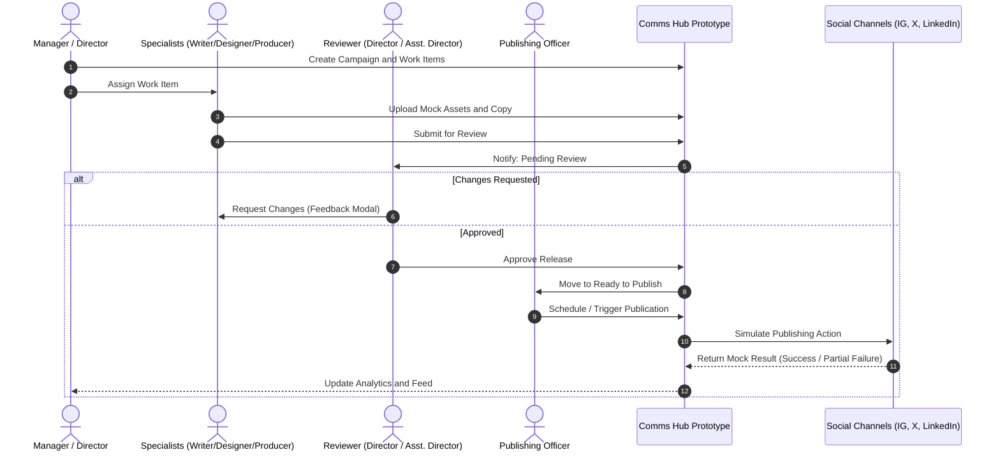
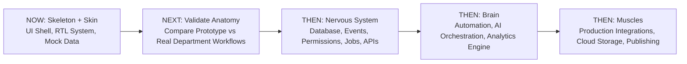

[[Comms Hub|Comms Hub Overview]] | [[Original_Idea|Original Concept]] | [[discussions_list|Discussions Index]]

---

# Comms Hub — MVP UI Shell Draft

> [!note] Status: Prototype MVP draft — UI/UX only
> **Status: Prototype MVP draft — UI/UX only**
>
> This document defines the first MVP as the **skeleton and skin** of the Communication Hub.
>
> It intentionally excludes the real backend logic, database, integrations, automation, authentication enforcement, and external services.
>
> The goal is to validate the product structure, pages, navigation, workflows, role experiences, terminology, and responsive UI before building the system’s “nervous system” and “brain.”

---


## Structure Tree & Document Map

- [[#Comms Hub — MVP UI Shell Draft|Overview & Prototype Scope]]
- **Part I: Strategic Foundations & Boundaries**
  - [[#1. Goal of This MVP|1. Goal of This MVP]]
  - [[#2. MVP Definition|2. MVP Definition]]
  - [[#3. Explicitly Out of Scope|3. Explicitly Out of Scope]]
  - [[#4. Mock Data|4. Mock Data]]
  - [[#5. Prototype “View As” Role Switcher|5. Prototype “View As” Role Switcher]]
- **Part II: User Experience Shell & Roles**
  - [[#6. Role-Specific Home Experience|6. Role-Specific Home Experience]]
  - [[#7. Main Information Architecture|7. Main Information Architecture]]
  - [[#8. Page Priority|8. Page Priority]]
  - [[#9. Main Application Shell|9. Main Application Shell]]
  - [[#10. Visual Direction|10. Visual Direction]]
  - [[#11. Sidebar|11. Sidebar]]
  - [[#12. Global Top Bar|12. Global Top Bar]]
- **Part III: Core Operational Screens**
  - [[#13. Home Page|13. Home Page]]
  - [[#14. Specialist Home|14. Specialist Home]]
  - [[#15. Work Page|15. Work Page]]
  - [[#16. Work List|16. Work List]]
  - [[#17. Work Item Detail|17. Work Item Detail]]
  - [[#18. Create Page|18. Create Page]]
  - [[#19. Social Post Form|19. Social Post Form]]
  - [[#20. Platform Variants|20. Platform Variants]]
  - [[#21. Media Attachment UI|21. Media Attachment UI]]
- **Part IV: Approval, Publishing & Operations**
  - [[#22. Approvals / Publishing Page|22. Approvals / Publishing Page]]
  - [[#23. Approvals Tab|23. Approvals Tab]]
  - [[#24. Review Screen|24. Review Screen]]
  - [[#25. Publishing Tab|25. Publishing Tab]]
  - [[#26. Mock Publishing Interaction|26. Mock Publishing Interaction]]
  - [[#27. Calendar|27. Calendar]]
  - [[#28. Media Library|28. Media Library]]
  - [[#29. Media Card|29. Media Card]]
  - [[#30. Asset Detail|30. Asset Detail]]
- **Part V: Secondary & Administrative Modules**
  - [[#31. Mail Page|31. Mail Page]]
  - [[#32. Ideas Page|32. Ideas Page]]
  - [[#33. Analytics Page|33. Analytics Page]]
  - [[#34. Monitoring Page|34. Monitoring Page]]
  - [[#35. Admin Page|35. Admin Page]]
  - [[#36. Users Page|36. Users Page]]
  - [[#37. Integrations Page|37. Integrations Page]]
  - [[#38. Settings Page|38. Settings Page]]
  - [[#39. Account Page|39. Account Page]]
- **Part VI: Cross-Cutting Interactions & Mobile**
  - [[#40. Notification Center|40. Notification Center]]
  - [[#41. Global Search|41. Global Search]]
  - [[#42. UI States to Prototype|42. UI States to Prototype]]
  - [[#43. Responsive Targets|43. Responsive Targets]]
  - [[#44. Mobile Priorities|44. Mobile Priorities]]
  - [[#45. Mobile Work Item|45. Mobile Work Item]]
  - [[#46. Prototype Interactions|46. Prototype Interactions]]
- **Part VII: Verification Scenario & Standards**
  - [[#47. One Coherent Demo Scenario|47. One Coherent Demo Scenario]]
  - [[#48. Use Real-Looking Arabic Content|48. Use Real-Looking Arabic Content]]
  - [[#49. Keep Clean Internal Status Vocabulary|49. Keep Clean Internal Status Vocabulary]]
  - [[#50. Features Not Worth Deep Prototyping Yet|50. Features Not Worth Deep Prototyping Yet]]
  - [[#51. Provisional End-to-End Demo Workflow|51. Provisional End-to-End Demo Workflow]]
  - [[#52. What Success Looks Like|52. What Success Looks Like]]
  - [[#53. Recommended Prototype MVP 0.1 Boundary|53. Recommended Prototype MVP 0.1 Boundary]]
  - [[#54. Development Sequence|54. Development Sequence]]
  - [[#55. Relationship With Astra Workflow Discovery|55. Relationship With Astra Workflow Discovery]]
  - [[#56. Core MVP Principle|56. Core MVP Principle]]

---

# 1. Goal of This MVP

The purpose is **not** to prove Supabase, Google Drive, social APIs, automation, or publishing.

The purpose is to answer:

> **Does this feel like the correct working environment for the Communication Department?**

The prototype should be realistic enough that the Director, Assistant Director, Writer, Designer, Media Producer, Publishing Officer, Members, and Admin can navigate it and give meaningful feedback.

The prototype should help us discover:

- Which pages matter
- Which pages are unnecessary
- Which workflows feel natural
- Which actions take too many clicks
- Which terminology is wrong
- Which roles need different views
- Which information belongs together
- Which screens need to work better on mobile
- Whether the approval and publishing experiences make sense
- Whether the Work page matches real department operations

---

# 2. MVP Definition

This MVP is a **high-fidelity operational prototype**.

It contains:

```text
Pages
Navigation
Layouts
Cards
Tables
Forms
Modals
Drawers
Tabs
Filters
Search UI
Empty states
Loading states
Error states
Status chips
Role-specific UI
Mobile layouts
Mock notifications
Mock files
Mock tasks
Mock approvals
Mock campaigns
Mock publishing
Mock analytics
```

Buttons should work visually.

Example:

```text
[Create Task]
```

opens a realistic modal.

The user can fill it out and click:

```text
[Create]
```

and the mock task may appear in the UI.

But the prototype does not need permanent data storage.

A refresh may reset the mock state.

---

# 3. Explicitly Out of Scope

> [!important] Scope Enforcement & Deferred Systems
> See architectural context in [[disscussios/security_discussion|Security Architecture]] and [[disscussios/First_idea_darft|First Idea Draft]].

The prototype must **not** accidentally become a backend implementation project.

The following are explicitly excluded:

```text
NO Supabase

NO Vercel production integration

NO Google Drive API

NO real authentication

NO real authorization enforcement

NO production database

NO social-media APIs

NO real publishing

NO real email sending/receiving

NO background workers

NO real automation engine

NO real AI API

NO OAuth

NO secret storage

NO NAS integration

NO production analytics

NO real push/email notifications

NO backup system

NO disaster-recovery implementation
```

All of these may be simulated visually where useful.

---

# 4. Mock Data

The prototype should use static/mock data for concepts such as:

```text
Users
Campaigns
Tasks
Assets
Approvals
Publications
Notifications
Integrations
Analytics
```

Example users:

```text
Mohammed
Role:
مدير الاتصال المؤسسي

Ahmed
Role:
المنتج الإعلامي

Sara
Role:
المصمم

Khalid
Role:
كاتب المحتوى
```

Example campaign:

```text
Saudi National Day 2026

Status:
Active

Progress:
72%

Team:
5 members

Content:
8 pieces

Pending approvals:
2
```

---

# 5. Prototype “View As” Role Switcher

> [!tip] Role Architecture
> Complete role models, permissions, and operational duties are defined in [[disscussios/organizational_role_discussion|Organizational Role Discussion]].

A development-only role switcher should allow the prototype to show different role experiences.

Example:

```text
VIEW AS

[مدير الاتصال المؤسسي ▼]
```

Options:

```text
مدير الاتصال المؤسسي
مساعد مدير الاتصال المؤسسي
كاتب المحتوى
المصمم
المنتج الإعلامي
مسؤول النشر وإدارة الحسابات
عضو
Admin
```

This is not real authorization.

It is a prototype tool for answering:

> What should this role see and prioritize?

---

# 6. Role-Specific Home Experience

## Director

Home should emphasize:

```text
Pending approvals
Department workload
Today's publishing
Needs Attention
Campaign status
```

## Assistant Director

Home should emphasize:

```text
Operational queue
Approvals
Assignments
Workload
Upcoming deadlines
```

## Content Writer

Home should emphasize:

```text
Copy tasks
Requested revisions
Upcoming deadlines
Awaiting review
```

## Designer

Home should emphasize:

```text
Design tasks
Requested revisions
Assets awaiting review
Upcoming deadlines
```

## Media Producer

Home should emphasize:

```text
Production tasks
Uploads
Media processing
Deadlines
Review status
```

## Publishing Officer

Home should emphasize:

```text
Ready to publish
Scheduled today
Publishing failures
Connected account health
```

## Member

Home should emphasize:

```text
Assigned work
Deadlines
Comments
Calendar
```

## Admin

Home should emphasize:

```text
System health
Users
Integration health
Storage
Security events
```

---

# 7. Main Information Architecture

The prototype should keep the current navigation structure:

```text
Home

Work

Create

Approvals / Publishing

Calendar

Mail

Media Library

Ideas

Analytics

Monitoring

────────────────

Admin

Settings

Account
```

Not every page needs equal depth in this first prototype.

---

# 8. Page Priority

## Level A — Fully Designed Prototype Pages

These are the core of the MVP:

```text
Home
Work
Create
Approvals / Publishing
Calendar
Media Library
```

These should feel genuinely usable.

## Level B — Believable but Lighter

```text
Mail
Ideas
Analytics
Monitoring
```

These should look complete enough to test layout and workflow assumptions.

## Level C — Configuration Shell

```text
Admin
Settings
Account
```

These only need enough UI to establish structure and future configuration direction.

### Information Architecture & Priority Map



---


# 9. Main Application Shell

Desktop structure:

```text
┌─────────────────────────────────────────────────────────┐
│ Top Bar                                                 │
│ Search        Notifications       Help        User      │
├─────────────┬───────────────────────────────────────────┤
│             │                                           │
│ Sidebar     │                                           │
│             │              PAGE CONTENT                 │
│ Home        │                                           │
│ Work        │                                           │
│ Create      │                                           │
│ Approvals   │                                           │
│ Calendar    │                                           │
│ Mail        │                                           │
│ Media       │                                           │
│ Ideas       │                                           │
│ Analytics   │                                           │
│ Monitoring  │                                           │
│             │                                           │
│ Admin       │                                           │
│ Settings    │                                           │
│ Account     │                                           │
└─────────────┴───────────────────────────────────────────┘
```

The prototype should be **RTL-first**.

Arabic should be the primary UI direction.

The component system should still be designed so English/LTR can be supported later.

### Shell Architecture & Responsive Diagram

```mermaid
flowchart TB
    subgraph Viewport [Desktop Application Shell - RTL Direction]
        TopBar[Top Bar: Global Search | Quick Create | Notifications | Profile]
        
        subgraph MainBody [Main Workspace Layout]
            Sidebar[Sidebar Navigation: Home, Work, Create, Approvals, Calendar, Mail, Media, Ideas, Analytics, Monitoring, Admin, Settings, Account]
            ContentArea[Page Content Viewport]
            DrawersModals[Contextual Drawers and Modals: Work Item Details, Asset View, Creation Forms]
        end
        
        TopBar --- MainBody
        Sidebar --- ContentArea
        ContentArea -.-> DrawersModals
    end
```

> [!note] Technical Framework References
> - [Next.js App Router Documentation](https://nextjs.org/docs)
> - [Tailwind CSS Direction & RTL Guide](https://tailwindcss.com/docs/hover-focus-and-other-states#rtl-support)
> - [Radix UI Accessible Primitives](https://www.radix-ui.com/primitives)
> - [Lucide Icons Library](https://lucide.dev/icons)
> - [Mermaid.js Documentation](https://mermaid.js.org/)

---


# 10. Visual Direction

The target feel should be:

> **Professional operational dashboard for a Communication Department**

Characteristics:

```text
Light background
White cards
Soft borders
Moderate corner radius
Green primary accent
Clear status colors
Strong Arabic typography
Comfortable whitespace
Dense enough for real work
Modern but restrained
```

The UI should feel:

```text
Official
Calm
Efficient
Modern
Professional
Saudi organizational software
```

Avoid:

```text
Gaming aesthetics
Overly futuristic styling
AI-first visual identity
Excessive animation
Social-media-app styling
Extreme minimalism
```

---

# 11. Sidebar

Potential Arabic navigation:

```text
الرئيسية

العمل
إنشاء
الموافقات والنشر
التقويم
البريد
مكتبة الوسائط
الأفكار
التحليلات
المراقبة

────────────────

الإدارة
الإعدادات
الحساب
```

Selected state:

```text
green accent
light tinted background
clear icon
```

Desktop may support a collapsed icon-only mode.

Mobile can use:

```text
Bottom Navigation
+
More Drawer
```

---

# 12. Global Top Bar

Suggested items:

```text
Global Search

Quick Create [+]

Notifications

Needs Attention indicator

Profile
```

Example:

```text
[ ابحث في مركز الاتصال... ]

                         [+ إنشاء]
                         [🔔 3]
                         [محمد ▼]
```

Prototype search can operate entirely on mock data.

---

# 13. Home Page

The Home page should answer:

> **What matters to me right now?**

It should not try to show every metric.

## Director Example

Header:

```text
صباح الخير، محمد
الخميس، 18 سبتمبر
```

KPI cards:

```text
بانتظار الموافقة      4
متأخر                  3
مجدول اليوم            6
يحتاج انتباه           2
```

### Needs Attention

Example items:

```text
LinkedIn needs reconnection
National Day Reel awaiting approval
Video task overdue
```

### Today's Work

```text
11:00  Event photography
14:30  Review campaign
18:00  Instagram publication
```

### Approval Queue

```text
National Day Reel
Sara
18 min ago

Event Poster
Ahmed
1h ago
```

### Active Campaigns

```text
National Day
72%

Volunteer Campaign
46%

Annual Report
89%
```

---

# 14. Specialist Home

A specialist homepage may show:

```text
MY WORK

Due today               3
Changes requested       1
Awaiting review         2
Completed this week     6
```

Then sections such as:

```text
My Tasks
Recent Comments
Upcoming Deadlines
```

Avoid management-heavy dashboards for specialist roles.

---

# 15. Work Page

This should be one of the strongest screens in the prototype.

Header:

```text
العمل

[+ مهمة جديدة]
[+ حملة]
```

Possible tabs:

```text
الكل
مهامي
الحملات
طلبات
متأخر
مكتمل
```

Views:

```text
List
Board
```

Timeline can be postponed.

---

# 16. Work List

Columns:

```text
Title
Type
Campaign
Owner / Assignee
Status
Priority
Due Date
```

Example:

```text
National Day Main Reel

Video

National Day Campaign

Ahmed

In Production

High

22 Sep
```

Clicking a row should open a Work Item detail drawer/page.

---

# 17. Work Item Detail

Example header:

```text
National Day Main Reel

VIDEO

IN PRODUCTION
```

Information:

```text
Campaign
National Day 2026

Due
22 Sep

Priority
High

Owner
Ahmed — Media Producer
```

Participants:

```text
Ahmed       Media Producer
Sara        Designer
Khalid      Content Writer
```

Tabs:

```text
Overview
Files
Comments
Activity
Approval
```

Mock production checklist:

```text
Script              ✓
Filming             ✓
Editing             In progress
Graphics            Waiting
Final review        Waiting
```

Buttons:

```text
[Add File]
[Comment]
[Submit for Review]
```

### Work Item Lifecycle State Diagram



---


# 18. Create Page

The Create page should begin by asking:

> **What are we creating?**

Possible creation types:

```text
Social Post
Video
Design
Announcement
Email
Press Release
Event Coverage
```

Selecting a type changes the form.

---

# 19. Social Post Form

Possible fields:

```text
Title

Campaign

Main Content

Platforms
☑ Instagram
☑ X
☑ LinkedIn

Media

Schedule

[Save Draft]
[Submit for Review]
```

---

# 20. Platform Variants

Tabs:

```text
MASTER
Instagram
X
LinkedIn
```

Example:

```text
MASTER
Main Arabic copy
```

Then:

```text
X
Shortened platform variant
```

A future AI button may already be placed:

```text
[اقتراح بالذكاء الاصطناعي]
```

In this MVP it may:

```text
show a mock result
```

or:

```text
show “Coming later”
```

The goal is to test placement and workflow.

---

# 21. Media Attachment UI

Prototype interaction:

```text
Drag files here

or

[Browse Files]
```

Mock results:

```text
national-day-image.jpg
2.8 MB

national-day-video.mp4
1.4 GB
```

Actions:

```text
Preview
Remove
Replace
```

No real cloud upload is required.

---

# 22. Approvals / Publishing Page

> [!note] Policy Reference
> See comprehensive approval criteria and multi-stage sign-off rules in [[disscussios/approval_policy_design|Approval Policy Design]].

Use two major tabs initially:

```text
الموافقات
النشر
```

Approval and publishing remain different concepts but are closely related enough to share a page in the prototype.

---

# 23. Approvals Tab

Possible sections:

```text
Needs My Review
Submitted by Me
Completed
```

Example card:

```text
National Day Reel

Submitted by:
Ahmed

Campaign:
National Day

Channels:
Instagram
X
LinkedIn

Submitted:
18 min ago

[Review]
```

---

# 24. Review Screen

Header:

```text
YOU ARE REVIEWING

National Day Reel
Release 4
```

Display:

```text
Copy
Media
Channel variants
Schedule
Destinations
Previous revisions
Comments
```

Actions:

```text
[Request Changes]
[Reject]
[Approve]
```

Mock Request Changes modal:

```text
Reason:
___________________

[Send]
```

---

# 25. Publishing Tab

Sections:

```text
Ready to Publish
Scheduled
Published
Failed
```

Example:

```text
National Day Reel

Approved ✓

Instagram
X
LinkedIn

Scheduled:
23 Sep — 18:00

[View]
```

Another:

```text
Volunteer Story

Approved ✓

No schedule

[Publish]
[Schedule]
```

---

# 26. Mock Publishing Interaction

Click:

```text
[Publish]
```

Show confirmation:

```text
CONFIRM PUBLICATION

Instagram @organization
X @organization

[Cancel]
[Confirm]
```

Then simulate:

```text
Publishing...
```

followed by:

```text
Instagram ✓
X ✓
LinkedIn ✕
```

This lets us test partial-failure UX before APIs exist.

> [!warning] Asynchronous Queue & Failure Handling
> Background failure recovery, retry policies, and worker queues are analyzed in [[disscussios/failure_handling_background_jobs|Failure Handling Background Jobs]].

---


# 27. Calendar

Views:

```text
Month
Week
Day
```

Filters:

```text
Tasks
Publications
Campaigns
Events
Deadlines
```

Example entries:

```text
18:00
Instagram Post

14:00
Video Deadline

10:00
Event Coverage
```

Clicking an entry opens a detail drawer.

A date-level create action may offer:

```text
Create:
Task
Event
Publication
Reminder
```

---

# 28. Media Library

Header:

```text
مكتبة الوسائط

[Upload]

Search...

Filters
```

Tabs:

```text
All
Images
Videos
Documents
Design
Archived
```

Views:

```text
Grid
List
```

---

# 29. Media Card

Example:

```text
[Thumbnail]

National Day Hero Image

IMAGE

National Day Campaign

v5

Approved
```

Clicking opens the asset detail view.

---

# 30. Asset Detail

Example:

```text
National Day Hero Image

[large preview]

Current Version:
v5

Approved Version:
v5
```

Metadata:

```text
Campaign
National Day

Created by
Sara

Type
Image

Status
Approved
```

Sections:

```text
Versions
Used In
Comments
Activity
```

Storage placeholder:

```text
Cloud
Available
```

Later this can be backed by Google Drive, Supabase Storage, or NAS.

> [!note] Storage Architecture
> See storage tiers, quotas, and NAS/Cloud replication details in [[disscussios/storage_lifecycle_disaster_recovery|Storage Lifecycle & Disaster Recovery]].

---


# 31. Mail Page

The MVP does not need real email.

Prototype layout:

```text
Inbox
Sent
Assigned
Waiting
Archived
```

Message list on one side.

Thread/conversation on the other.

Example:

```text
Subject:
Media coverage request

From:
Department X

[Reply]
[Assign]
[Create Work Item]
```

The important workflow interaction is:

```text
[Create Work Item]
```

which opens a mock Work Item creation modal.

---

# 32. Ideas Page

Simple cards:

```text
Idea title
Author
Tags
Related campaign
Status
```

Actions:

```text
[+ New Idea]
[Turn into Campaign]
[Turn into Work Item]
```

Visual transitions only.

---

# 33. Analytics Page

Use mock data only.

Example:

```text
Last 30 Days

Posts Published        28
Total Reach            142K
Engagement             8.3K
Top Platform           Instagram
```

Sections:

```text
Content Performance
Campaign Performance
Platform Performance
```

The goal is to discover what metrics management actually wants.

---

# 34. Monitoring Page

Monitoring should focus on workflow and workload, not surveillance.

Example:

```text
TEAM WORKLOAD

Ahmed
4 active
1 overdue

Sara
3 active
0 overdue

Khalid
5 active
2 awaiting review
```

Workflow summary:

```text
Awaiting Review       5
Changes Requested     3
Scheduled             6
Overdue               4
```

Avoid:

```text
productivity score
mouse movement
screen surveillance
```

---

# 35. Admin Page

Prototype sections:

```text
Users
Roles & Permissions
Integrations
System Health
Storage
Security
Automation
Notification Policy
```

Only UI shells are needed.

---

# 36. Users Page

Example:

```text
Ahmed
Media Producer
Active

Sara
Designer
Active

Mohammed
Director
Active
```

User detail may show:

```text
Role
Status
Campaign access
Additional permissions
```

No real enforcement yet.

---

# 37. Integrations Page

Mock cards:

```text
Instagram
Connected

X
Connected

LinkedIn
Reconnect Required

Google Drive
Not Configured

Mail
Connected

NAS
Not Configured
```

Clicking:

```text
[Connect]
```

opens a mock connection flow.

> [!note] Secret Management & OAuth Architecture
> Token refreshing, scopes, and credential isolation are detailed in [[disscussios/connected_account_secrets_management|Connected Account Secrets Management]].

---


# 38. Settings Page

Possible sections:

```text
Organization
Appearance
Language
Notifications
Publishing Defaults
Approval Defaults
AI & Automation
Storage
```

Visual configuration only.

---

# 39. Account Page

Possible sections:

```text
Profile

Name
Role
Email
Language

Notification preferences

Active sessions
```

Sessions are mock data.

---

# 40. Notification Center

> [!note] Notification Framework
> Category definitions, mute rules, and channel routing are outlined in [[disscussios/notification_model|Notification Model]].

Use the notification model already discussed.

Tabs:

```text
All
Actions
Attention
Mentions
```

Examples:

```text
ACTION
National Day Reel needs your approval

ATTENTION
LinkedIn requires reconnection

MENTION
Sara mentioned you

INFO
Publication completed
```

Clicking should deep-link to the relevant mock screen.

---

# 41. Global Search

Search can operate entirely on the mock dataset.

Example:

```text
national day
```

Results:

```text
Campaign
National Day 2026

Work
National Day Reel

Asset
National Day Hero Image

Publication
National Day Instagram Post
```

This allows search UX to be validated before building a real search index.

> [!note] Metadata Taxonomy & Indexing
> Entity search queries, tagging hierarchies, and filtering schemas are documented in [[disscussios/search_and_metadata|Search and Metadata]].

---


# 42. UI States to Prototype

Important components should include:

```text
Normal
Hover
Selected
Disabled
Loading
Empty
Success
Warning
Error
Needs Attention
```

Examples:

```text
No tasks yet

No approvals waiting

Upload processing...

Publishing failed

Integration disconnected

Search returned no results
```

The MVP should not show only perfect/happy-path states.

---

# 43. Responsive Targets

The design should deliberately support at least:

```text
Desktop
1440 px

Laptop
1280 px

Tablet
768–1024 px

Mobile
~390 px
```

The goal is to establish a reliable responsive system, not optimize for every possible device immediately.

---

# 44. Mobile Priorities

Primary mobile navigation:

```text
Home
My Work
Create
Calendar
Notifications
```

Then:

```text
More
```

opens:

```text
Approvals
Mail
Media
Analytics
Settings
```

Role-specific priorities may alter this.

---

# 45. Mobile Work Item

Avoid squeezing desktop tables into a phone.

Example card:

```text
National Day Reel
VIDEO

In Production

Due:
22 Sep

Owner:
Ahmed

[Open]
```

Mobile should rely heavily on cards, drawers, and focused actions.

---

# 46. Prototype Interactions

The following should work visually:

```text
Navigate between pages
Open/close sidebar
Open drawers
Open modals
Switch tabs
Switch list/grid
Search mock data
Filter mock data
Change View As role
Toggle mock settings
Add mock task
Edit mock task
Submit mock approval
Approve/reject mock release
Schedule mock publication
Show simulated publish result
Show notifications
Preview mock assets
Responsive navigation
```

Client-side state is enough.

No persistence is required.

---

# 47. One Coherent Demo Scenario

The prototype should contain one polished, realistic campaign that connects multiple pages.

Recommended example:

```text
Saudi National Day 2026
```

Campaign:

```text
Saudi National Day 2026
```

Work Items:

```text
Main Reel
Poster
X Copy
Instagram Carousel
Event Photography
```

Participants:

```text
Content Writer
Designer
Media Producer
Publishing Officer
Assistant Manager
Director
```

Assets:

```text
poster-v3.psd
poster-final.jpg
main-reel-v4.mp4
drone-shot.mov
```

Approval:

```text
Main Reel awaiting review
```

Calendar:

```text
23 Sep
18:00 publish
```

Analytics:

```text
Older mock publication data
```

Everything should tell one coherent story.

### Saudi National Day 2026 Demo Topology



---


# 48. Use Real-Looking Arabic Content

Avoid placeholder text such as:

```text
Lorem ipsum
Task 1
Campaign test
User A
```

Use believable Arabic departmental data.

Example:

```text
الحملة:
اليوم الوطني السعودي

المهمة:
إعداد الفيديو الرئيسي

الحالة:
قيد الإنتاج

الموعد:
22 سبتمبر
```

This will produce much better feedback from real users.

---

# 49. Keep Clean Internal Status Vocabulary

User-facing Arabic:

```text
قيد المراجعة
```

Internal mock state:

```text
IN_REVIEW
```

User-facing:

```text
بحاجة إلى تعديل
```

Internal:

```text
CHANGES_REQUESTED
```

This makes future backend implementation cleaner.

---

# 50. Features Not Worth Deep Prototyping Yet

Do not spend much time on:

```text
Complex automation builder
Advanced disaster-recovery UI
Detailed secret-management UI
Incident simulation platform
Semantic AI search
NAS administration
Full analytics suite
Advanced employee monitoring
Custom workflow designer
Complex taxonomy administration
```

These have already been discussed conceptually and can be implemented later.

> [!note] Emergency Protocol Handling
> Kill switches, urgent publishing overrides, and crisis modes are addressed in [[disscussios/emergency_workflows|Emergency Workflows]].

---


# 51. Provisional End-to-End Demo Workflow

Until Astra completes real workflow mapping, use this provisional flow:

```text
Manager creates campaign
       ↓
Creates Work Item
       ↓
Assigns Writer / Designer / Producer
       ↓
Specialists create mock work
       ↓
Submit for Review
       ↓
Assistant / Director reviews
       ↓
Changes requested OR Approved
       ↓
Publishing Officer sees Ready to Publish
       ↓
Schedules publication
       ↓
Calendar displays it
       ↓
Mock publication result
       ↓
Activity / Analytics update visually
```

Once real workflow discovery is complete, this flow should be revised to match actual department practice.

### End-to-End Workflow Sequence Diagram



---


# 52. What Success Looks Like

The prototype succeeds when it can be placed in front of actual department users and they can:

> **Pretend this is the real system and show how they would do their job.**

The prototype should reveal:

```text
Which pages matter?
Which do not?
What terminology feels wrong?
Which roles need different experiences?
Which actions are missing?
What takes too many clicks?
What information belongs together?
Does mobile work?
Does approval feel natural?
Does Work match the department?
Does Create match real content creation?
Does Publishing expose the right information?
```

The main output of the MVP is **validated product knowledge**.

---

# 53. Recommended Prototype MVP 0.1 Boundary

```text
Application shell
RTL design system
Responsive navigation

Home
Work
Create
Approvals / Publishing
Calendar
Media Library

Light versions:
Mail
Ideas
Analytics
Monitoring
Admin
Settings
Account

Mock role switcher
Mock data
One coherent demo campaign
Client-side interactions only
No persistence
No external integrations
```

---

# 54. Development Sequence

The recommended sequence is:

```text
NOW
Skeleton + Skin

NEXT
Validate anatomy against real workflows

THEN
Nervous System
Database / events / permissions / jobs / APIs

THEN
Brain
Automation / AI / analytics

THEN
Muscles
Real integrations / publishing / storage
```

The MVP should remain intentionally UI-first.

### Development Sequence Flowchart



---


# 55. Relationship With Astra Workflow Discovery

Astra should map real department workflows using the confirmed organizational roles.

Then compare:

```text
Prototype assumed workflow
           VS
Real department workflow
```

The prototype should be revised before backend architecture is frozen.

This prevents the product from encoding theoretical workflows that employees do not actually use.

---

# 56. Core MVP Principle

> **Build enough of the product visually that the department can meaningfully criticize it before we spend time building the backend.**

And:

> **The prototype should look like the future Communication Hub, but it should not pretend that its integrations, security, publishing, automation, storage, or analytics are real yet.**

This document defines the MVP shell only. It is not yet the Version 1 technical specification or implementation roadmap. ^core-mvp-boundary
