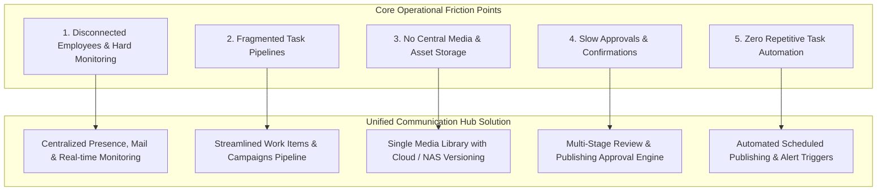
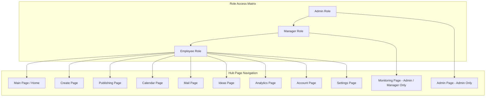
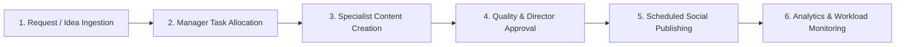

[[Comms Hub|Comms Hub Overview]] | [[MVP_draft|MVP Draft UI Shell]] | [[discussions_list|Discussions Index]]

---

## Structure Tree & Document Map

- [[#Project Genesis & Brainstorming Pitch|Project Genesis & Brainstorming Pitch]]
- [[#Main Idea|Main Idea]]
  - [[#Core Hub Vision|Core Hub Vision]]
- [[#Main issue|Main issue]]
  - [[#Problem-Solution Mapping Diagram|Problem-Solution Mapping Diagram]]
- [[#Scope|Scope]]
  - [[#Initial Operational Boundaries|Initial Operational Boundaries]]
- [[#Pages|Pages]]
  - [[#Navigation Matrix & Page Hierarchy Diagram|Navigation Matrix & Page Hierarchy Diagram]]
- [[#Roles & Access Hierarchy|Roles & Access Hierarchy]]
  - [[#Role Evolution Pathway|Role Evolution Pathway]]
- [[#Must-Have Features|Must-Have Features]]
  - [[#Operational Workflow Diagram|Operational Workflow Diagram]]
  - [[#Technical Architecture References|Technical Architecture References]]
- [[#Discussion Next Steps & Reference Artifacts|Discussion Next Steps & Reference Artifacts]]

---

# Project Genesis & Brainstorming Pitch

> [!note] Project Genesis & Brainstorming Pitch
> ok, I have a new project Idea that I want to try to brain-storm with you here, so we can later build it in codex;
>
> ok here is the idea:

---

# Main Idea:

### Core Hub Vision

One website that can be the working hup for the communication department.

> [!tip] Architectural Evolution
> This concept expanded into the formal 6-system foundation in [[Comms Hub|Comms Hub Architecture]] (People, Work, Content, Assets, Channels, Operations) and the interactive UI prototype in [[MVP_draft|MVP UI Shell Draft]].

\# Main issue:

1\. Dont have one application that groups all the employees together, making situation monitoring, and communication hard.&#x20;
2\. fragmented task pipelines.
3\. not having a storage system that holds files, images, videos. and makes transferring and backup easy.
4\. taking to much time on approvals and task confirmations.
5\. no automations for easy or repetitive tasks.

### Problem-Solution Mapping Diagram

> [!note] Downstream Architectural Solutions
> - Point 1 & Monitoring: See [[disscussios/notification_model|Notification Model]] and [[disscussios/organizational_role_discussion|Organizational Roles]]
> - Point 2 & Pipelines: See [[MVP_draft#15. Work Page|MVP Draft Work Page]]
> - Point 3 & Storage: See [[disscussios/storage_lifecycle_disaster_recovery|Storage Lifecycle & Disaster Recovery]]
> - Point 4 & Approvals: See [[disscussios/approval_policy_design|Approval Policy Design]]
> - Point 5 & Automations: See [[disscussios/failure_handling_background_jobs|Failure Handling Background Jobs]]

\# Scope:

\- one website that houses all Communication department users, with roles, and access layers.
\- streamlining the operation and task pipelines.
\- confirmations of quality before sharing.
\- each page hase its tools&#x20;
\- collecting data, for analytics and monitoring &#x20;

### Initial Operational Boundaries
> [!note] Scope Progression
> For the concrete prototype boundaries, see [[MVP_draft#53. Recommended Prototype MVP 0.1 Boundary|MVP Draft 0.1 Boundary]] and the initial comprehensive synthesis in [[disscussios/First_idea_darft|First Idea Draft]].

\# Pages:
\- Main page
\- Create page
\- publishing page
\- Calendar page
\- mail page
\- Ideas page
\- analytics page
\- monitoring page (admin/manager only).
\- settings page
\- Admin page (admin only)
\- Account page

### Navigation Matrix & Page Hierarchy Diagram

> [!note] Priority Mapping
> In the MVP UI Shell, pages are classified into Level A (Core), Level B (Secondary), and Level C (Configuration). See [[MVP_draft#8. Page Priority|MVP Page Priority]].

## Roles & Access Hierarchy

the roles currently are basic but latter in development it would get more detiled:
\- Manager - Admin - employee&#x20;

### Role Evolution Pathway
> [!tip] Expanded Department Roles
> The initial 3 roles evolved in [[disscussios/organizational_role_discussion|Organizational Role Discussion]] into: Director, Assistant Director, Content Writer, Designer, Media Producer, Publishing Officer, Member, and Admin. See also [[MVP_draft#5. Prototype “View As” Role Switcher|Prototype View As Role Switcher]].

## Must-Have Features

Some features that is must have:
\- internal and external communication channel (mail page)
\- external communications (the account for the department that others can send emails to, and the manager can see and replay to) (mail page)
\- task allocation (by manager) to employs
\- calendar tasks and events, with automated tasks that happen at certain date and time, (e.g. post to .. at this date and time.).&#x20;
\- content analysis, what happens to our posts, with visuals.
\- connecting social medias (settings page), and giving them IDs to use for automated tasks or manual posts.&#x20;
\- employs monitoring: soft attendance (not forcing to have the user click a button or fill a form, simple take not when he/she inters and leaves), work done, communications, actions, tasks assigned, analysis and visuals.&#x20;
\- notifications for the admin, manager and employs.&#x20;
\- reminders for the admin, manager and employs.&#x20;
\- ability to add and remove users, and assign a role for them, and open and close features from them.
\- having a edit option for everything that is created or added.&#x20;
\- some AI automations.&#x20;
\- reactive design (reacts to the users inputs, having idle, hover, and clicked states).&#x20;
\- adaptive layouts (fits many screens, and phone view).&#x20;

### Operational Workflow Diagram

### Technical Architecture References
> [!note] Standard Web Technologies
> - Frontend Architecture: [Next.js Documentation](https://nextjs.org/docs)
> - Responsive Design & Media Queries: [Tailwind CSS Responsive Guide](https://tailwindcss.com/docs/responsive-design)
> - Accessible Primitives: [Radix UI Documentation](https://www.radix-ui.com/)
> - Data Layer & Auth: [Supabase Architecture Overview](https://supabase.com/docs/guides/architecture)
> - Diagramming Engine: [Mermaid.js Documentation](https://mermaid.js.org/)

\----------------

this is the idea so far, I did upload some reference images.&#x20;
can we flash out this idea, lets discuss this&#x20;

## Discussion Next Steps & Reference Artifacts

> [!note] Brainstorming Resolution
> This brainstorm led directly to the detailed discussion series cataloged in [[discussions_list|Master Discussions List]] and the operational shell in [[MVP_draft|MVP UI Shell Draft]]. ^genesis-summary
