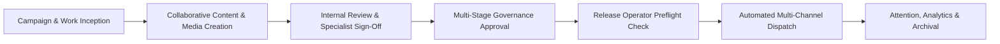
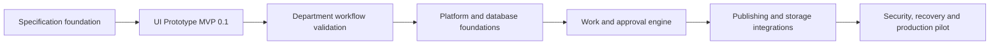

[[Comms Hub|Comms Hub Overview]] | [[Status|Current Status]] | [[progress|Progress Log]] | [[MVP_draft|MVP Draft UI Shell]] | [[discussions_list|Master Discussions Index]]

---

# Communication Department Hub — Product Roadmap

> [!note] Update as you work
> This roadmap is a living operational document. It establishes the planning rules, delivery horizons, and workflow boundaries for the Communication Department Hub. Update timelines, progress markers, and horizon items as real development proceeds.

---

## Product Purpose

The **Communication Department Hub** is a specialized, institutional management and operations platform engineered for corporate communications teams. It provides a unified workspace that bridges campaign planning, collaborative content creation, multi-tier approval governance, secure multi-channel publishing, and long-term digital asset preservation.

The hub serves eight confirmed organizational and administrative roles:
1. **مدير الاتصال المؤسسي** (Director of Corporate Communication) — Strategic authority and executive release governance.
2. **مساعد مدير الاتصال المؤسسي** (Assistant Director) — Operational oversight, task allocation, and delegated review.
3. **كاتب المحتوى** (Content Writer) — Editorial drafting, messaging alignment, and revision iteration.
4. **المصمم** (Designer) — Visual assets, brand identity consistency, and multi-format exports.
5. **المنتج الإعلامي** (Media Producer) — High-resolution video, motion graphics, and media pipeline processing.
6. **مسؤول النشر وإدارة الحسابات** (Publishing & Account Officer) — Channel scheduling, token verification, and release execution.
7. **عضو** (Department Member) — Collaborative contribution, campaign participation, and internal review.
8. **Admin** (System Administrator) — Infrastructure configuration, integration secrets, security policies, and user management.

---

## Core Operational Journey

The primary workflow routes work items smoothly from initial campaign assignment to verified external distribution:



---

## Delivery Horizons

The active scope is the UI Prototype MVP 0.1 in [[MVP_draft]]. Validate the prototype with department users before platform implementation. Future production work remains planned below; dates will be set after validation.



> [!important] Scope and Planning Boundaries
> Detailed implementation tracking begins once development commences. Specific development cycles, milestones, and work packages must be defined collaboratively as each horizon approaches, ensuring that real learning from early stages directly informs subsequent engineering work.

---

## Planning & Operating Rules

### Document Responsibilities

The vault maintains a strict separation of document concerns across four core operational files:

| Document | Primary Responsibility | Update Frequency |
|---|---|---|
| `Roadmap.md` | Planned directions, dependency order, delivery horizons, and exit gates. | At milestone boundaries and major scope alignments. |
| `Status.md` | Present condition, active focus, capability health matrix, and next actions. | At the conclusion of every active work session. |
| `progress.md` | Dated outcomes, verified evidence, benchmark results, and limitations. | Whenever a meaningful change is completed and verified. |
| `MVP_draft.md` | Authoritative UI shell layout, page specifications, and user flows. | When interface requirements or user interactions change. |

### Work Hierarchy & Breakdown Standards

Implementation work across the Communication Department Hub follows a four-tier breakdown structure modeled on proven project governance standards:

```
Version (X.0)
└── Checkpoint (X.Y)
    └── Phase (X.Y.Z)
        └── Task (X.Y.Z.W)
```

1. **Version (`X.0`) — Major Release Generation:**
   - Represents an overarching strategic milestone or product release lifecycle.
   - Contains high-level strategic objectives, core architectural boundaries, and the group of sequential checkpoints required for release.
2. **Checkpoint (`X.Y`) — Functional Capability Gate:**
   - Represents a major sequential milestone delivering an end-to-end usable capability.
   - Contains a concrete **Outcome Statement** (what capability is unlocked), prerequisite dependencies, and an **Exit Gate** (the strict verification criteria that must pass before advancing).
   - Exactly **one** checkpoint is actively in progress at any given time.
3. **Phase (`X.Y.Z`) — Thematic Subsystem Work Package:**
   - Represents a cohesive grouping of tightly coupled tasks focusing on a single subsystem (such as database schema, auth policies, queue worker, or UI shell).
   - Contains the specific set of atomic tasks needed to implement and verify that subsystem.
4. **Task (`X.Y.Z.W`) — Atomic Executable Unit:**
   - Represents an individual, bounded engineering task designed for completion within a single focused session.
   - Contains a standardized status marker (`[ ]`, `[/]`, `[x]`, `[-]`), an unambiguous definition of done, and an evidence requirement (unit test, terminal output, or artifact log) required for completion.

### Task State Conventions

When work items are scheduled in future planning iterations, use these standardized status markers:
- `[x]` = Completed and verified with concrete evidence (passing tests, recorded commands, or logs).
- `[/]` = Actively in progress in the current work session.
- `[ ]` = Planned and specified, but implementation has not started.
- `[-]` = Deliberately cancelled or superseded, accompanied by an explicit recorded reason.

### Engineering Truth & Safety Principles

1. **Evidence Over Assertion:** A feature is never marked completed simply because code was written or a mock interface was rendered. A capability is verified only when its real execution path runs successfully against real or realistic test fixtures.
2. **Recoverable Baselines:** Every significant file mutation must be preceded by a clean, recoverable baseline (Git commit or verified backup snapshot). Uncommitted work must never be silently overwritten, merged, or discarded.
3. **Prototype Boundary:** Version 0 uses local mock state only. For future production versions, long-running or external platform interactions belong in durable background jobs. This rule does not authorize workers or integrations in MVP 0.1.
4. **Zero Data Loss:** All modifications to documentation and code must preserve existing institutional context, Arabic terminology, and domain requirements.

---

## How to Proceed from This Scaffolding

When starting active implementation on the Communication Department Hub, follow this sequence:

1. **Review Current Status:** Consult `Status.md` to confirm the baseline state and identify the current active focus.
2. **Consult Architectural Specifications:** Reference the 11 companion documents in `disscussios/` for deep architectural guidance:
   - **Foundational Ideation Drafts:**
     - [[disscussios/First_idea_darft|First Idea Draft]] — Foundational technical ideation.
     - [[disscussios/Second_discussion_draft|Second Discussion Draft]] — Storage, AI controls, and publishing.
   - **Detailed Architecture Specifications:**
     - [[disscussios/organizational_role_discussion|Organizational Roles & Permissions]] — 8 confirmed roles and authority model.
     - [[disscussios/approval_policy_design|Approval Policies & Version Binding]] — Multi-stage approval and version binding.
     - [[disscussios/storage_lifecycle_disaster_recovery|Storage Lifecycle & 3-2-1 Disaster Recovery]] — Hybrid storage and backup.
     - [[disscussios/failure_handling_background_jobs|Background Jobs & Reliability Architecture]] — Queue and failure routing.
     - [[disscussios/connected_account_secrets_management|Connected Accounts & Secrets Management]] — OAuth and secret envelopes.
     - [[disscussios/notification_model|Three-Tier Attention & Notification Model]] — Action, Attention, Notification.
     - [[disscussios/search_and_metadata|Search, Metadata & Arabic Taxonomy]] — Full-text search and Arabic taxonomy.
     - [[disscussios/security_discussion|Security, Zero-Trust & Audit Logging]] — Defense-in-depth and immutable audit log.
     - [[disscussios/emergency_workflows|Emergency Workflows & Kill-Switch Controls]] — Crisis governance and freeze switch.
3. **Structure Initial Work Packages:** When ready to commence coding, define the initial milestone block with clear acceptance criteria and exit gates.
4. **Maintain Cadence:** Work on one bounded problem at a time, verify the result, log evidence in `progress.md`, update `Status.md`, and advance `Roadmap.md`.

---

## Version 0: UI Prototype

### Checkpoint 0.1: UI Prototype MVP 0.1

**State:** Complete and verified (2026-09-19). **Authority:** [[MVP_draft]].
**Outcome:** A runnable Arabic RTL product prototype for eight roles, using one connected Saudi National Day 2026 scenario.  
**Exit Gate:** Selected design; six high-fidelity Level A pages; lighter B/C pages; role simulation; verified end-to-end mock workflow and responsive layouts. No real backend, authentication, integrations, or publishing.

> [!note] Acceptance State (2026-09-19)
> READY FOR CHECKPOINT 0.2. All eight personas and central supporting actions verified; 14 Level A desktop/mobile screenshots visually inspected; complete publication journey and 60 viewport checks pass. Build, typecheck and five domain tests pass. Focused keyboard/contrast review complete, not a formal accessibility certification. Retained local release snapshots added; upload/playback deliberately deferred. Evidence and accepted limitations: `qa/ACCEPTANCE.md`. No production services.

#### Phase 0.1.1: Scope and visual decision

- [x] 0.1.1.1 Inspect specifications and reconcile UI-first scope. Evidence: repository review and reordered roadmap, baseline commit `7e45e2b`.
- [x] 0.1.1.2 Produce three distinct visual directions, each with Home, Work, Work detail, Create, Approvals/Publishing, and Media at desktop and mobile. Evidence: `design-review/index.html`, 36 screenshots, three desktop boards, and `design-review/verification.json` with 72 viewport checks passing. Visual boards inspected.
- [x] 0.1.1.3 Record the user's selected or combined direction. User selected A on 2026-09-19; B contributes only larger media previews. Exact boundary recorded in `DESIGN.md`.

#### Phase 0.1.2: Selected foundation

- [x] 0.1.2.1 Scaffold Next.js, TypeScript and Tailwind; establish selected RTL tokens, shell and responsive navigation. Evidence: start/build checks and browser navigation.
- [x] 0.1.2.2 Add coherent mock entities and eight-role View As simulation. Evidence: linked campaign data and visible role-specific priorities.

#### Phase 0.1.3: Core workflow

- [x] 0.1.3.1 Implement Home, Work, Work detail and Create with forms, tabs, search, comments and mock review submission. Evidence: browser interaction walkthrough.
- [x] 0.1.3.2 Implement Approvals/Publishing, Calendar and Media Library with revision review, scheduling, previews and per-channel results. Evidence: approve/schedule/publish/partial-failure walkthrough.

#### Phase 0.1.4: Supporting experiences

- [x] 0.1.4.1 Add believable Mail, Ideas, Analytics and Monitoring, plus Admin, Settings and Account shells. Evidence: page and central-action checks.
- [x] 0.1.4.2 Connect notifications, activity, empty/loading/error states and mock outcomes. Evidence: cross-page state checks; notification read state separate from approval state.

#### Phase 0.1.5: Acceptance and handoff

> [!note] Phase Scope & Execution
> Phase 0.1.5 is executed as a unified verification and handoff package. Astra completes both the remaining multi-persona/accessibility verification in 0.1.5.1 and the final acceptance, demonstration, and documentation closure in 0.1.5.2.

- [x] 0.1.5.1 Persona, responsive, keyboard, and QA verification. Verify remaining persona experiences (designer, producer, member), 1440/1280 desktop, 768–1024 tablet and ~390 mobile layouts, central dialogs, and keyboard/accessibility navigation. Evidence: screenshots, verification test fixtures, and focused QA log.
- [x] 0.1.5.2 Final prototype acceptance, handoff, and tracking closure. Demonstrate the complete mock workflow end-to-end, verify clean production build and absence of production secrets/services, document verified limits, and synchronize tracking across Status, progress, and Roadmap. Evidence: acceptance walkthrough record and runnable setup instructions.

---

### Checkpoint 0.2: Department Validation

**State:** Ready to start; not started. Checkpoint 0.1 accepted.
**Outcome:** Validate the prototype against actual Communication Department work, record operational corrections, and authorize production architecture planning.  
**Exit Gate:** The department can complete the agreed representative workflows through the prototype without major structural confusion.

> [!important] Agent vs. Human Responsibilities in Checkpoint 0.2
> - **Astra / Agent Responsibility:** Conduct pre-validation workflow mapping (0.2.1), analyze prototype interaction bottlenecks, prepare structured guided interview scripts, validation rubrics, and feedback collection instruments, and synthesize evidence-based corrections into the specification and freeze gate (0.2.3, 0.2.4).
> - **Human Department Responsibility:** The actual execution of Phase 0.2.2 (Guided Department Validation) requires real human department leadership (Director, Assistant Director) and staff specialists (Writers, Designers, Producers, Publishing Officers) testing and evaluating the prototype against their real day-to-day operational realities. An agent cannot simulate or substitute for real department validation.

#### Phase 0.2.1 — Workflow Mapping
- [ ] Map representative real workflows using the confirmed seven department roles plus Admin (system authority).
- [ ] Compare actual workflow to MVP assumptions.
- [ ] Record exceptions, bottlenecks, and terminology corrections.
- [ ] Prepare structured validation scripts and feedback rubrics for human department reviewers.

#### Phase 0.2.2 — Guided Department Validation (Human Department Execution)
- [ ] Director / Assistant Director strategic and review validation with human leadership.
- [ ] Content Writer, Designer, and Media Producer specialist validation with operational team members.
- [ ] Publishing Officer release, scheduling, and channel governance validation.
- [ ] Administrative and department member operational feedback collection.
- [ ] Mobile workflow review where relevant to on-call or remote operational scenarios.

#### Phase 0.2.3 — Prototype Corrections
- [ ] Synthesize human validation findings and apply only evidence-based workflow/UI corrections.
- [ ] Remove or simplify unneeded interactions identified during department testing.
- [ ] Correct role-specific experiences and Arabic terminology.

#### Phase 0.2.4 — Product Freeze Gate
- [ ] Freeze Version 1 product workflow assumptions based on human sign-off.
- [ ] Record unresolved questions separately in discussions.
- [ ] Authorize production architecture planning.

---

## Version 1: Production Foundation

**State:** Planned (blocked on prototype validation).  
**Authority:** Architectural specifications in `disscussios/`.  
**Goal:** Convert the validated prototype into a secure, persistent, deployable multi-user application foundation.

### Checkpoint 1.1 — Platform & Environment Foundation

**Outcome:** Reproducible development, staging, and deployment environment with hardened boundaries.

Phases:
- **1.1.1 Codebase & Tooling Cleanup:** Production build configuration, linting, and dependency sanitization.
- **1.1.2 Vercel Environment Setup:** Deployment targets, preview branches, and edge runtime configuration.
- **1.1.3 Supabase Environment Setup:** Project initialization, database connection pooling, and client SDK bindings.
- **1.1.4 Configuration & Secrets Boundary:** Strict separation of client/server environment variables and key management.
- **1.1.5 Migration & Seed Baseline:** Deterministic database migration tooling and baseline test seed data.
- **1.1.6 Build & CI Verification:** Continuous integration pipeline running typecheck, unit tests, and build checks.

**Exit Gate:** Fresh environment can be configured, migrated, built, and deployed reproducibly.

### Checkpoint 1.2 — Identity & Organizational Authorization

**Outcome:** Real authenticated users operate under the confirmed institutional organizational model.

Phases:
- **1.2.1 Authentication & Session Management:** Supabase Auth integration, session tokens, and refresh flows.
- **1.2.2 User Profile & Lifecycle:** Account states (active, suspended, offboarded) and profile metadata.
- **1.2.3 Organizational Positions & Hierarchy:** Department positions, reporting lines, and organizational units.
- **1.2.4 Role Permissions & Capabilities:** Fine-grained permission assignments mapping to the eight confirmed roles.
- **1.2.5 Resource-Level Access Control:** Scoped access to campaigns, work items, and internal documents.
- **1.2.6 Delegation Foundations:** Temporary and delegated authority mechanisms for review and approvals.
- **1.2.7 Server-Side & RLS Enforcement:** Row-Level Security policies ensuring no client can bypass authorization rules.

**Exit Gate:** Authorization tests prove users cannot read or mutate data exceeding their verified authority.

### Checkpoint 1.3 — Persistent Core Domain

**Outcome:** Campaigns, Work Items, participants, comments, and core Asset metadata persist durably.

Phases:
- **1.3.1 Relational Schema & Constraints:** Tables, foreign keys, constraints, and indexes for core entities.
- **1.3.2 Domain Repositories & Services:** Clean application service layer mediating between UI and database.
- **1.3.3 Migration Pipeline & Baseline:** Fully versioned, reversible schema migration scripts.
- **1.3.4 Realistic Seed Fixtures:** Realistic department test data reflecting institutional workflows.
- **1.3.5 UI State Binding:** Replacement of local mock state with server-backed data fetching and mutations.
- **1.3.6 Concurrency Controls & Data Validation:** Optimistic locking, input validation, and transaction boundaries.

**Exit Gate:** Core work survives browser sessions and redeploys, maintaining full consistency across concurrent users.

### Checkpoint 1.4 — Event & Audit Foundation

**Outcome:** Meaningful organizational changes emit structured events and durable, immutable audit records.

Phases:
- **1.4.1 Structured Event Vocabulary & Schemas:** Defined event types covering all state transitions and governance actions.
- **1.4.2 Immutable Audit Logging Model:** Append-only audit table tracking actor, timestamp, action, and payload diffs.
- **1.4.3 Actor & Resource Context Propagation:** Request context tracing ensuring every mutation captures the initiating identity.
- **1.4.4 Sensitive Action & Security Records:** Dedicated audit capture for permission changes, emergency actions, and logins.
- **1.4.5 Audit Query & Compliance Display Foundation:** Admin interface for querying and inspecting audit trails.

**Exit Gate:** Representative workflows produce complete, tamper-resistant, and trustworthy audit histories.

### Checkpoint 1.5 — Version 1 Acceptance Gate

**Outcome:** Secure, persistent multi-user foundation fully validated against staging environments.  
**Exit Gate:** Real authentication, roles, persistent database, core work workflows, audit logging, and automated deployment operate correctly without external publishing integrations.

---

## Version 2: Workflow & Operations

**State:** Planned (follows Version 1).  
**Goal:** Turn the production foundation into the department's real internal operating system.

### Checkpoint 2.1 — Work & Campaign Engine
- **Scope:** Campaigns, Work Items, participants, priorities, deadlines, comments, revision tracking, and complete lifecycle states.
- **Outcome:** Full operational tracking of all departmental content initiatives from concept to readiness.

### Checkpoint 2.2 — Asset Management Core
- **Scope:** Provider-agnostic core domain logic. Establishes the Asset, Version, Location abstraction (`AssetLocation`), metadata schemas, MIME validation, thumbnail extraction pipeline, and Work/Campaign bindings. Real external storage integrations (Google Drive, NAS, etc.) are strictly deferred to Checkpoint 3.2.
- **Outcome:** Unified, provider-agnostic asset domain model supporting version immutability and multi-format bindings without external provider lock-in.

### Checkpoint 2.3 — Approval & Release Engine
- **Scope:** Version-bound release packages, multi-stage approval requests, formal decisions, delegation, and revision invalidation.
- **Outcome:** Strict governance ensuring approved content cannot be modified without re-triggering the approval chain.

### Checkpoint 2.4 — Actions, Attention & Notifications
- **Scope:** Three-tier attention model: Action Items (blocking), Attention Items (informational), and Notifications (activity feed).
- **Outcome:** Role-tailored operational inbox preventing notification fatigue while ensuring critical approvals are never missed.

### Checkpoint 2.5 — Search & Metadata
- **Scope:** Permission-aware global search, tag taxonomy, faceted filtering, full-text indexing, and Arabic text normalization.
- **Outcome:** Fast discovery across campaigns, work items, and media assets with full dialectal Arabic tolerance.

### Checkpoint 2.6 — Durable Job Foundation
- **Scope:** Background job execution, scheduled triggers, retry policies, exponential backoff, dead-letter queues, and Needs Attention triage.
- **Outcome:** Resilient asynchronous task engine capable of handling media processing and batch tasks without data loss.

### Checkpoint 2.7 — Internal Operations Pilot

**Exit Gate:** The department can plan, assign, create, review, revise, approve, and track real internal work end-to-end without external publishing integrations.

---

## Version 3: Connected Operations

**State:** Planned (follows Version 2).  
**Goal:** Safely connect Comms Hub to external storage, communication channels, and publishing systems.

### Checkpoint 3.1 — Connected Account Infrastructure
- **Scope:** OAuth 2.0 flows, token encryption envelopes, token refresh workers, health monitoring, reauthorization alerts, and revocation.
- **Outcome:** Secure external platform connection management without exposing raw secrets to client code.

### Checkpoint 3.2 — Production Storage Adapter
- **Scope:** Implement the `AssetLocation` / Storage Adapter interface with the selected first production storage provider (evaluating Google Shared Drive as the primary institutional candidate, without locking into an unearned S3/hybrid decision prematurely).
- **Outcome:** Seamless large-file asset preservation adhering to the 3-2-1 backup lifecycle specification with the chosen initial storage provider.

### Checkpoint 3.3 — Publication Orchestrator
- **Scope:** Publication bundles, platform adapters (X/Twitter, LinkedIn, Instagram, etc.), preflight checks, and child publication records.
- **Outcome:** Unified multi-channel publishing interface with channel-specific validation rules.

### Checkpoint 3.4 — Scheduling & Failure Recovery
- **Scope:** Durable scheduling, platform rate limit respect, idempotency keys, transient error retries, and partial failure isolation.
- **Outcome:** Dependable publishing that isolates failed channels without re-publishing or duplicating successful ones.

### Checkpoint 3.5 — External Mail & Intake
- **Scope:** Inbound press releases, media inquiries, official correspondence intake, and automatic work item drafting. Delivery sequence and depth are subject to validated department priority established in Checkpoint 0.2 (retaining its position if email intake is central to daily operations, or deferred/reordered if other integrations take precedence).
- **Outcome:** Direct translation of inbound external communications into actionable departmental work items aligned with verified department intake habits.

### Checkpoint 3.6 — External Reconciliation
- **Scope:** Webhook receivers and polling workers to track and reconcile posts modified, scheduled, or deleted directly on native platforms.
- **Outcome:** Synchronized truth between external social channels and the internal Comms Hub calendar.

### Checkpoint 3.7 — Real Analytics Collection
- **Scope:** Platform metrics collection (impressions, engagement, clicks, reach), campaign-level rollups, and reporting exports.
- **Outcome:** Automated performance reporting linked directly to originating campaigns and work items.

### Checkpoint 3.8 — Controlled Production Pilot

**Exit Gate:** Selected real departmental communication workflows can be planned, approved, scheduled, executed, reconciled, and monitored live through Comms Hub.

---

## Version 4: Intelligence & Automation

**State:** Future / intentionally un-decomposed.  
**Goal:** Use the trusted data, workflows, and external execution capability from Versions 1–3 to provide controlled automation and contextual intelligence.

### Candidate Capabilities
- Rule-based workflow automation and routing.
- AI drafting assistance and Arabic-language stylistic refinement.
- Automated diff comparison between approval revisions.
- Inbound mail summarization and metadata extraction.
- Automatic OCR, speech-to-text transcription, and video captioning.
- Semantic vector search across institutional media archives.
- AI-derived taxonomy tagging and tone compliance checks.
- Executive analytics summarization and trend explanations.
- Human-in-the-loop policy boundaries and AI confidence scoring.
- AI usage, latency, and cost governance controls.

> [!important] Planning Rule for Version 4
> Detailed checkpoints, phases, and atomic tasks for Version 4 will not be defined until empirical operational evidence and user feedback from the Version 3 production pilot have been collected and analyzed.

---

^comms-hub-roadmap-boundary
