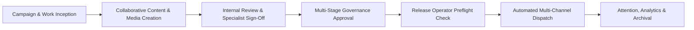
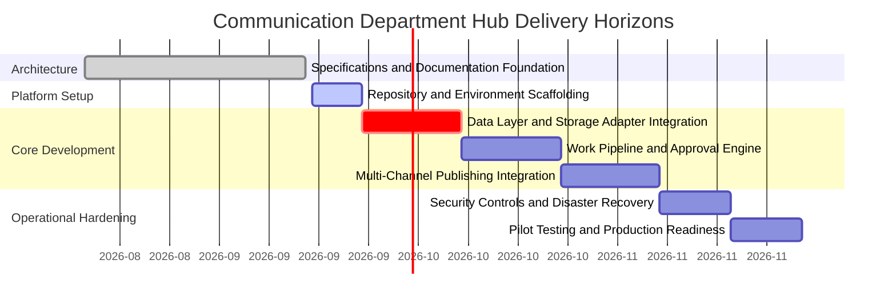

[[Comms Hub|Comms Hub Overview]] | [[Status|Current Status]] | [[progress|Progress Log]] | [[MVP_draft|MVP Draft UI Shell]] | [[discussions_list|Master Discussions Index]]

---

# Communication Department Hub — Product Roadmap

> [!note] Update as you work
> This roadmap is a living operational document. It establishes the planning rules, delivery horizons, and workflow boundaries for the Communication Department Hub. Update timelines, progress markers, and horizon items as real development proceeds.

---

## Product Purpose

The **Communication Department Hub** is a specialized, institutional management and operations platform engineered for corporate communications teams. It provides a unified workspace that bridges campaign planning, collaborative content creation, multi-tier approval governance, secure multi-channel publishing, and long-term digital asset preservation.

The hub serves eight confirmed organizational and administrative roles:
1. **مدير الاتصال المؤسسي** (Director of Corporate Communication) — Strategic authority and executive release governance.
2. **مساعد مدير الاتصال المؤسسي** (Assistant Director) — Operational oversight, task allocation, and delegated review.
3. **كاتب المحتوى** (Content Writer) — Editorial drafting, messaging alignment, and revision iteration.
4. **المصمم** (Designer) — Visual assets, brand identity consistency, and multi-format exports.
5. **المنتج الإعلامي** (Media Producer) — High-resolution video, motion graphics, and media pipeline processing.
6. **مسؤول النشر وإدارة الحسابات** (Publishing & Account Officer) — Channel scheduling, token verification, and release execution.
7. **عضو** (Department Member) — Collaborative contribution, campaign participation, and internal review.
8. **Admin** (System Administrator) — Infrastructure configuration, integration secrets, security policies, and user management.

---

## Core Operational Journey

The primary workflow routes work items smoothly from initial campaign assignment to verified external distribution:



---

## Delivery Horizons

The high-level delivery horizons outline the path from specification to production readiness.



> [!important] Scope and Planning Boundaries
> Detailed implementation tracking begins once development commences. Specific development cycles, milestones, and work packages must be defined collaboratively as each horizon approaches, ensuring that real learning from early stages directly informs subsequent engineering work.

---

## Planning & Operating Rules

### Document Responsibilities

The vault maintains a strict separation of document concerns across four core operational files:

| Document | Primary Responsibility | Update Frequency |
|---|---|---|
| `Roadmap.md` | Planned directions, dependency order, delivery horizons, and exit gates. | At milestone boundaries and major scope alignments. |
| `Status.md` | Present condition, active focus, capability health matrix, and next actions. | At the conclusion of every active work session. |
| `progress.md` | Dated outcomes, verified evidence, benchmark results, and limitations. | Whenever a meaningful change is completed and verified. |
| `MVP_draft.md` | Authoritative UI shell layout, page specifications, and user flows. | When interface requirements or user interactions change. |

### Work Hierarchy & Breakdown Standards

Implementation work across the Communication Department Hub follows a four-tier breakdown structure modeled on proven project governance standards:

```
Version (X.0)
└── Checkpoint (X.Y)
    └── Phase (X.Y.Z)
        └── Task (X.Y.Z.W)
```

1. **Version (`X.0`) — Major Release Generation:**
   - Represents an overarching strategic milestone or product release lifecycle.
   - Contains high-level strategic objectives, core architectural boundaries, and the group of sequential checkpoints required for release.
2. **Checkpoint (`X.Y`) — Functional Capability Gate:**
   - Represents a major sequential milestone delivering an end-to-end usable capability.
   - Contains a concrete **Outcome Statement** (what capability is unlocked), prerequisite dependencies, and an **Exit Gate** (the strict verification criteria that must pass before advancing).
   - Exactly **one** checkpoint is actively in progress at any given time.
3. **Phase (`X.Y.Z`) — Thematic Subsystem Work Package:**
   - Represents a cohesive grouping of tightly coupled tasks focusing on a single subsystem (such as database schema, auth policies, queue worker, or UI shell).
   - Contains the specific set of atomic tasks needed to implement and verify that subsystem.
4. **Task (`X.Y.Z.W`) — Atomic Executable Unit:**
   - Represents an individual, bounded engineering task designed for completion within a single focused session.
   - Contains a standardized status marker (`[ ]`, `[/]`, `[x]`, `[-]`), an unambiguous definition of done, and an evidence requirement (unit test, terminal output, or artifact log) required for completion.

### Task State Conventions

When work items are scheduled in future planning iterations, use these standardized status markers:
- `[x]` = Completed and verified with concrete evidence (passing tests, recorded commands, or logs).
- `[/]` = Actively in progress in the current work session.
- `[ ]` = Planned and specified, but implementation has not started.
- `[-]` = Deliberately cancelled or superseded, accompanied by an explicit recorded reason.

### Engineering Truth & Safety Principles

1. **Evidence Over Assertion:** A feature is never marked completed simply because code was written or a mock interface was rendered. A capability is verified only when its real execution path runs successfully against real or realistic test fixtures.
2. **Recoverable Baselines:** Every significant file mutation must be preceded by a clean, recoverable baseline (Git commit or verified backup snapshot). Uncommitted work must never be silently overwritten, merged, or discarded.
3. **Frontend as Orchestration Only:** The frontend web application is strictly an interaction and review interface. All long-running, failure-prone, or external platform interactions must execute as durable background jobs.
4. **Zero Data Loss:** All modifications to documentation and code must preserve existing institutional context, Arabic terminology, and domain requirements.

---

## How to Proceed from This Scaffolding

When starting active implementation on the Communication Department Hub, follow this sequence:

1. **Review Current Status:** Consult `Status.md` to confirm the baseline state and identify the current active focus.
2. **Consult Architectural Specifications:** Reference the 11 detailed companion documents in `disscussios/` for deep architectural guidance:
   - [[disscussios/organizational_role_discussion|Organizational Roles & Permissions]]
   - [[disscussios/approval_policy_design|Approval Policies & Version Binding]]
   - [[disscussios/storage_lifecycle_disaster_recovery|Storage Lifecycle & 3-2-1 Disaster Recovery]]
   - [[disscussios/failure_handling_background_jobs|Background Jobs & Reliability Architecture]]
   - [[disscussios/connected_account_secrets_management|Connected Accounts & Secrets Management]]
   - [[disscussios/notification_model|Three-Tier Attention & Notification Model]]
   - [[disscussios/search_and_metadata|Search, Metadata & Arabic Taxonomy]]
   - [[disscussios/security_discussion|Security, Zero-Trust & Audit Logging]]
   - [[disscussios/emergency_workflows|Emergency Workflows & Kill-Switch Controls]]
3. **Structure Initial Work Packages:** When ready to commence coding, define the initial milestone block with clear acceptance criteria and exit gates.
4. **Maintain Cadence:** Work on one bounded problem at a time, verify the result, log evidence in `progress.md`, update `Status.md`, and advance `Roadmap.md`.

---

## Version 1 MVP

**Goal:** Establish the foundational production release of the Communication Department Hub, delivering a reliable, secure workspace for departmental campaign planning, collaborative creation, multi-tier approval governance, and automated multi-channel publishing.

**Status:** Scaffolding Baseline / Ready for Implementation

> [!note] Checkpoints, Phases, and Tasks Definition
> Detailed checkpoints, phases, and atomic tasks for Version 1 MVP will be defined sequentially as active development commences, adhering to the Work Hierarchy & Breakdown Standards and informed by real engineering feedback.

---

^comms-hub-roadmap-boundary
