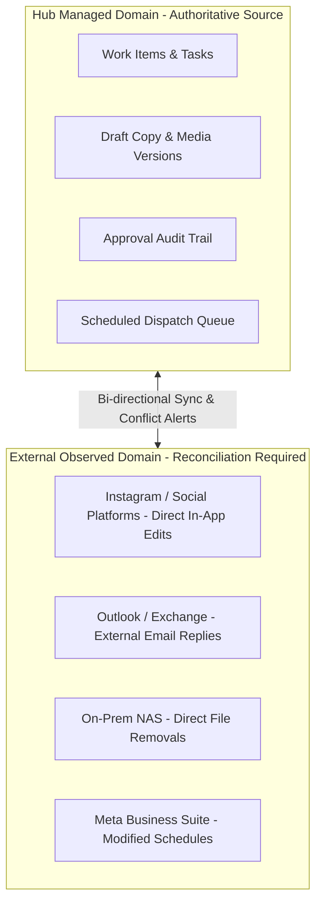
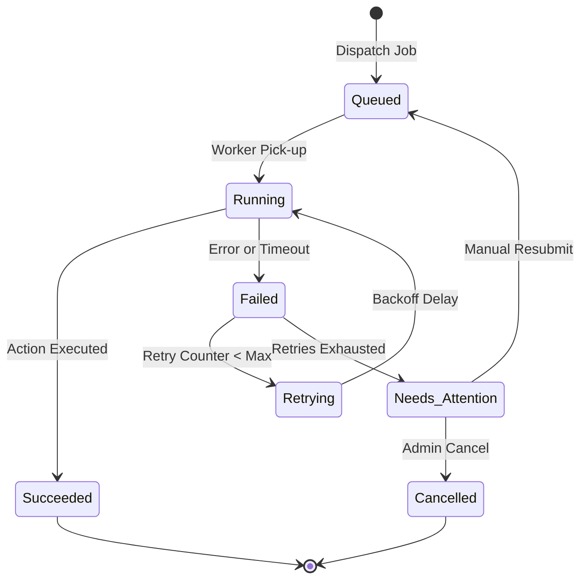
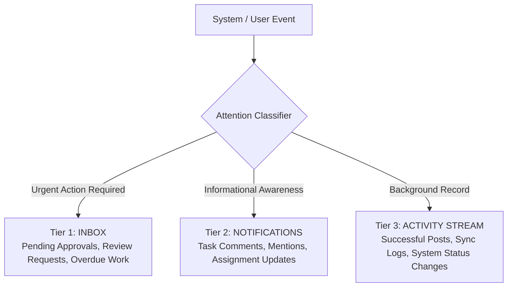
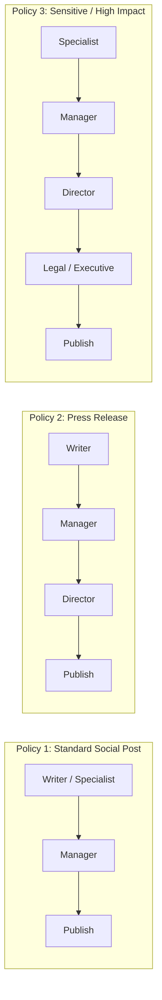
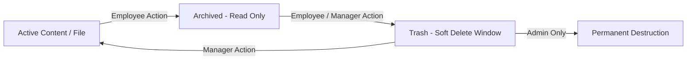

[[Comms Hub|Comms Hub Overview]] | [[Original_Idea|Original Concept]] | [[MVP_draft|MVP Draft UI Shell]]

---

# Discussions List — Communication Department Hub

> [!note] Status: Open discussion topics
> **Status: Open discussion topics**
>
> This document preserves the major blind spots and unresolved questions identified before formal architecture planning begins.
>
> These are **not final decisions or requirements**. They are topics that should be discussed, validated against real department workflows, and resolved progressively before implementation.

---


## Structure Tree & Document Map

- [[#Discussions List — Communication Department Hub|Overview & Discussion Status]]
- **Part I: Data Boundaries & Reliability**
  - [[#1. Source of Truth and External Systems|1. Source of Truth and External Systems]]
  - [[#2. Failure Handling|2. Failure Handling]]
  - [[#3. Background Jobs, Queues, and Workers|3. Background Jobs, Queues, and Workers]]
- **Part II: Identity, Governance & Security**
  - [[#4. Identity Beyond Basic Roles|4. Identity Beyond Basic Roles]]
  - [[#5. Organizational Ownership vs User Ownership|5. Organizational Ownership vs User Ownership]]
  - [[#6. Connected Account Security|6. Connected Account Security]]
  - [[#7. Integration Ownership|7. Integration Ownership]]
- **Part III: Attention, Discovery & Collaboration**
  - [[#8. Notification Overload|8. Notification Overload]]
  - [[#9. Global Search|9. Global Search]]
  - [[#10. Metadata and Taxonomy|10. Metadata and Taxonomy]]
  - [[#11. Concurrent Editing|11. Concurrent Editing]]
- **Part IV: Policy, Compliance & Resilience**
  - [[#12. Flexible Approval Policies|12. Flexible Approval Policies]]
  - [[#13. Emergency Overrides|13. Emergency Overrides]]
  - [[#14. Deletion, Archive, and Retention|14. Deletion, Archive, and Retention]]
  - [[#15. Security Architecture|15. Security Architecture]]
- **Part V: Operational Discipline & Infrastructure**
  - [[#16. Employee Monitoring Philosophy|16. Employee Monitoring Philosophy]]
  - [[#17. Disaster Recovery|17. Disaster Recovery]]
  - [[#18. System Health and Operational Monitoring|18. System Health and Operational Monitoring]]
  - [[#19. Cost Controls|19. Cost Controls]]
  - [[#20. Development, Staging, and Production Separation|20. Development, Staging, and Production Separation]]
- **Part VI: Roadmapping & Topic Catalog**
  - [[#21. Real Workflow Discovery|21. Real Workflow Discovery]]
  - [[#22. Recommended Next Discussions|22. Recommended Next Discussions]]
  - [[#23. Status|23. Status]]

---

# 1. Source of Truth and External Systems

We need to decide what the Communication Hub is actually authoritative over.

Examples:

- A post is created in the Hub but later edited directly on Instagram.
- A manager replies to an email using Outlook instead of the Hub.
- A file is deleted directly from the NAS.
- A scheduled social post is changed inside Meta Business Suite.

The system may need to distinguish between:

- **Managed by our system**
- **Observed by our system**

The Hub should not assume it completely controls external platforms.

Questions:

- Which system is considered the source of truth?
- Do we periodically reconcile external state?
- How do we display external modifications?
- How are conflicts resolved?

### Source of Truth Dual-Domain Boundary Diagram



> [!tip] In-Depth Synthesis
> See foundational considerations in [[disscussios/First_idea_darft|First Idea Draft]] and [[disscussios/Second_discussion_draft|Second Discussion Draft]].

---

# 2. Failure Handling

Most workflows have been discussed as happy paths, but production failures must be designed for.

Examples:

```text
Create
↓
Approve
↓
Schedule
↓
Social token expires
↓
Publishing fails
```

Other cases:

- Large upload fails at 93%.
- Approved content is edited immediately before publication.
- Automation stops halfway through execution.
- An API request times out after the external platform actually completed the action.
- A retry accidentally creates a duplicate post.

Possible job/action states:

```text
Queued
Running
Succeeded
Failed
Retrying
Needs Attention
Cancelled
```

Questions:

- Which actions are safe to retry?
- How do we avoid duplicate external actions?
- What requires manual intervention?
- What happens after repeated failures?
- Who is notified?

---

# 3. Background Jobs, Queues, and Workers

Many actions should not live inside a normal webpage request.

Examples:

- Publish at a scheduled time
- Generate thumbnails
- Process uploaded files
- Synchronize NAS storage
- Collect analytics
- Retry failed publications
- Generate AI summaries
- Scan large uploads
- Send scheduled email

The architecture should eventually understand the concept of a **Job / Queue / Worker**.

Example:

```text
JOB #4182

Type:
SOCIAL_PUBLISH

Status:
RUNNING

Started:
18:00:01

Attempts:
1 / 3

Target:
Instagram / Account #12

Related Work Item:
#827
```

### Background Job Lifecycle State Diagram



> [!note] Dedicated Discussion Note
> Full error classification, backoff formulas, and dead-letter queue architectures are specified in [[disscussios/failure_handling_background_jobs|Failure Handling and Background Jobs]].
> See also technical reference: [BullMQ Queue Architecture](https://docs.bullmq.io/).

---

# 4. Identity Beyond Basic Roles

The initial roles are:

- Admin
- Manager
- Employee

But identity may eventually include:

- Employee
- Team
- Department
- Job position
- Direct manager
- Temporary assignment
- Account status
- External collaborator
- Service account

Questions:

- What happens during annual leave?
- Can approvals be delegated temporarily?
- Can an Acting Manager be assigned?
- What happens when a user leaves the organization?
- Who inherits their assigned work?

---

# 5. Organizational Ownership vs User Ownership

A core rule should likely be:

> The organization owns organizational work; users participate in it.

Deleting or disabling a user should not delete:

- Files
- Campaigns
- Scheduled posts
- Automations
- Approval history
- Communication history

Questions:

- How is ownership transferred?
- Can a user account be disabled while their work remains?
- Which data belongs to the user personally, if any?

> [!tip] Dedicated Discussion Note
> Role models, acting managers, delegation during leave, and ownership succession are analyzed in [[disscussios/organizational_role_discussion|Organizational Role Discussion]].

---

# 6. Connected Account Security

Connected social media accounts may allow the Hub to publish officially on behalf of the organization.

Their credentials must be treated as secrets.

We need to discuss:

- OAuth tokens
- Refresh tokens
- Token expiry
- Reauthorization
- Permission revocation
- Secret storage
- Audit logs
- Credential rotation
- Least privilege
- Integration health

Possible UI:

```text
INTEGRATION HEALTH

Instagram   ✓ Healthy
X           ✓ Healthy
LinkedIn    ⚠ Reauthorization needed
YouTube     ✓ Healthy
Mail        ✓ Healthy
NAS         ✓ Connected
```

---

# 7. Integration Ownership

If an employee connects the official Instagram account, the integration should likely belong to the department or organization rather than the individual employee.

Possible model:

```text
CHANNEL ACCOUNT

Organization:
Charity

Channel:
Instagram

Account:
@organization

Connection owner:
Communications Department

Authorized by:
Ahmed

Authorized at:
...
```

Questions:

- Who may disconnect it?
- Who may reconnect it?
- What happens if the authorizing employee leaves?
- Which roles may publish through it?

> [!note] Dedicated Discussion Note
> OAuth scopes, refresh loops, KMS credential encryption, and department account governance are resolved in [[disscussios/connected_account_secrets_management|Connected Account Secrets Management]].
> See also technical reference: [OAuth 2.0 Security BCP](https://datatracker.ietf.org/doc/html/draft-ietf-oauth-security-topics).

---

# 8. Notification Overload

The system should not turn every event into an urgent notification.

Possible separation:

```text
INBOX
Things requiring my action

NOTIFICATIONS
Things I should know

ACTIVITY
Everything that happened
```

Examples:

**Action Required**
- Approve National Day post

**Notification**
- Sara commented on your task

**Activity**
- Instagram publication succeeded

Questions:

- Which events require action?
- Which are informational only?
- Can users configure notification channels?
- How do we avoid alert fatigue?

### Three-Tier Attention Architecture Diagram



> [!tip] Dedicated Discussion Note
> Event schemas, routing channels, and user digest preferences are defined in [[disscussios/notification_model|Notification Model]].

---

# 9. Global Search

As the system grows, navigation alone will not be enough.

The Hub may eventually contain:

- Thousands of posts
- Tens of thousands of files
- Thousands of emails
- Thousands of tasks
- Hundreds of campaigns

A global search could search across:

```text
Campaigns
Files
Content
Emails
Tasks
People
```

Potential UX:

```text
Ctrl + K

national day drone
```

Results:

```text
CAMPAIGN
Saudi National Day 2026

FILES
national-day-drone-v4.mp4

CONTENT
National Day Instagram Reel

EMAIL
Drone permissions confirmation

TASK
Edit drone footage
```

---

# 10. Metadata and Taxonomy

Folders alone will not scale.

Possible metadata:

```text
Campaign
Content type
Department
Channel
Year
Event
Category
Tags
Owner
Status
```

The system should help prevent chaotic naming such as:

```text
final.mp4
final2.mp4
final-final.mp4
new-final.mp4
FINAL-ACTUAL.mp4
```

Questions:

- Which metadata is mandatory?
- Which metadata is optional?
- Who can create tags/categories?
- Should taxonomy be centrally controlled?

> [!note] Dedicated Discussion Note
> Unified tag schemas, search indexing, and metadata filters are established in [[disscussios/search_and_metadata|Search and Metadata Architecture]].

---

# 11. Concurrent Editing

Multiple employees may edit the same record at the same time.

Possible problem:

- Ahmed edits the title.
- Sara edits the caption.
- Ahmed saves.
- Sara saves later and accidentally overwrites Ahmed.

Potential solutions:

- Optimistic concurrency
- Revision checks
- Conflict warnings
- Locking
- Merge/review flow

Example:

> “This item was updated by Ahmed while you were editing. Review changes before saving.”

Full Google Docs-style collaboration is not necessarily required initially.

---

# 12. Flexible Approval Policies

Approval may be more complicated than:

```text
Employee → Manager → Approved
```

Possible flows:

```text
Content Writer
      ↓
Supervisor
      ↓
Communications Manager
      ↓
Legal / Executive
      ↓
Publish
```

Different content may require different policies.

Examples:

```text
SOCIAL — NORMAL
Manager approval

PRESS RELEASE
Manager → Director

SENSITIVE CONTENT
Manager → Director → Executive
```

Questions:

- How many approval policies are needed?
- Can approvals happen in parallel?
- Can an approver delegate?
- Does any content require external review?
- What happens if an approver is unavailable?

### Multi-Policy Approval Matrix Diagram



> [!tip] Dedicated Discussion Note
> Flexible sign-off stages, SLA timers, parallel reviews, and delegation protocols are modeled in [[disscussios/approval_policy_design|Approval Policy Design]].

---

# 13. Emergency Overrides

Urgent situations may require bypassing normal workflow.

Example:

- An incorrect public statement needs immediate correction.

Possible approach:

```text
Emergency Publish

Reason:
Correction to inaccurate public information

⚠ Approval workflow bypassed

[Confirm]
```

Such actions should be heavily logged.

Questions:

- Who can use emergency actions?
- Which actions can be overridden?
- Is a reason mandatory?
- Who is notified afterward?

> [!warning] Dedicated Discussion Note
> Kill switches, emergency retraction of published posts, and incident escalation channels are detailed in [[disscussios/emergency_workflows|Emergency Workflows]].

---

# 14. Deletion, Archive, and Retention

Delete should not always mean permanent deletion.

Possible lifecycle:

```text
Archive
Trash
Restore
Permanent Delete
```

Possible permissions:

```text
Employee → Archive own draft
Manager  → Restore
Admin    → Permanent deletion
```

Some records, especially audit logs, may not be editable or deletable through normal UI.

A more accurate principle than “everything is editable” may be:

> Everything appropriate should be correctable, but important historical records must remain traceable.

### Data Lifecycle & Retention Hierarchy Diagram



---

# 15. Security Architecture

Security is not simply an Admin settings page.

The Hub may contain:

- Official email
- Unpublished media
- Social publishing credentials
- Employee information
- Internal discussions
- Analytics
- Sensitive campaign material

Security areas requiring discussion:

```text
Authentication
MFA
Session management
Role/permission enforcement
Secrets
Encryption
Signed links
Audit logs
Rate limiting
Upload validation
Malware scanning
Backups
Account recovery
Integration credential security
```

High-privilege accounts require special attention because one compromised Admin account may expose files, communication, and publishing capabilities.

> [!important] Dedicated Discussion Note
> Zero-trust boundaries, session invalidation, MFA requirements, and audit storage are detailed in [[disscussios/security_discussion|Security Architecture]].
> See also technical reference: [Supabase Row Level Security Guide](https://supabase.com/docs/guides/database/postgres/row-level-security).

---

# 16. Employee Monitoring Philosophy

Soft presence can be useful but should not be confused with productivity.

Important principle:

```text
Presence ≠ Productivity
```

Examples of legitimate work that may appear inactive:

- Event photography
- Video recording
- Meetings
- Field visits
- Discussions with other departments

Work output should be measured from actual workflow data rather than browser activity alone.

Questions:

- What monitoring is appropriate?
- What data is visible to managers?
- What data is visible to employees?
- How long is presence data retained?

---

# 17. Disaster Recovery

Backup is only useful if it can be restored.

We need to discuss:

- Database restoration
- File restoration
- Configuration restoration
- Integration restoration
- Automation restoration
- Backup frequency
- Backup retention
- Restore testing
- Recovery time expectations
- Acceptable data-loss window

A backup that has never been tested should not be assumed reliable.

> [!tip] Dedicated Discussion Note
> Cloud backup cadences, point-in-time recovery, cold NAS storage tiers, and drill runbooks are analyzed in [[disscussios/storage_lifecycle_disaster_recovery|Storage Lifecycle and Disaster Recovery]].

---

# 18. System Health and Operational Monitoring

Employee monitoring and system monitoring are different.

Possible system health view:

```text
SYSTEM HEALTH

Database          ✓
Storage           ✓
Mail              ✓
Instagram         ✓
X                 ✓
LinkedIn          ⚠
Job workers       ✓
NAS sync          ⚠
AI provider       ✓

Failed jobs today: 3

[View issues]
```

Questions:

- Who receives system alerts?
- Which failures are urgent?
- Which failures can be retried automatically?
- How do we distinguish vendor outages from our own issues?

---

# 19. Cost Controls

Automation, AI, storage, bandwidth, analytics API calls, and media processing can all create variable cost.

Potential future controls:

```text
AI BUDGET

Monthly limit
██████░░░░

Used:
62%

Per-user limits
Manager       High
Employee      Standard

Expensive AI actions
Require confirmation
```

Questions:

- Are budgets per organization, team, or user?
- What happens when limits are reached?
- Which actions can continue?
- Which automations need rate/cost protection?

---

# 20. Development, Staging, and Production Separation

Real organizational accounts should not be used as the development playground.

Conceptually:

```text
DEVELOPMENT
Codex / developers

STAGING
Safe test environment

PRODUCTION
Real employees
Real files
Real publishing accounts
```

External integrations should use test/sandbox credentials where possible.

Questions:

- Which data can exist in staging?
- Should production data ever be copied to staging?
- How are secrets separated?
- Who can deploy to production?

---

# 21. Real Workflow Discovery

Before architecture planning, we should map how the department actually works today.

For each real task, ask:

```text
How does the request arrive?
Who receives it?
Who decides priority?
Who assigns it?
Where are files stored?
Who creates the work?
Who reviews it?
How many revisions happen?
How is the requester notified?
Who publishes or sends it?
Where is the final output archived?
```

The goal is not to force the department into an idealized workflow.

The goal is:

> Make the application's path easier than the fragmented path employees use today.

We should map approximately 3–5 real department workflows before finalizing the product architecture.

---

# 22. Recommended Next Discussions

Before formal implementation planning, the major topics should include:

1. Security architecture # — [[disscussios/security_discussion|Security Architecture Discussion]]
2. Real current department workflows — [[MVP_draft#55. Relationship With Astra Workflow Discovery|Astra Workflow Discovery]]
3. Source-of-truth rules — [[disscussios/First_idea_darft|First Idea Draft]] & [[disscussios/Second_discussion_draft|Second Discussion Draft]]
4. Failure handling and background jobs # — [[disscussios/failure_handling_background_jobs|Failure Handling & Background Jobs]]
5. Identity and organizational ownership — [[disscussios/organizational_role_discussion|Organizational Role Discussion]]
6. Approval policy design # — [[disscussios/approval_policy_design|Approval Policy Design]]
7. Storage lifecycle and disaster recovery @ — [[disscussios/storage_lifecycle_disaster_recovery|Storage Lifecycle and Disaster Recovery]]
8. Connected-account and secrets management @ — [[disscussios/connected_account_secrets_management|Connected Account Secrets Management]]
9. Notification model @ — [[disscussios/notification_model|Notification Model]]
10. Search and metadata @ — [[disscussios/search_and_metadata|Search and Metadata Architecture]]
11. Monitoring/privacy boundaries — [[#16. Employee Monitoring Philosophy|Monitoring Philosophy]]
12. Production/staging separation — [[#20. Development, Staging, and Production Separation|Environment Separation]]
13. Cost controls — [[#19. Cost Controls|Cost Controls]]
14. Emergency workflows @ — [[disscussios/emergency_workflows|Emergency Workflows]]
15. MVP boundaries — [[MVP_draft#53. Recommended Prototype MVP 0.1 Boundary|MVP Draft 0.1 Boundary]]

### Master Architectural Discussions Topology

```mermaid
graph TD
    Hub[Comms Hub Master Architecture]
    
    subgraph DiscoveryNotes [In-Depth Discussion Documents]
        D_Role[disscussios/organizational_role_discussion.md]
        D_Appr[disscussios/approval_policy_design.md]
        D_Fail[disscussios/failure_handling_background_jobs.md]
        D_Sec[disscussios/security_discussion.md]
        D_Secr[disscussios/connected_account_secrets_management.md]
        D_Stor[disscussios/storage_lifecycle_disaster_recovery.md]
        D_Notif[disscussios/notification_model.md]
        D_Srch[disscussios/search_and_metadata.md]
        D_Emerg[disscussios/emergency_workflows.md]
        D_Draft1[disscussios/First_idea_darft.md]
        D_Draft2[disscussios/Second_discussion_draft.md]
    end

    Hub --> D_Role
    Hub --> D_Appr
    Hub --> D_Fail
    Hub --> D_Sec
    Hub --> D_Secr
    Hub --> D_Stor
    Hub --> D_Notif
    Hub --> D_Srch
    Hub --> D_Emerg
    Hub --> D_Draft1
    Hub --> D_Draft2
```




---

# 23. Status

This document is a **discussion checklist**.

It is intentionally broader than the current product specification so that important blind spots are explored **before implementation begins**. ^discussions-checklist-scope
