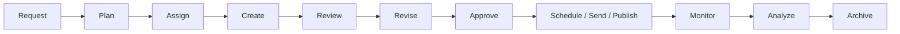
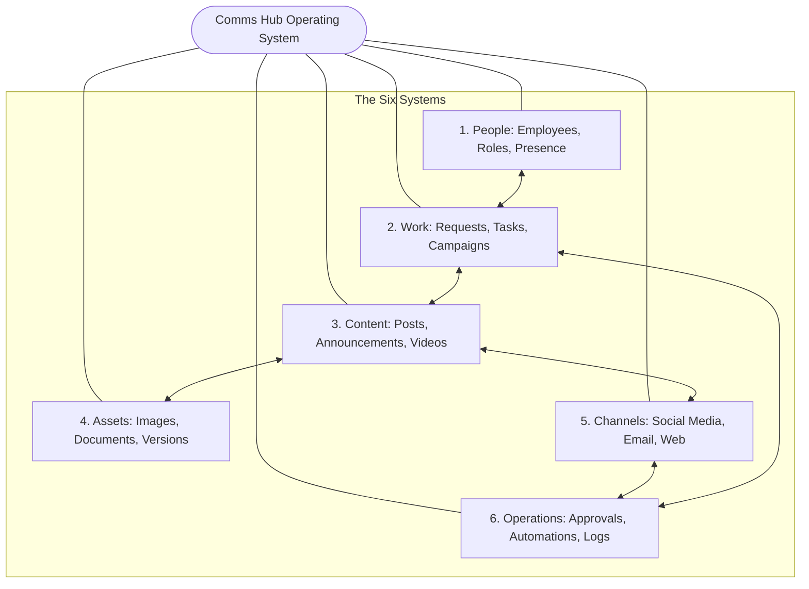
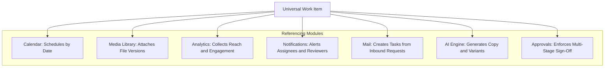
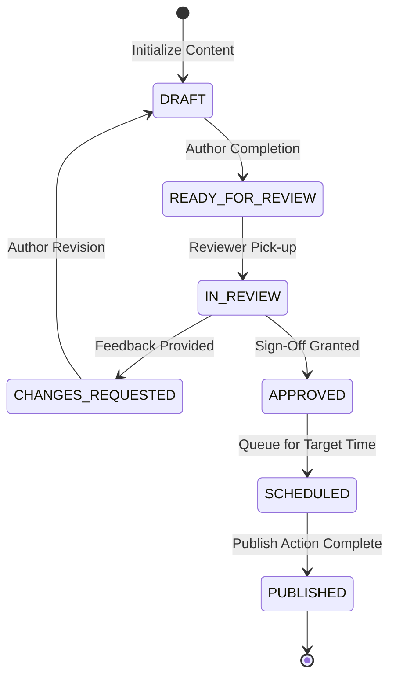
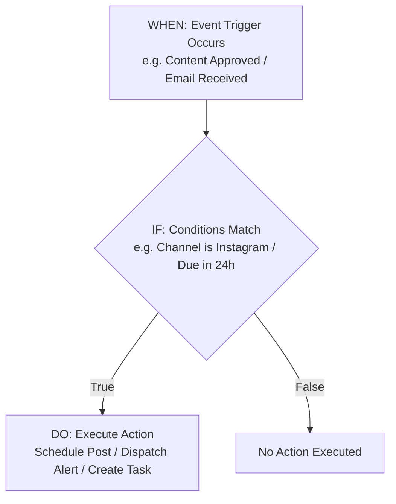
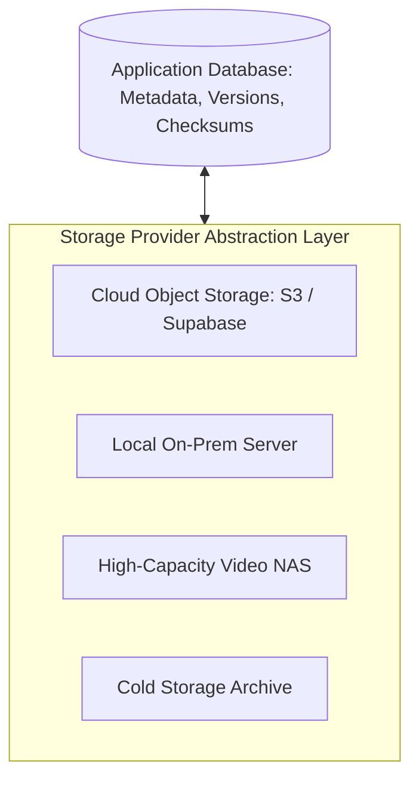
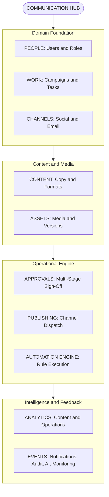

[[Comms Hub|Comms Hub Overview]] | [[Original_Idea|Original Concept Genesis]] | [[MVP_draft|MVP UI Shell Draft]] | [[discussions_list|Master Discussions Index]] | [[disscussios/Second_discussion_draft|Second Discussion Draft]]

---

# First Idea Draft — Communication Department Working Hub

> [!note] Status: Early discussion draft
> **Status: Early discussion draft**
>
> This document preserves the current brainstorming state of the project. It is **not a final specification** and we have **not agreed on all items yet**.
>
> The architecture, scope, workflows, permissions, storage strategy, automation behavior, AI use, publishing behavior, monitoring rules, and MVP boundaries are still under discussion and may change substantially before implementation in Codex.

---


## Structure Tree & Document Map

- [[#First Idea Draft — Communication Department Working Hub|Overview & Brainstorm Status]]
- **Part I: Strategic Foundations & Operating Model**
  - [[#1. Main Idea|1. Main Idea]]
  - [[#2. Main Problems We Want to Solve|2. Main Problems We Want to Solve]]
  - [[#3. Current Scope|3. Current Scope]]
  - [[#4. Product Model|4. Product Model]]
- **Part II: Core Work Management & Media Entities**
  - [[#5. Proposed Main Navigation|5. Proposed Main Navigation]]
  - [[#6. Work Page|6. Work Page]]
  - [[#7. Media Library|7. Media Library]]
  - [[#8. Universal Work Item|8. Universal Work Item]]
- **Part III: Governance, Approvals & Communication**
  - [[#9. Approval Workflow|9. Approval Workflow]]
  - [[#10. Editing and Versioning|10. Editing and Versioning]]
  - [[#11. Internal Communication|11. Internal Communication]]
  - [[#12. External Communication and Shared Mail|12. External Communication and Shared Mail]]
- **Part IV: Automation, Intelligence & Dashboards**
  - [[#13. Calendar|13. Calendar]]
  - [[#14. Automation Engine Concept|14. Automation Engine Concept]]
  - [[#15. AI Assistance|15. AI Assistance]]
  - [[#16. Home Dashboard|16. Home Dashboard]]
- **Part V: Operational Infrastructure & Data Architecture**
  - [[#17. Roles and Permissions|17. Roles and Permissions]]
  - [[#18. Monitoring Philosophy|18. Monitoring Philosophy]]
  - [[#19. Activity and Audit Log|19. Activity and Audit Log]]
  - [[#20. Storage Architecture Concept|20. Storage Architecture Concept]]
- **Part VI: Creation, Ideation & Analytics Modules**
  - [[#21. Create Page Concept|21. Create Page Concept]]
  - [[#22. Ideas Page|22. Ideas Page]]
  - [[#23. Analytics|23. Analytics]]
  - [[#24. Campaigns|24. Campaigns]]
- **Part VII: Architectural Synthesis & Research Questions**
  - [[#25. Conceptual Architecture|25. Conceptual Architecture]]
  - [[#26. Current Product Definition|26. Current Product Definition]]
  - [[#27. Important Open Questions|27. Important Open Questions]]
  - [[#28. Draft Status|28. Draft Status]]

---

# 1. Main Idea

Create one website that acts as the operational working hub for the Communication Department.

The goal is not simply to collect many tools into one website. The stronger concept is to build a **Communication Department Operating System**: one place where communication work enters the department, becomes a task, is assigned, created, reviewed, approved, published or sent, measured, and archived.

A healthy work lifecycle could look like:

**Request → Plan → Assign → Create → Review → Revise → Approve → Schedule / Send / Publish → Monitor → Analyze → Archive**

Every page should support part of this lifecycle rather than behaving as an isolated tool.

### Department Operating System Lifecycle Diagram



---

# 2. Main Problems We Want to Solve

1. No single application groups all department employees together, which makes situation monitoring and communication difficult.
2. Fragmented task and content pipelines.
3. No unified storage system for files, images, videos, project assets, transfer, and backup.
4. Approvals and task confirmations take too much time.
5. Repetitive tasks are not automated.
6. Discussions, files, approvals, and final outputs can become separated from one another.
7. It is difficult to understand the current operational state of the department at a glance.
8. Data about work and publishing is not consistently collected for analysis.

---

# 3. Current Scope

The system should eventually support:

- One website for all Communication Department users.
- Roles and access layers.
- Streamlined operations and task pipelines.
- Quality confirmation before content is shared externally.
- Tools specific to each page or workflow.
- Data collection for analytics and operational monitoring.
- Internal communication.
- External communication.
- Task assignment.
- Calendar-based work and events.
- Automated scheduled actions.
- Content publishing.
- Connected social media accounts.
- Notifications and reminders.
- Media and file storage.
- AI-assisted workflows.
- Responsive and adaptive layouts.
- Detailed activity history.

This list is still under discussion.

---

# 4. Product Model

The product can be understood as six connected systems.

## People

- Employees
- Managers
- Administrators
- Teams
- Roles
- Permissions
- Presence
- User accounts

## Work

- Requests
- Tasks
- Projects
- Campaigns
- Assignments
- Deadlines
- Priorities
- Statuses

## Content

- Social posts
- Announcements
- Articles
- Videos
- Designs
- Emails
- Internal communications
- Website content

## Assets

- Images
- Videos
- Documents
- Project files
- Versions
- Metadata
- Usage history

## Channels

- Email
- X
- Instagram
- LinkedIn
- YouTube
- Website
- Other future communication channels

## Operations

- Approvals
- Automation
- Notifications
- Analytics
- Monitoring
- Audit/activity logs
- AI assistance

The main value comes from connecting all six together.

### Product Model Interconnection Diagram



> [!note] Downstream Architectural Refinement
> This six-system foundation was formalized in [[Comms Hub#The Six Foundational Subsystems|Comms Hub Master Architecture]] and operationalized in [[MVP_draft#7. Main Information Architecture|MVP Main Information Architecture]].

---

# 5. Proposed Main Navigation

The current proposed page structure is:

1. Home
2. Work
3. Create
4. Approvals / Publishing
5. Calendar
6. Mail
7. Media Library
8. Ideas
9. Analytics
10. Monitoring
11. Admin
12. Settings
13. Account

This navigation is not final. Some sections may later be merged, split, renamed, or hidden depending on role.

---

# 6. Work Page

The Work page should become the operational center of the department.

Possible content:

- Tasks
- Requests
- Campaigns
- Projects
- Assignments
- Deadlines
- Priority
- Status
- Assignee
- Contributors
- Related files
- Related content
- Comments
- Approval state

This prevents task management from being awkwardly distributed between Calendar, Create, Mail, and other pages.

---

# 7. Media Library

A dedicated Media Library should be a first-class module rather than treating storage as a simple upload button.

Possible features:

- Folders
- Collections
- Tags
- Search
- Preview
- File metadata
- File owner
- Upload date
- Campaign
- Related work item
- File type
- Version
- Approval status
- Usage history
- Permissions
- Download
- Share
- Replace with new version

Example structure:

`Media > Ramadan 2027 > Campaign A > Final`

But the system should not depend only on folders; tags and relationships should also be available.

A file should eventually be able to show where it was used, for example:

- Instagram — Sep 17
- X — Sep 17
- Website article — Sep 19

> [!tip] Dedicated Storage Discussion
> Comprehensive asset versioning, checksum validation, and cloud-to-NAS replication workflows are detailed in [[disscussios/storage_lifecycle_disaster_recovery|Storage Lifecycle and Disaster Recovery]].

---

# 8. Universal Work Item

A central architectural idea is to create a universal **Work Item**.

A Work Item could represent:

- Social media post
- Video
- Announcement
- Press release
- Email campaign
- Design
- Photography request
- Event coverage
- Website content
- Internal announcement

Possible fields:

```text
Title
Description
Type
Campaign
Creator
Assignee
Contributors
Priority
Due date
Status
Files
Comments
Approvers
Channels
Scheduled date
Publication records
Analytics
Activity history
```

This allows different pages to reference the same underlying work rather than creating disconnected records.

Examples:

- Calendar displays Work Items by date.
- Media attaches files to Work Items.
- Analytics reads publication data from Work Items.
- Notifications point to Work Items.
- Mail can create Work Items.
- AI can analyze Work Items.

This idea is promising but still subject to refinement.

### Universal Work Item Topology Diagram



> [!note] Prototype Implementation
> For the visual layout and card structures of the Work Item, see [[MVP_draft#16. Work List|MVP Work List]] and [[MVP_draft#17. Work Item Detail|MVP Work Item Detail]].

---

# 9. Approval Workflow

The approval system should be a major feature.

Possible lifecycle:

```text
DRAFT
  ↓
READY FOR REVIEW
  ↓
IN REVIEW
  ↓
 ┌───────────────┐
 ↓               ↓
CHANGES        APPROVED
REQUESTED         ↓
 ↓             SCHEDULED
DRAFT              ↓
                 PUBLISHED
```

Every important transition should be recorded.

Example:

```text
10:42 — Sara submitted version 3
10:56 — Mohammed requested changes
11:18 — Sara uploaded version 4
11:26 — Mohammed approved
11:27 — Automatically scheduled for 18:00
```

Approvals should be lightweight enough that they improve workflow rather than creating unnecessary bureaucracy.

### Approval Lifecycle State Diagram



> [!tip] Dedicated Approval Specification
> Detailed approval policies, version-binding rules, delegation during leave, and emergency publishing bypasses are analyzed in [[disscussios/approval_policy_design|Approval Policy Design]].

---

# 10. Editing and Versioning

The system should allow editing, but important historical information should not be silently overwritten.

For approved content:

> Editing an approved item should create a new revision and may require reapproval.

Example:

```text
Version 1
Version 2
Version 3 — Approved
Version 4 — Awaiting approval
```

Versioning may apply to:

- Documents
- Media files
- Content
- Automation rules
- Tasks
- Important configuration

The user experience can still feel like editing while the backend preserves history.

---

# 11. Internal Communication

The system should not necessarily attempt to replace a complete corporate email or chat application.

Instead, internal communication should be contextual.

Examples:

- Task discussion
- Campaign discussion
- Content discussion
- Approval feedback
- Mentions
- Comments
- Assignment notes

The goal is for communication to remain attached to the work it belongs to.

---

# 12. External Communication and Shared Mail

The Mail page should support a departmental shared inbox.

Example:

`communications@organization.sa`

Authorized users could:

- Read incoming mail
- Reply
- Assign messages
- Add tags
- Link an email to a project
- Convert an email into a task or request
- Track response state
- Search conversation history

Example workflow:

```text
External email arrives
      ↓
Manager assigns it to Ahmed
      ↓
Email becomes External Request #184
      ↓
Priority: Normal
Due: Sunday
Status: In Progress
```

The original email remains attached.

---

# 13. Calendar

The Calendar should aggregate operational work rather than only events.

Possible calendar items:

- Tasks
- Publications
- Deadlines
- Campaigns
- Events
- Meetings
- Reminders
- Automated actions

Possible filters:

```text
☑ Tasks
☑ Publications
☑ Campaigns
☑ Events
☐ Personal reminders
```

Possible views:

- Month
- Week
- Day
- Timeline

Scheduled actions may eventually trigger automation.

Example:

```text
Instagram Post
18 Sep — 6:00 PM
APPROVED
Auto-publish enabled
```

Possible automated flow:

```text
Automation triggered
       ↓
Post sent to platform
       ↓
Result returned
       ↓
Publication ID stored
       ↓
Status → Published
       ↓
Manager notified
       ↓
Analytics collection scheduled
```

---

# 14. Automation Engine Concept

A future automation model could follow:

**WHEN something happens → IF conditions are true → DO something**

Examples:

```text
WHEN
Content gets approved

IF
Instagram is selected

DO
Schedule Instagram publication
```

```text
WHEN
Task is due in 24 hours

IF
Status != Completed

DO
Notify assignee
Notify manager
```

```text
WHEN
External email arrives

IF
Subject contains "media request"

DO
Create request
Categorize as Media
Notify Communications Manager
```

The full automation builder does not need to be built in the first version, but the architecture should allow automation later.

### Trigger-Condition-Action Automation Pipeline



> [!note] Job Execution Engine
> For the technical worker implementation, retry mechanisms, and idempotency guarantees, see [[disscussios/failure_handling_background_jobs|Failure Handling and Background Jobs]].

---

# 15. AI Assistance

AI should be embedded inside workflows rather than existing only as a separate chatbot.

Possible uses:

## Create

- Rewrite content in organizational tone
- Generate platform variants
- Shorten text
- Check Arabic grammar
- Suggest titles
- Suggest hashtags

## Mail

- Summarize a thread
- Extract requests
- Extract people and deadlines
- Draft a response
- Classify an incoming message

## Approvals

- Compare revisions
- Check spelling
- Check required wording
- Flag possible issues
- Generate review summaries

## Analytics

- Summarize performance
- Explain data
- Identify patterns
- Compare campaigns
- Produce management summaries

## Ideas

- Turn an idea into a campaign outline
- Suggest related content
- Expand a concept
- Create draft briefs

AI behavior, permissions, and automation levels are still under discussion.

> [!tip] AI Administrative Controls
> The governance model, trust levels, and cost safeguards for AI are explored in [[disscussios/Second_discussion_draft#1. AI and Automation Should Be Administratively Controlled|Second Discussion Draft (AI Controls)]].

---

# 16. Home Dashboard

Home should be personalized by role.

## Example Employee Dashboard

```text
Good morning, Ahmed

MY WORK
3 tasks due today
2 items awaiting your revision
1 unread mention

UPCOMING
11:00 Event photography
15:30 Draft deadline
18:00 Instagram publication

RECENT ACTIVITY
...

QUICK ACTIONS
+ New content
+ Upload media
+ Add idea
```

## Example Manager Dashboard

```text
DEPARTMENT STATUS

12 Active tasks
4 Awaiting approval
2 Overdue
6 Scheduled publications
3 Unanswered external messages

TEAM WORKLOAD
Ahmed     ██████░
Sara      ███░░░░
Mona      █████░░

APPROVALS
[Review 4]

TODAY'S CALENDAR
...

CHANNEL STATUS
Instagram ✓
X ✓
LinkedIn ✓
Email ✓
```

## Admin Dashboard

Potential focus:

- Integrations
- Storage
- Users
- Permissions
- Failed jobs
- System events
- Connected services
- Security
- Backups
- Automation status

---

# 17. Roles and Permissions

The current basic roles are:

- Admin
- Manager
- Employee

This is sufficient for an early version.

However, permissions should be modeled independently from roles.

Example:

```text
Module: Publishing

View             ✓
Create           ✓
Edit own         ✓
Edit others      ✕
Approve          ✕
Publish          ✕
Delete           ✕
```

This allows future roles such as:

- Photographer
- Designer
- Content Writer
- Social Media Specialist
- Supervisor
- Department Head
- External Reviewer

The target model is:

**Role → Permissions → Resources**

rather than hard-coding role names throughout the application.

> [!important] Role Model Upgrade
> The early 3-role assumption (`Admin`, `Manager`, `Employee`) was superseded when management provided confirmed departmental positions. See the full model in [[disscussios/organizational_role_discussion|Organizational Role Discussion]].

---

# 18. Monitoring Philosophy

Monitoring should focus on operational visibility rather than invasive surveillance.

Possible soft presence data:

```text
Ahmed
Last activity: 3 min ago
Session started: 08:04
Status: Active
```

This may be recorded automatically without forcing users to clock in.

However, browser presence alone should not be treated as definitive working hours.

More useful operational metrics include:

```text
Ahmed

Assigned       18
Completed      14
In progress     3
Overdue         1

Approvals
Accepted first review: 8
Revision requested: 4

This week
Files uploaded      16
Content completed    7
Comments            11
```

Possible manager-level indicators:

- Task throughput
- Average approval time
- Pending approvals
- Overdue work
- Workload distribution
- Communication volume
- Publication activity

Monitoring rules and privacy expectations are still under discussion.

---

# 19. Activity and Audit Log

Every meaningful action should generate an event.

Possible event types:

```text
USER_LOGIN
TASK_CREATED
TASK_ASSIGNED
FILE_UPLOADED
CONTENT_UPDATED
APPROVAL_REQUESTED
APPROVAL_GRANTED
POST_SCHEDULED
POST_PUBLISHED
EMAIL_RECEIVED
EMAIL_REPLIED
AUTOMATION_EXECUTED
```

This event/activity system could later power:

- Notifications
- Dashboards
- Audit trails
- Monitoring
- Analytics
- Automation triggers
- Activity feeds

This is likely to become one of the architectural foundations of the platform.

> [!note] Event-Driven Architecture
> How system events trigger the four-tier attention model is detailed in [[disscussios/notification_model#3. Notifications Should Originate From Events|Notification Model (Event Foundation)]]. Security audit compliance is addressed in [[disscussios/security_discussion|Security Architecture]].

---

# 20. Storage Architecture Concept

Storage should be abstracted so that the application does not depend permanently on one physical storage provider.

Conceptually:

```text
Storage Provider
      │
      ├── Cloud storage
      ├── Local server
      ├── NAS
      └── S3-compatible storage
```

The application database should store file metadata such as:

```text
Asset ID
Owner
Storage provider
Storage key/path
Size
MIME type
Version
Checksum
Permissions
Created at
Related Work Item
```

The actual large video/image/document does not need to live directly inside the relational database.

The final storage approach is still under discussion.

### Abstracted Storage Layer Diagram



> [!tip] Hybrid Storage Implementation
> For the complete transition from Supabase Storage to On-Prem NAS and Disaster Recovery runbooks, see [[disscussios/storage_lifecycle_disaster_recovery|Storage Lifecycle and Disaster Recovery]].

---

# 21. Create Page Concept

Possible layout:

```text
CREATE CONTENT

Campaign:       [National Day ▾]
Content type:   [Social Post ▾]

Channels:
[X ✓] [Instagram ✓] [LinkedIn ✓] [YouTube ○]

────────────────────────────────────

Arabic
┌──────────────────────────────────┐
│ اكتب المحتوى هنا...              │
│                                  │
└──────────────────────────────────┘

[✨ AI Assist] [# Hashtag] [🔗 Link]
[📷 Media] [😀 Emoji]

Attached assets
[img01] [video01]

────────────────────────────────────

Quality check
✓ Spelling
✓ Brand terminology
⚠ Instagram image ratio
✓ Link valid

────────────────────────────────────

[Save draft]
[Send for approval]
```

Individual platform variants may be editable separately.

---

# 22. Ideas Page

Ideas should become part of the workflow rather than a disconnected note area.

Example:

```text
Idea #142

"Weekly employee spotlight"

Submitted by: Sara
Category: Internal Culture
Status: Under consideration

👍 7
💬 4

Related campaigns:
—

[Convert to Work Item]
```

An accepted idea should be convertible into a project, campaign, task, or content item without re-entering all information.

---

# 23. Analytics

Analytics may eventually be divided into two broad areas.

## Content Analytics

- Impressions
- Reach
- Views
- Engagement
- Clicks
- Follower changes
- Video completion
- Engagement rate
- Platform performance

## Operational Analytics

- Tasks completed
- Overdue rate
- Approval turnaround
- Production time
- Revision frequency
- Publishing frequency
- Channel activity
- Campaign throughput
- Unanswered requests
- Workload distribution

Possible navigation:

```text
Analytics
├── Content
├── Channels
├── Campaigns
└── Operations
```

---

# 24. Campaigns

Campaigns should probably exist as an important data model even if they do not immediately require a dedicated sidebar page.

Example:

```text
Saudi National Day 2027
──────────────────────────
Status: Active
Owner: Communications Manager
September 10–24

CONTENT
12 / 18 completed

TASKS
████████░░ 82%

APPROVALS
3 pending

FILES
48 assets

CHANNELS
Instagram
X
LinkedIn
Website

CALENDAR
[Campaign timeline]

PERFORMANCE
[Analytics]
```

A campaign acts as a container connecting work, assets, publishing, calendar items, approvals, and analytics.

---

# 25. Conceptual Architecture

```text
                        COMMUNICATION HUB
                               │
         ┌─────────────────────┼─────────────────────┐
         │                     │                     │
      PEOPLE                  WORK                 CHANNELS
         │                     │                     │
    Users/Roles        Campaigns/Tasks         Social/Email
         │                     │                     │
         └──────────────┬──────┴──────┬──────────────┘
                        │             │
                     CONTENT       ASSETS
                        │             │
                        └──────┬──────┘
                               │
                           APPROVALS
                               │
                           PUBLISHING
                               │
                      AUTOMATION ENGINE
                               │
                 ┌─────────────┴─────────────┐
                 │                           │
             ANALYTICS                   EVENTS
                                             │
                              Notifications / Audit /
                                 Monitoring / AI
```

### Conceptual Architecture Diagram




---

---

# 26. Current Product Definition

The project is stronger when defined as:

> A centralized operational platform for a Communication Department to manage people, requests, tasks, content, media, approvals, communication channels, publishing, analytics, and automation from one system.

The system does **not** need to replace tools such as Photoshop, Premiere, Outlook, or every social network.

Instead, it should become the operational layer that knows:

**what needs to happen → who owns it → what files belong to it → what stage it is in → who approved it → where it goes → when it goes → what happened afterward.**

---

# 27. Important Open Questions

The following are intentionally unresolved and should remain part of future discussion:

- How much automation should be enabled?
- What AI actions are allowed automatically?
- Which actions always require human confirmation?
- What controls should Admin and Manager have over AI?
- What storage provider should be used in the first version?
- How should storage transition from cloud-only to a NAS or hybrid architecture?
- What file sizes and video workflows should be supported?
- Which social platforms should be supported first?
- Can approved content be published to multiple selected platforms from one action?
- What happens when one social platform fails but others succeed?
- How should platform-specific content variations be handled?
- What should be included in the first MVP?
- What monitoring data is appropriate?
- What should employees be allowed to see about one another?
- How detailed should permissions become?
- Should campaigns be a page or only a data model?
- How should internal communication differ from Mail?
- Which features should be available on mobile?
- What should be available offline, if anything?

---

# 28. Draft Status

This document is a **preservation of the first major brainstorm**, not a contract, final requirements document, or implementation specification.

We are still discussing the system and expect to revise:

- Product scope
- Page structure
- Data models
- User roles
- Permissions
- Storage architecture
- AI controls
- Automation controls
- Social publishing
- Monitoring
- Security
- Infrastructure
- MVP priorities

A later document should turn agreed ideas into a formal product specification only after the main design questions are resolved. ^first-draft-synthesis

---

## Technical Framework References
- Modern Web Platform: [Next.js App Router Documentation](https://nextjs.org/docs)
- Storage & Relational Database: [Supabase Documentation](https://supabase.com/docs)
- Asynchronous Workers: [BullMQ Architecture](https://docs.bullmq.io/)
- UI Design System: [Radix UI Primitives](https://www.radix-ui.com/) & [Tailwind CSS](https://tailwindcss.com/)
- Visual Modeling Engine: [Mermaid.js Documentation](https://mermaid.js.org/)

