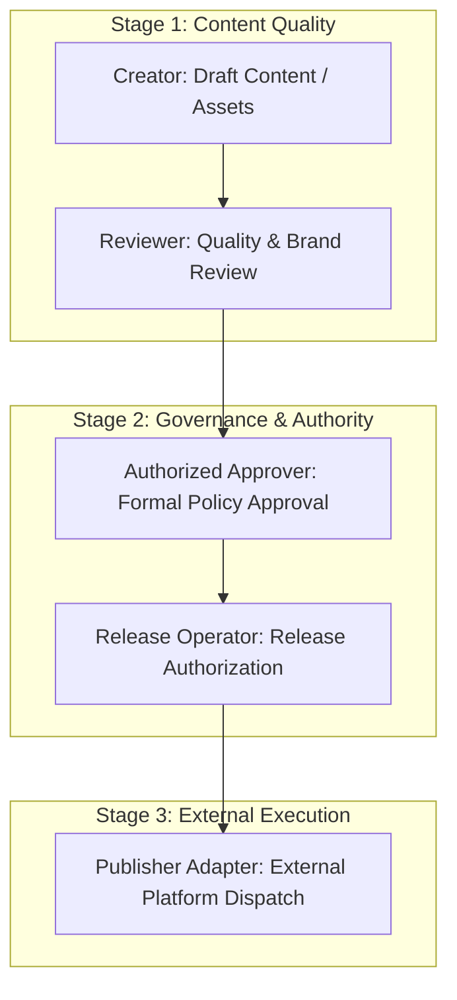
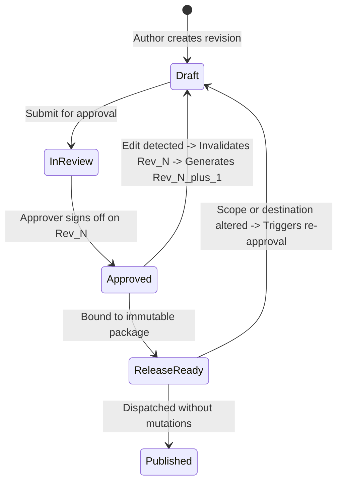
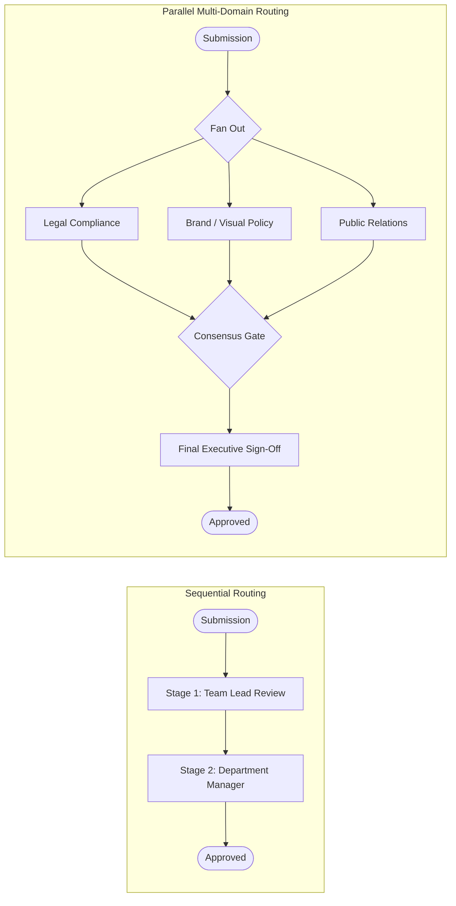
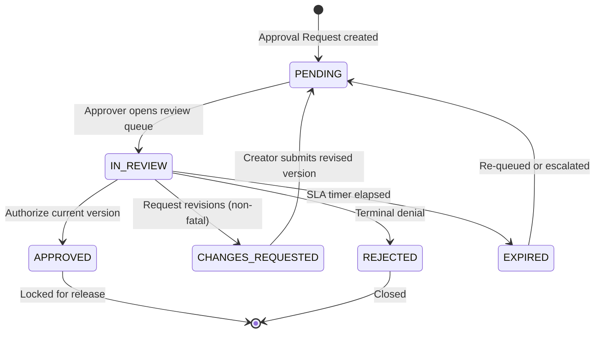
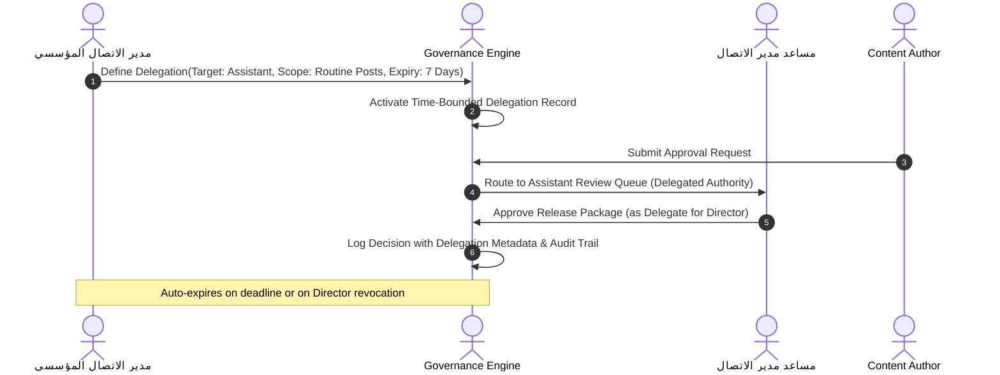
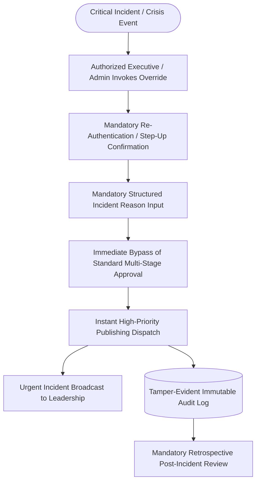
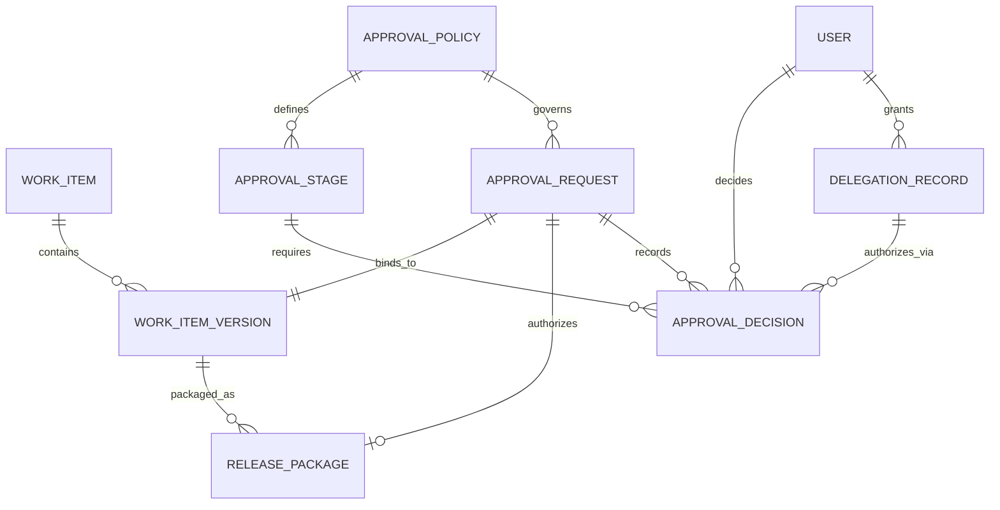

[[Comms Hub|Comms Hub Overview]] | [[MVP_draft|MVP UI Shell Draft]] | [[discussions_list|Master Discussions Index]] | [[disscussios/organizational_role_discussion|Organizational Role Discussion]] | [[disscussios/emergency_workflows|Emergency Workflows]] | [[disscussios/Second_discussion_draft|Second Discussion Draft]]

---

# Approval Policy Design — Communication Department Hub

> [!note] Status: Discussion record — not final approval specification
> **Status: Discussion record — not final approval specification**
>
> This document preserves the current discussion about review, approval, release authorization, approval policies, delegation, version binding, emergency overrides, and approval analytics.
>
> The ideas below are architectural directions. Exact roles, policy rules, approval stages, content categories, expiry rules, escalation behavior, and permissions are still under discussion.

---

## Structure Tree & Document Map

- [[#Approval Policy Design — Communication Department Hub|Overview & Scope]]
- **Part I: Foundational Concepts & Version Binding**
  - [[#1. Review, Approval, and Release Are Different|1. Review, Approval, and Release Are Different]]
  - [[#2. Approval Must Bind to a Specific Version|2. Approval Must Bind to a Specific Version]]
  - [[#3. Changes After Approval|3. Changes After Approval]]
  - [[#4. Approval Scope|4. Approval Scope]]
  - [[#5. Conservative First-Version Rule|5. Conservative First-Version Rule]]
- **Part II: Dynamic Approval Policies & Multi-Stage Engines**
  - [[#6. Approval Policies Instead of Hard-Coded Logic|6. Approval Policies Instead of Hard-Coded Logic]]
  - [[#7. Conditional Policy Selection|7. Conditional Policy Selection]]
  - [[#8. Explain Why Approval Is Required|8. Explain Why Approval Is Required]]
  - [[#9. Sequential and Parallel Approval Stages|9. Sequential and Parallel Approval Stages]]
  - [[#10. Approval Request as Its Own Object|10. Approval Request as Its Own Object]]
  - [[#11. Approval Decision Object|11. Approval Decision Object]]
  - [[#12. Decision Types|12. Decision Types]]
  - [[#13. Request Changes vs Reject|13. Request Changes vs Reject]]
  - [[#14. Contextual Review Comments|14. Contextual Review Comments]]
  - [[#15. Preserve Every Approval Cycle|15. Preserve Every Approval Cycle]]
  - [[#16. Changes During Multi-Stage Approval|16. Changes During Multi-Stage Approval]]
- **Part III: Release Authority, Publishing Binding & Post-Approval Lifecycle**
  - [[#17. Approval Status and Release Status Should Be Separate|17. Approval Status and Release Status Should Be Separate]]
  - [[#18. Approval and Publication Should Be Separate Actions|18. Approval and Publication Should Be Separate Actions]]
  - [[#19. Configurable Post-Approval Behavior|19. Configurable Post-Approval Behavior]]
  - [[#20. Schedule Changes May Affect Approval|20. Schedule Changes May Affect Approval]]
  - [[#21. Destination Changes May Affect Approval|21. Destination Changes May Affect Approval]]
  - [[#22. Exact Account Binding|22. Exact Account Binding]]
  - [[#23. Some Work Requires No Formal Approval|23. Some Work Requires No Formal Approval]]
- **Part IV: Risk Classification, Scoping & Governance Controls**
  - [[#24. Risk-Based Approval|24. Risk-Based Approval]]
  - [[#25. Contextual Approval Authority|25. Contextual Approval Authority]]
  - [[#26. Delegation|26. Delegation]]
  - [[#27. Delegation Scope|27. Delegation Scope]]
  - [[#28. Self-Approval|28. Self-Approval]]
  - [[#29. Separation of Duties|29. Separation of Duties]]
- **Part V: Operations, Timers, Escalations & UI Queues**
  - [[#30. Approval Expiry|30. Approval Expiry]]
  - [[#31. Stuck Approval Escalation|31. Stuck Approval Escalation]]
  - [[#32. Approval Reminders as Background Jobs|32. Approval Reminders as Background Jobs]]
  - [[#33. Approval Queue UX|33. Approval Queue UX]]
  - [[#34. Show Exactly What Is Being Approved|34. Show Exactly What Is Being Approved]]
  - [[#35. Approval Comments|35. Approval Comments]]
- **Part VI: Emergency Overrides, Policy Versioning & Determinism**
  - [[#36. Emergency Override|36. Emergency Override]]
  - [[#37. Emergency Override Permission|37. Emergency Override Permission]]
  - [[#38. Approval Policy Versioning|38. Approval Policy Versioning]]
  - [[#39. Policy Changes Do Not Rewrite History|39. Policy Changes Do Not Rewrite History]]
  - [[#40. Pending Requests During Policy Changes|40. Pending Requests During Policy Changes]]
  - [[#41. Deterministic Policy Resolution|41. Deterministic Policy Resolution]]
  - [[#42. Safe Fallback Policy|42. Safe Fallback Policy]]
- **Part VII: Automation, Conceptual Data Model & Starting Matrix**
  - [[#43. Pre-Submission Quality Checks|43. Pre-Submission Quality Checks]]
  - [[#44. AI Assistance During Review|44. AI Assistance During Review]]
  - [[#45. Approval Engine and Job System Separation|45. Approval Engine and Job System Separation]]
  - [[#46. Approval, Audit, and Job Are Different|46. Approval, Audit, and Job Are Different]]
  - [[#47. Conceptual Data Model|47. Conceptual Data Model]]
  - [[#48. Employee Experience Should Remain Simple|48. Employee Experience Should Remain Simple]]
  - [[#49. Approval Workload Management|49. Approval Workload Management]]
  - [[#50. Approval Analytics|50. Approval Analytics]]
  - [[#51. Avoid Building a Full Workflow Designer Initially|51. Avoid Building a Full Workflow Designer Initially]]
  - [[#52. Proposed Starting Approval Model|52. Proposed Starting Approval Model]]
    - [[#Internal Low-Risk Work|Internal Low-Risk Work]]
    - [[#Routine External Content|Routine External Content]]
    - [[#Higher-Risk External Content|Higher-Risk External Content]]
    - [[#Emergency|Emergency]]
  - [[#53. Core Principle|53. Core Principle]]
  - [[#54. Still Unresolved|54. Still Unresolved]]

---

# 1. Review, Approval, and Release Are Different

The approval system should distinguish three concepts:

```text
REVIEW
"Is this work good/correct?"

APPROVAL
"Do I authorize this version?"

RELEASE
"May the organization actually send/publish it?"
```

A useful high-level workflow is:

```text
CREATE
  ↓
QUALITY REVIEW
  ↓
FORMAL APPROVAL
  ↓
RELEASE AUTHORIZED
  ↓
PUBLISH / SEND
```

These should not necessarily use the same permission.

---


### Approval Stage Separation Architecture


> [!tip] Architectural Separation
> For operational role mappings, see [[disscussios/organizational_role_discussion#11. Publishing Officer as Release Operator|Publishing Officer as Release Operator]] and the [[MVP_draft#22. Approvals Tab|MVP Approvals Tab]].


# 2. Approval Must Bind to a Specific Version

The system should not approve a Work Item in the abstract.

It should approve a specific revision or release package.

Example:

```text
Work Item #248
Revision 7
```

For external publication, approval may apply to an exact release package:

```text
Release Package #R7

Arabic master copy:
Revision 7

Instagram caption:
Revision 4

X copy:
Revision 3

LinkedIn copy:
Revision 2

Image:
asset_882
Version 5

Video:
asset_1031
Version 2

Accounts:
Instagram @organization
X @organization

Scheduled:
18 Sep 2026 18:00
```

The approver authorizes that exact package.

---

# 3. Changes After Approval

Dangerous workflow:

```text
Manager approves
      ↓
Employee edits caption
      ↓
System publishes edited caption
```

Correct workflow:

```text
Manager approves Release Package A
      ↓
Employee edits caption
      ↓
Release Package B created
      ↓
Approval status:
OUTDATED
      ↓
Reapproval required
```

The system should clearly display:

> Content changed after approval. Reapproval required.

This must be enforced by the backend, not only the UI.

---


### Version-Bound Invalidation State Machine


> [!warning] Invalidation Rule
> Any post-approval mutation strictly invalidates the existing approval signature. See [[disscussios/storage_lifecycle_disaster_recovery#15. Asset Version Immutability|Storage Lifecycle & Asset Version Immutability]] and [[MVP_draft#17. Work Item Lifecycle|MVP Work Item Lifecycle]].


# 4. Approval Scope

Not every change should invalidate approval.

A social-publication approval might cover:

```text
✓ Public text
✓ Selected media versions
✓ Destination accounts
✓ Platform variants
✓ Publication date
✓ Publication time
```

It may not cover:

```text
Internal comments
Internal tags
Private notes
Task assignment
```

Changing internal metadata should not necessarily restart the approval process.

---

# 5. Conservative First-Version Rule

For the first implementation:

> Any modification to approved public-facing content or approved media invalidates approval.

This keeps behavior:

- predictable
- auditable
- safe

More nuanced behavior can be added later.

---

# 6. Approval Policies Instead of Hard-Coded Logic

Approval rules should be policy-driven.

Example:

```text
Policy:
NORMAL_SOCIAL_POST

Stage 1:
Communications Manager
```

Another:

```text
Policy:
PRESS_RELEASE

Stage 1:
Communications Manager

Stage 2:
Department Director
```

Another:

```text
Policy:
HIGH_SENSITIVITY_PUBLICATION

Stage 1:
Communications Manager

Stage 2:
Department Director

Stage 3:
Executive Approval
```

The engine should support future roles without being tied to current role names.

---

# 7. Conditional Policy Selection

Policies may be selected based on conditions.

Example:

```text
IF
Content Type = Social Post
AND
Campaign Risk = Standard

USE
NORMAL_SOCIAL_POST
```

Another:

```text
IF
Content Type = Press Release

USE
PRESS_RELEASE_POLICY
```

Potential policy inputs:

```text
Content type
Campaign
Channel
Department
Sensitivity
External/internal
Account
Audience
Emergency status
```

---

# 8. Explain Why Approval Is Required

The system should show why an item requires approval.

Example:

```text
Approval Required

Policy:
External Social Publication

Reason:
This item will be published to an
official organizational account.

Required:
1. Communications Manager
```

This makes approval transparent rather than arbitrary.

---

# 9. Sequential and Parallel Approval Stages

Sequential approval:

```text
Manager
   ↓
Director
   ↓
Executive
```

Parallel review:

```text
          ┌─ Legal Review
Content ──┤
          └─ Brand Review
```

Then:

```text
Legal ✓
Brand ✓
    ↓
Manager final approval
```

The architecture should support both concepts even if MVP mostly uses sequential approval.

---


### Sequential vs Parallel Multi-Stage Pipeline


> [!note] Policy Routing
> For concrete role-policy assignments, see [[disscussios/organizational_role_discussion#19. Approval Policies with Real Roles|Approval Policies with Real Roles]].


# 10. Approval Request as Its Own Object

Avoid a single field such as:

```text
work_item.approved = true
```

Instead:

```text
Approval Request #882

Work Item:
#248

Release Package:
Revision 7

Policy:
NORMAL_SOCIAL_POST

Requested by:
Sara

Requested at:
10:42

Current stage:
Manager Approval

Status:
PENDING
```

Approval decisions should be stored separately.

---

# 11. Approval Decision Object

Example:

```text
Decision #1

Approver:
Mohammed

Decision:
APPROVED

At:
11:07

Comment:
Ready for publishing.
```

This creates historical accountability.

---

# 12. Decision Types

Possible decisions:

```text
APPROVE
REQUEST_CHANGES
REJECT
```

Potential future options:

```text
DELEGATE
ABSTAIN
```

`REQUEST_CHANGES` and `REJECT` should not mean the same thing.

---

# 13. Request Changes vs Reject

Request Changes:

> The work remains valid, but requires revision.

Example:

```text
REQUEST CHANGES

"Replace image 3 and correct the date."
```

Reject:

> The item should not proceed in its current purpose.

Example:

```text
REJECT

"This announcement has been cancelled."
```

---


### Decision Outcomes & Review Transitions


> [!important] Non-Fatal Review Cycle
> Requesting changes does not terminate the work item; it returns the draft to the author with structured feedback. See [[MVP_draft#19. Work Item Detail Drawer|MVP Work Item Detail Drawer]].


# 14. Contextual Review Comments

Approvers should be able to attach comments to specific components.

Examples:

```text
Instagram Caption

"Use the approved organization terminology."
```

```text
Image 2

"Logo spacing needs correction."
```

This reduces vague review cycles.

---

# 15. Preserve Every Approval Cycle

Example:

```text
Approval Cycle 1
Version 1
Changes requested

Approval Cycle 2
Version 2
Approved
```

Do not overwrite earlier review history.

This later supports:

- audit
- analytics
- training
- process improvement

---

# 16. Changes During Multi-Stage Approval

Example:

```text
Manager        ✓
Director       ✓
Legal          pending
```

If public content changes:

- historical approvals remain recorded
- those approvals do not automatically apply to the new version
- a new approval request should normally begin

This is the safest default.

---

# 17. Approval Status and Release Status Should Be Separate

Possible approval states:

```text
DRAFT
READY_FOR_REVIEW
APPROVAL_REQUESTED
IN_REVIEW
CHANGES_REQUESTED
RESUBMITTED
APPROVED
APPROVAL_OUTDATED
REJECTED
CANCELLED
```

Possible release states:

```text
NOT_READY
READY_TO_RELEASE
SCHEDULED
PUBLISHING
PUBLISHED
PARTIALLY_PUBLISHED
FAILED
```

An item can be approved without yet being published.

---

# 18. Approval and Publication Should Be Separate Actions

Avoid treating:

```text
[Approve & Publish]
```

as the only normal workflow.

Prefer:

```text
[Approve]
```

then:

```text
Ready for publication.

[Publish Now]
[Schedule]
```

Automatic post-approval publishing can exist as an explicit policy choice.

---

> [!tip] Publishing Decoupling
> Decoupling approval sign-off from platform dispatch allows release queue scheduling. See [[disscussios/Second_discussion_draft#19. Publishing Orchestrator Architecture|Second Discussion Draft - Publishing Orchestrator Architecture]] and [[MVP_draft#25. Publishing Tab|MVP Publishing Preflight Tab]].

# 19. Configurable Post-Approval Behavior

Example policy setting:

```text
After final approval:

○ Mark ready for publishing
● Keep existing schedule
○ Publish immediately
```

The safest defaults are usually:

- mark ready
- honor an approved schedule

Immediate publication should be intentional.

---

# 20. Schedule Changes May Affect Approval

If an approver authorized:

```text
Publish tomorrow at 18:00
```

and someone changes it to:

```text
02:00
```

the operational intent changed.

Schedule may therefore be part of approval scope.

---

# 21. Destination Changes May Affect Approval

If an item was approved for:

```text
Instagram only
```

changing it to:

```text
Instagram + X + LinkedIn
```

should require new or expanded approval.

Approvers authorize specific destinations, not unlimited destinations.

---

# 22. Exact Account Binding

Approval should bind to exact account IDs.

Example:

```text
Instagram:
@charity_official
```

should not silently become:

```text
@ceo_personal
```

The release package should include exact destination accounts.

---

> [!important] Target Binding
> Approvals must bind to exact target destination credentials. See [[disscussios/connected_account_secrets_management#2. Target Account Binding|Target Account Binding]].

# 23. Some Work Requires No Formal Approval

Not every action needs management approval.

Examples:

- internal reminder
- draft notes
- early concept work
- low-risk internal tasks

Policies may include:

```text
NO_FORMAL_APPROVAL
```

The system should avoid unnecessary bureaucracy.

---

# 24. Risk-Based Approval

Design principle:

> Use the minimum approval appropriate to the risk.

Example:

| Work | Possible Policy |
|---|---|
| Internal draft | No formal approval |
| Routine social post | Manager |
| Major campaign launch | Manager + Director |
| Press statement | Manager + Director |
| Sensitive public correction | Special policy |
| Emergency correction | Authorized emergency override |

These are examples only.

---

# 25. Contextual Approval Authority

An approver may be authorized for some content categories but not others.

Example:

```text
Manager

Can approve:
✓ Standard social posts
✓ Event photography
✓ Internal communications

Cannot final-approve:
✕ Press releases
✕ Legal statements
✕ Crisis communication
```

Authority should come from permission plus policy.

---

# 26. Delegation

Approval authority should be delegatable during leave or temporary absence.

Example:

```text
Mohammed
Communications Manager

Delegates approval authority to:
Sara

From:
22 Sep

Until:
30 Sep

Scope:
Normal Social Content
```

Audit history:

```text
Approved by:
Sara

Acting under delegated authority from:
Mohammed
```

---


### Temporary Authority Delegation Sequence


> [!tip] Delegation Governance
> Temporary delegation must maintain an unbroken audit trail identifying both the original role owner and the acting delegate. See [[disscussios/organizational_role_discussion#25. Temporary Position Assignment|Temporary Position Assignment]].


# 27. Delegation Scope

Delegation should be limited.

Example:

```text
Delegated:
NORMAL_SOCIAL
```

but not necessarily:

```text
EMERGENCY_OVERRIDE
USER_ADMINISTRATION
SECURITY_POLICY
```

Delegation should be permission/policy-specific.

---

# 28. Self-Approval

Self-approval should be configurable by policy.

Example:

```text
Self approval:
DISALLOWED
```

for sensitive workflows.

Possibly:

```text
Self approval:
ALLOWED
```

for low-risk workflows.

The system should not assume one global rule.

---

# 29. Separation of Duties

Higher-risk policies may require:

```text
creator != final approver
```

or:

```text
publisher != approver
```

Example:

```text
Sara creates
Mohammed approves
Automation publishes
```

This creates stronger control for important releases.

---

# 30. Approval Expiry

Some approvals may have a validity period.

Examples:

```text
Approval validity:
7 days
```

or:

```text
Valid until campaign end
```

Possible transition:

```text
APPROVED
      ↓
time passes
      ↓
EXPIRED
```

Reapproval may then be required.

---

# 31. Stuck Approval Escalation

Example:

```text
Approval waiting:
28 hours
```

Possible policy:

```text
12h → reminder
24h → second reminder
48h → escalation
```

The exact timing should be configurable.

---

# 32. Approval Reminders as Background Jobs

Approval reminder logic can use the background-job system.

Example:

```text
Approval requested
      ↓
No action after configured period
      ↓
Reminder job
      ↓
Still pending
      ↓
Escalation job
```

Once approved, remaining reminder jobs should be cancelled.

---

> [!note] Reminder Scheduling
> Timers and escalation reminders are executed by delayed job queues. See [[disscussios/failure_handling_background_jobs#15. Delayed and Scheduled Jobs|Failure Handling - Scheduled Jobs]] and [[disscussios/notification_model#12. Urgent vs Digest Routing|Notification Model - Urgent Routing]].

# 33. Approval Queue UX

Possible Manager view:

```text
APPROVALS

Needs My Review                4
────────────────────────────────

National Day Reel
Sara
Submitted 18 min ago
[Review]

Press Release — Event Opening
Ahmed
Submitted 2h ago
[Review]

Weekly Instagram Post
Mona
Submitted yesterday
[Review]
```

Useful filters:

```text
priority
due date
campaign
content type
request age
requester
```

---

# 34. Show Exactly What Is Being Approved

The approval screen should clearly show:

```text
YOU ARE APPROVING

Content:
National Day Campaign — Release 7

Destinations:
Instagram @organization
X @organization
LinkedIn Organization Page

Schedule:
23 Sep 2026
18:00 Riyadh

Media:
3 approved assets

After approval:
Content will become eligible for scheduled publication.
```

Then:

```text
[Request Changes]
[Reject]
[Approve]
```

---

# 35. Approval Comments

Routine approval:

```text
Comment optional
```

Sensitive approval:

```text
Approval note required
```

Request Changes and Reject should normally require a reason.

---

# 36. Emergency Override

Urgent public corrections may require bypassing normal approval.

The system should explicitly record:

```text
NORMAL APPROVAL BYPASSED
```

along with:

```text
Actor
Reason
Timestamp
Affected channels
Content version
```

Potentially:

```text
Follow-up review required
```

Emergency override should never pretend the normal workflow occurred.

---


### Emergency Override & Incident Audit Pipeline


> [!warning] Emergency Governance
> Emergency overrides bypass standard gating but require mandatory post-incident audit reviews. See [[disscussios/emergency_workflows#1. What Counts as an Emergency|Emergency Workflows - Emergency Definition]] and [[disscussios/emergency_workflows#17. Emergency Control Panel|Emergency Control Panel]].


# 37. Emergency Override Permission

Emergency release should be a high-risk permission, such as:

```text
approval.emergency_override
```

It may require:

- selected Manager/Admin users
- step-up authentication
- mandatory reason
- strong audit logging

---

# 38. Approval Policy Versioning

Policies themselves must be versioned.

Example:

```text
September 1:
Social posts require Manager approval.

September 20:
Social posts require Manager + Director.
```

Approval requests should record:

```text
policy_id
policy_version
```

Example:

```text
NORMAL_SOCIAL
Version 3
```

---

# 39. Policy Changes Do Not Rewrite History

A publication approved under Policy v2 should remain recorded as:

```text
Approved according to Policy v2
```

even after Policy v3 exists.

Historical approvals must remain interpretable.

---

# 40. Pending Requests During Policy Changes

A predictable default is:

> Existing approval requests remain bound to the policy version under which they started unless explicitly migrated.

New requests use the new policy version.

---

# 41. Deterministic Policy Resolution

If multiple policies match, resolution must be deterministic.

Possible approach:

```text
Sensitive Content      priority 100
Press Release          priority 80
Standard Social        priority 20
Default                priority 0
```

Another possible rule is that the most restrictive applicable policy wins.

The exact method is still undecided.

---

# 42. Safe Fallback Policy

If no policy matches, the system should not silently assume:

```text
No approval required.
```

A safer fallback is:

```text
Policy unresolved.

Manager review required before external release.
```

This follows the default-deny security philosophy.

---

# 43. Pre-Submission Quality Checks

Before submission:

```text
PRE-SUBMISSION CHECK

✓ Required title
✓ Media attached
✓ Platform variants complete
✓ Links valid
⚠ Missing alt text
✓ Selected channels connected
```

These checks reduce wasted review time.

Automatic checks are validation gates, not human approval.

---

# 44. AI Assistance During Review

AI may assist with:

```text
Potential typo found
Image may crop poorly
Platform variant differs materially
Terminology differs from previous approved wording
```

AI should not substitute for formal authorization.

---

# 45. Approval Engine and Job System Separation

Approval determines authorization.

Background jobs perform execution.

Example:

```text
Final approval
      ↓
Release state updated
      ↓
Relevant jobs created
```

Depending on policy:

```text
Existing schedule
→ publication jobs remain scheduled
```

```text
Manual release
→ wait for Publish action
```

```text
Auto-publish enabled
→ create publishing jobs
```

---

> [!note] Engine Separation
> Approval state evaluation must remain synchronous in database transactions, while side effects run asynchronously. See [[disscussios/failure_handling_background_jobs#1. Why Background Jobs Are Mandatory|Failure Handling - Background Jobs]].

# 46. Approval, Audit, and Job Are Different

Example:

```text
APPROVAL DECISION
Mohammed approved Release Package #77.
```

```text
AUDIT EVENT
Mohammed performed APPROVAL_GRANTED.
```

```text
JOB
Instagram publication scheduled for 18:00.
```

These records have different purposes and should remain separate.

---

# 47. Conceptual Data Model

```text
ApprovalPolicy
     │
     ├── Policy Version
     │
     └── Approval Stages
              │
              ├── Required role/permission
              ├── Sequential/parallel
              └── Conditions

Work Item
     │
     ▼
Release Package / Revision
     │
     ▼
Approval Request
     │
     ├── Policy Version
     ├── Current Stage
     └── Status
              │
              ▼
        Approval Decisions
```

Then:

```text
Final Approval
      ↓
Release Authorization
      ↓
Publication Jobs
```

---


### Approval Governance Conceptual Data Model


> [!note] Data Model Alignment
> For job system separation and async queue integration, see [[disscussios/failure_handling_background_jobs#1. Why Background Jobs Are Mandatory|Failure Handling - Mandatory Background Jobs]] and [[MVP_draft#15. Work Page|MVP Work Page]].


# 48. Employee Experience Should Remain Simple

Employee flow:

```text
[Submit for Approval]
```

Then:

```text
Awaiting Mohammed's review
Submitted 12 minutes ago
```

Later:

```text
Changes requested

"Please replace image 2 and update
the final sentence."

[Create Revision]
```

The backend can be sophisticated while the user experience remains straightforward.

---

# 49. Approval Workload Management

Approvals can become a bottleneck if not managed well.

The queue should support:

```text
priority
due date
campaign
content type
request age
requester
```

The approval system should reduce approval delay rather than merely digitize it.

---

# 50. Approval Analytics

Potential metrics:

```text
Average approval time
Average revision cycles
First-review approval rate
Items waiting >24h
Approval bottleneck by stage
Content types requiring most revisions
Average Draft → Approved time
```

These metrics should support process improvement rather than surveillance.

---

# 51. Avoid Building a Full Workflow Designer Initially

Version one should not become a complex drag-and-drop enterprise workflow builder.

A simpler structured configuration is better.

Example:

```text
Admin creates Approval Policy

Content type:
Social Post

Stages:
1. Manager

Self approval:
No

Approval expires:
Never

Changes invalidate:
Public content + media + destinations + schedule
```

The system can expand later if real workflows require more complexity.

---

# 52. Proposed Starting Approval Model

## Internal Low-Risk Work

```text
No formal approval
or lightweight review
```

## Routine External Content

```text
Employee creates
      ↓
Manager approves
      ↓
Ready for publishing
      ↓
Manual / scheduled publish
```

## Higher-Risk External Content

```text
Employee creates
      ↓
Manager approves
      ↓
Second authorized approver
      ↓
Ready for publishing
```

## Emergency

```text
Authorized Manager/Admin
      ↓
Emergency override
      ↓
Reason required
      ↓
Step-up confirmation
      ↓
Release
      ↓
Strong audit + follow-up review
```

Actual organizational categories and approvers still need to be discovered.

---

# 53. Core Principle

The approval system can be summarized as:

> **Approval belongs to a specific version of a specific release, under a specific policy, by a specific authorized person.**

This is substantially safer and more auditable than simply saying:

> “The post is approved.”

---

^approval-policy-boundary

> [!important] Policy Governance Hub
> Cross-reference with [[discussions_list#4. Approval Policies and Dynamic Routing|Discussions List - Approval Policies]] and [[Comms Hub#Master Vault Document Map|Comms Hub Master Map]].

# 54. Still Unresolved

We still need to decide:

- Exact approval roles
- Exact content-risk categories
- Default approval policies
- Which metadata changes invalidate approval
- Whether schedule always belongs to approval scope
- Approval expiry rules
- Self-approval rules
- Delegation rules
- Escalation timing
- Emergency override permissions
- Parallel approval requirements
- Approval comment requirements
- Policy priority/resolution rules
- How pending approvals react to policy changes
- Which approval metrics belong in Manager analytics

This document preserves the approval-policy discussion only and is not yet the final approval architecture.

---

## External Architectural & Standards References

- **NIST Attribute Based Access Control**: [NIST SP 800-162 ABAC Guide](https://csrc.nist.gov/publications/detail/sp/800-162/final)
- **ISO/IEC 27001 Access Control & Separation of Duties**: [ISO/IEC 27001 Security Standards](https://www.iso.org/standard/27001)
- **RFC 4949 Internet Security Glossary (Authorization & Duties)**: [RFC 4949 Specification](https://datatracker.ietf.org/doc/html/rfc4949)
- **Mermaid Diagrams Specification**: [Mermaid Sequence and State Documentation](https://mermaid.js.org/)

