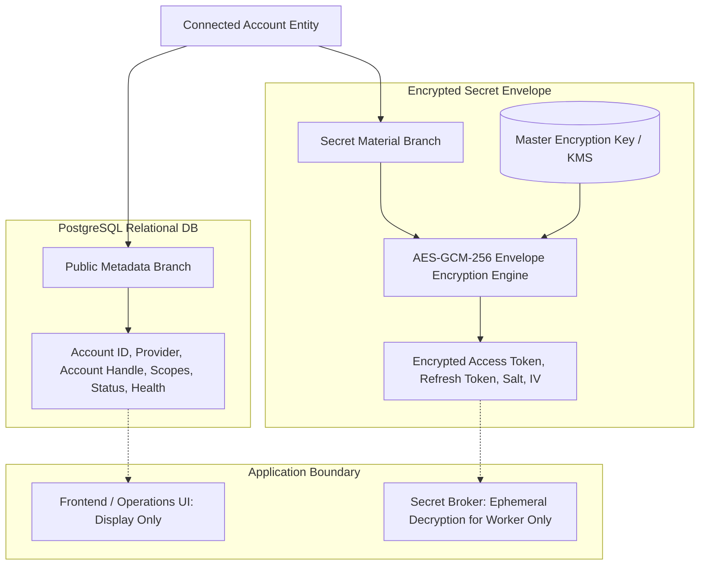
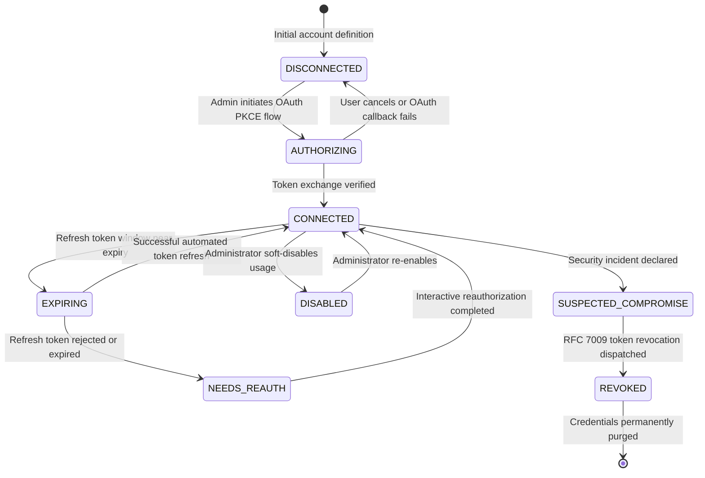
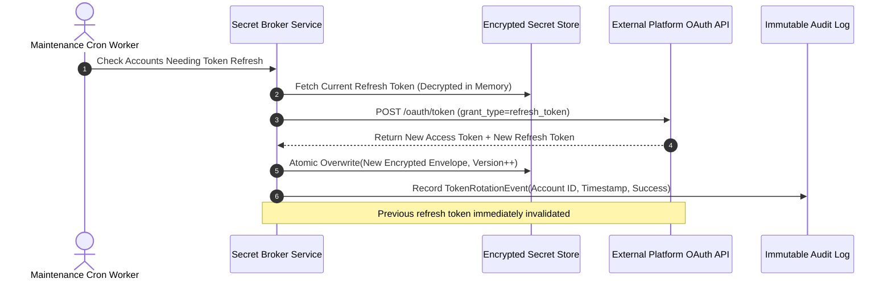
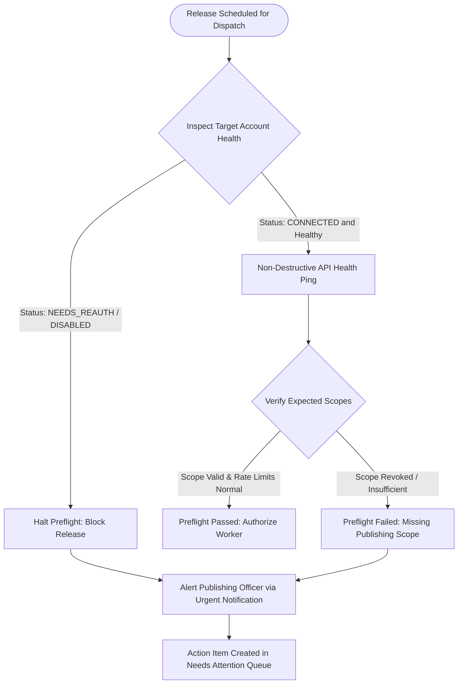
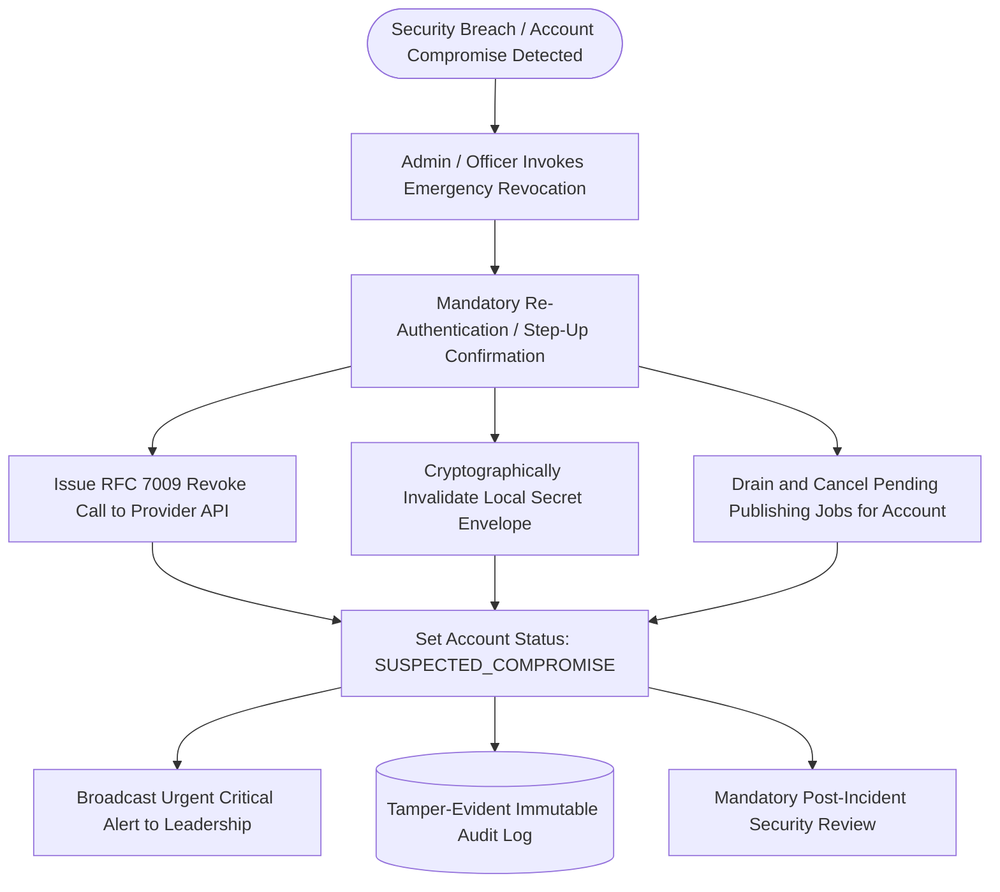
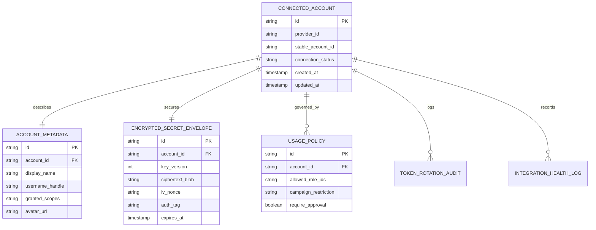

[[Comms Hub|Comms Hub Overview]] | [[MVP_draft|MVP UI Shell Draft]] | [[discussions_list|Master Discussions Index]] | [[disscussios/approval_policy_design|Approval Policy Design]] | [[disscussios/storage_lifecycle_disaster_recovery|Storage Lifecycle and Disaster Recovery]] | [[disscussios/failure_handling_background_jobs|Failure Handling Background Jobs]]

---

# Connected-Account and Secrets Management — Communication Department Hub

> **Status: Discussion record — not final integration/security specification**
>
> This document preserves the current discussion about connected organizational accounts, OAuth, dynamic secrets, credential encryption, integration health, token lifecycle, environment separation, service isolation, revocation, and recovery.
>
> The concepts below are architectural directions only. Exact providers, OAuth implementations, encryption mechanisms, key-management systems, refresh behavior, health-check frequency, service boundaries, and production policies are still under discussion.

---

## Structure Tree & Document Map

- [[#Connected-Account and Secrets Management — Communication Department Hub|Overview & Security Scope]]
- **Part I: Organizational Resource & Secret Separation**
  - [[#1. A Connected Account Is an Organizational Resource|1. A Connected Account Is an Organizational Resource]]
  - [[#2. ConnectedAccount Should Be a First-Class Object|2. ConnectedAccount Should Be a First-Class Object]]
  - [[#3. Account Metadata and Secret Material Must Be Separate|3. Account Metadata and Secret Material Must Be Separate]]
  - [[#4. Secret Categories|4. Secret Categories]]
    - [[#Application Secrets|Application Secrets]]
    - [[#Organizational OAuth Tokens|Organizational OAuth Tokens]]
    - [[#Infrastructure Credentials|Infrastructure Credentials]]
    - [[#Cryptographic Secrets|Cryptographic Secrets]]
  - [[#5. Static Secrets vs Dynamic Secrets|5. Static Secrets vs Dynamic Secrets]]
  - [[#6. Dynamic Token Storage Options|6. Dynamic Token Storage Options]]
    - [[#Option A — Controlled Vault Storage|Option A — Controlled Vault Storage]]
    - [[#Option B — Application-Level Encryption|Option B — Application-Level Encryption]]
  - [[#7. Do Not Invent Cryptography|7. Do Not Invent Cryptography]]
  - [[#8. Plaintext Secret Lifetime Should Be Minimal|8. Plaintext Secret Lifetime Should Be Minimal]]
  - [[#9. Humans Should Not Normally View Secrets|9. Humans Should Not Normally View Secrets]]
- **Part II: OAuth Security, Permissions & Connection States**
  - [[#10. OAuth Should Be the Standard Connection Mechanism|10. OAuth Should Be the Standard Connection Mechanism]]
  - [[#11. Protect the OAuth Flow|11. Protect the OAuth Flow]]
  - [[#12. Minimum Provider Scopes|12. Minimum Provider Scopes]]
  - [[#13. Show Granted Permissions|13. Show Granted Permissions]]
  - [[#14. Provider Permissions and Internal Permissions Are Separate|14. Provider Permissions and Internal Permissions Are Separate]]
  - [[#15. Connected Accounts Need Internal Usage Policy|15. Connected Accounts Need Internal Usage Policy]]
  - [[#16. Rich Connection States|16. Rich Connection States]]
  - [[#17. Reconnect the Existing Logical Account|17. Reconnect the Existing Logical Account]]
  - [[#18. Token Metadata|18. Token Metadata]]
- **Part III: Lifecycle Automation, Token Rotation & Health Verification**
  - [[#19. Token Maintenance as Background Jobs|19. Token Maintenance as Background Jobs]]
  - [[#20. Refresh-Token Rotation|20. Refresh-Token Rotation]]
  - [[#21. Secret Updates Must Be Atomic|21. Secret Updates Must Be Atomic]]
  - [[#22. Integration Health|22. Integration Health]]
  - [[#23. Health Checks Must Be Non-Destructive|23. Health Checks Must Be Non-Destructive]]
  - [[#24. Publishing Preflight Checks Integration Health|24. Publishing Preflight Checks Integration Health]]
  - [[#25. Pre-Schedule Readiness Checks|25. Pre-Schedule Readiness Checks]]
  - [[#26. Disable vs Disconnect / Revoke|26. Disable vs Disconnect / Revoke]]
    - [[#Disable|Disable]]
    - [[#Disconnect / Revoke|Disconnect / Revoke]]
  - [[#27. Disconnect Must Show Impact|27. Disconnect Must Show Impact]]
  - [[#28. Disconnect Must Preserve History|28. Disconnect Must Preserve History]]
  - [[#29. Account Replacement|29. Account Replacement]]
- **Part IV: Multi-Account Scope, Channel Types & Credential Brokerage**
  - [[#30. Multiple Accounts Per Provider|30. Multiple Accounts Per Provider]]
  - [[#31. Use Stable Provider IDs|31. Use Stable Provider IDs]]
  - [[#32. Connected Account Types Beyond Social Media|32. Connected Account Types Beyond Social Media]]
  - [[#33. Mail Integrations Are Especially Sensitive|33. Mail Integrations Are Especially Sensitive]]
  - [[#34. Service Isolation|34. Service Isolation]]
  - [[#35. Credential Service / Secret Broker|35. Credential Service / Secret Broker]]
  - [[#36. AI Must Never Receive Raw Secrets|36. AI Must Never Receive Raw Secrets]]
  - [[#37. Never Log Plaintext Secrets|37. Never Log Plaintext Secrets]]
  - [[#38. Error Messages Must Not Leak Secrets|38. Error Messages Must Not Leak Secrets]]
  - [[#39. Credential Lifecycle Events Should Be Audited|39. Credential Lifecycle Events Should Be Audited]]
  - [[#40. Secret Metadata vs Secret Material|40. Secret Metadata vs Secret Material]]
- **Part V: Encryption Architecture, Key Management & Environment Hygiene**
  - [[#41. Secret Rotation|41. Secret Rotation]]
  - [[#42. Master Encryption Key|42. Master Encryption Key]]
  - [[#43. Development Must Not Use Production Connected Accounts|43. Development Must Not Use Production Connected Accounts]]
  - [[#44. Environment Separation|44. Environment Separation]]
  - [[#45. Database Copies Must Strip Live Secrets|45. Database Copies Must Strip Live Secrets]]
  - [[#46. Webhook Secrets|46. Webhook Secrets]]
  - [[#47. Webhook Rotation|47. Webhook Rotation]]
  - [[#48. NAS Credentials|48. NAS Credentials]]
  - [[#49. Backup Credentials|49. Backup Credentials]]
  - [[#50. AI Provider Credentials|50. AI Provider Credentials]]
- **Part VI: Governance Workflows, Compromise Response & Health Orchestration**
  - [[#51. Connected-Account Ownership Metadata|51. Connected-Account Ownership Metadata]]
  - [[#52. Reauthorization Workflow|52. Reauthorization Workflow]]
  - [[#53. Suspected Credential Compromise Workflow|53. Suspected Credential Compromise Workflow]]
  - [[#54. Provider Outage vs Credential Failure|54. Provider Outage vs Credential Failure]]
  - [[#55. Track Expected Scopes|55. Track Expected Scopes]]
  - [[#56. Connection Health Feeds Other Systems|56. Connection Health Feeds Other Systems]]
  - [[#57. Central Integrations Page|57. Central Integrations Page]]
  - [[#58. Connection and Permission Should Be Shown Separately|58. Connection and Permission Should Be Shown Separately]]
  - [[#59. Secret Recovery|59. Secret Recovery]]
  - [[#60. Backups Containing Secrets Are Highly Sensitive|60. Backups Containing Secrets Are Highly Sensitive]]
  - [[#61. Secrets Committed to Git Must Be Rotated|61. Secrets Committed to Git Must Be Rotated]]
  - [[#62. Codex Does Not Need Production Secret Values|62. Codex Does Not Need Production Secret Values]]
- **Part VII: Architecture Synthesis, Security Tiers & Foundations**
  - [[#63. OAuth App Configuration Is Infrastructure|63. OAuth App Configuration Is Infrastructure]]
  - [[#64. Security Tiers for Connected-Account Actions|64. Security Tiers for Connected-Account Actions]]
  - [[#65. Provider State Is Ultimately External|65. Provider State Is Ultimately External]]
  - [[#66. Connected Accounts Need Periodic Verification|66. Connected Accounts Need Periodic Verification]]
  - [[#67. Service-to-Service Credentials|67. Service-to-Service Credentials]]
  - [[#68. Prefer Short-Lived Credentials Where Practical|68. Prefer Short-Lived Credentials Where Practical]]
  - [[#69. Conceptual Connected-Account Architecture|69. Conceptual Connected-Account Architecture]]
  - [[#70. Practical Early Architecture|70. Practical Early Architecture]]
  - [[#71. Recommended First Production Foundations|71. Recommended First Production Foundations]]
  - [[#72. Core Principle|72. Core Principle]]
  - [[#73. Still Unresolved|73. Still Unresolved]]

---

# 1. A Connected Account Is an Organizational Resource

If Ahmed connects:

```text
Instagram
@charity_official
```

the account should not conceptually belong to Ahmed.

Instead:

```text
ORGANIZATION
    │
    ▼
CONNECTED ACCOUNT
Instagram @charity_official

Authorized by:
Ahmed

Managed by:
Communication Department
```

Ahmed authorizes the connection.

The organization owns the connected resource.

This distinction matters when an employee:

- changes roles
- goes on leave
- leaves the organization
- loses publishing permission

---

> [!tip] Institutional Ownership
> Connected social media accounts and publishing credentials belong exclusively to the organization, not to the personal profiles of the employees who connected them. See [[disscussios/organizational_role_discussion#10. مسؤول النشر وإدارة الحسابات — High-Risk Operational Role|Publishing & Account Officer Role]].

# 2. ConnectedAccount Should Be a First-Class Object

Conceptual model:

```text
ConnectedAccount

id
organization_id
department_id

provider
provider_account_id
display_name
username

status

authorized_by_user_id
authorized_at

last_verified_at

permissions/scopes

connection_health

secret_reference
```

Example:

```text
Connected Account #17

Provider:
Instagram

Account:
@charity_official

Owner:
Communication Department

Authorized by:
Ahmed

Status:
CONNECTED

Permissions:
Publish content
Read insights

Last verified:
18 Sep 2026
```

Credentials themselves should live separately.

---

# 3. Account Metadata and Secret Material Must Be Separate

Avoid storing normal metadata and credentials together.

Prefer:

```text
ConnectedAccount
      │
      ▼
Secret Reference
      │
      ▼
Encrypted Secret Storage
```

The normal application should be able to query:

```text
Instagram @charity_official
```

without returning:

```text
access_token
refresh_token
client_secret
```

This reduces accidental exposure.

---


### Metadata vs Secret Material Encryption Pipeline


> [!important] Separation of Secrets
> Database dumps and application logs must only ever contain public metadata; secret tokens are encrypted with AES-GCM-256 and never surfaced in cleartext. See [[MVP_draft#38. Settings Page|MVP Settings Page]].


# 4. Secret Categories

The system will likely contain several different secret types.

## Application Secrets

Examples:

```text
Supabase service credential
AI provider API key
OAuth client secret
Webhook signing secret
```

## Organizational OAuth Tokens

Examples:

```text
Instagram access token
LinkedIn refresh token
YouTube OAuth refresh token
Microsoft/Google mail authorization
```

## Infrastructure Credentials

Examples:

```text
NAS service account
Backup storage credential
S3 credential
```

## Cryptographic Secrets

Examples:

```text
Token-encryption key
Webhook signing key
Recovery encryption key
```

Different categories may need different lifecycle and storage rules.

---

# 5. Static Secrets vs Dynamic Secrets

Static application secrets can live in deployment-secret configuration.

Dynamic secrets are created when users connect organizational services.

Examples:

```text
Instagram refresh token
LinkedIn token
Department mail token
```

These cannot realistically be managed as manually entered environment variables every time a connection is created.

They need secure dynamic secret storage.

---

# 6. Dynamic Token Storage Options

Possible approaches include:

## Option A — Controlled Vault Storage

```text
ConnectedAccount
      │
 secret_reference
      │
      ▼
Vault
```

Advantages:

- integrated secret storage
- encrypted at rest
- simpler initial deployment

Requires strict control of which backend components can retrieve decrypted values.

## Option B — Application-Level Encryption

Example:

```text
connected_account_secrets

account_id
encrypted_access_token
encrypted_refresh_token
token_expires_at
encryption_key_version
```

Tokens are encrypted before being stored.

The encryption key is kept outside the database.

Conceptually:

```text
Database stolen
       ↓
encrypted token only
       ↓
encryption key not present
       ↓
credential remains protected
```

The exact implementation remains undecided.

---

# 7. Do Not Invent Cryptography

Application-level encryption means using well-established authenticated encryption, not creating a custom cipher.

Conceptually:

```text
plaintext token
      ↓
authenticated encryption
      ↓
ciphertext
+ nonce / metadata
      ↓
database
```

Later:

```text
database ciphertext
      ↓
server decrypts only when required
      ↓
provider API call
      ↓
plaintext discarded
```

---

# 8. Plaintext Secret Lifetime Should Be Minimal

Bad pattern:

```text
Read token
      ↓
Return token to browser
      ↓
Browser publishes
```

Preferred:

```text
Publishing worker
      ↓
Requests credential internally
      ↓
Decrypt token server-side
      ↓
Call provider API
      ↓
Discard plaintext
```

Managers and employees need connection status, not raw tokens.

---

# 9. Humans Should Not Normally View Secrets

Admin UI should show metadata such as:

```text
Instagram

Status:
Connected

Permissions:
Publish
Analytics

Authorized:
12 Aug 2026

Last refreshed:
18 Sep 2026

[Reconnect]
[Revoke]
```

It should not normally offer:

```text
[Show Access Token]
```

---

# 10. OAuth Should Be the Standard Connection Mechanism

The system should not ask for social-platform passwords.

Preferred flow:

```text
[Connect Instagram]
       ↓
Provider authorization page
       ↓
User signs in directly with provider
       ↓
User grants requested access
       ↓
Provider redirects to our callback
       ↓
Our server completes authorization
```

The provider keeps the actual password.

Our system receives delegated authorization.

---

> [!important] Standardize on OAuth 2.0
> Never store raw passwords or human credentials in the platform; authenticate third-party platforms strictly via OAuth 2.0 PKCE. See [[MVP_draft#38. Settings Page|MVP Settings Page]].

# 11. Protect the OAuth Flow

The OAuth authorization flow should use modern protections such as:

```text
state validation
PKCE where supported
authorization-code flow
secure callback validation
```

Conceptually:

```text
Manager clicks:
Connect LinkedIn
       ↓
Generate OAuth transaction
       ↓
PKCE / state protection
       ↓
Redirect to provider
       ↓
Manager authorizes
       ↓
Callback
       ↓
Validate transaction
       ↓
Exchange authorization code
       ↓
Encrypt resulting credentials
```

---

# 12. Minimum Provider Scopes

Request only the provider permissions actually needed.

If the system needs:

```text
publish posts
read analytics
```

avoid unnecessary permissions such as:

```text
manage advertising
read private messages
administer unrelated resources
```

This reduces the damage from credential leakage.

---

# 13. Show Granted Permissions

Example:

```text
Instagram @organization

Permissions granted:

✓ Publish content
✓ Read insights
✕ Manage advertising
✕ Read messages
```

If a future feature requires more authority:

```text
Additional permission required.

[Authorize]
```

Do not request maximum access from the beginning.

---

# 14. Provider Permissions and Internal Permissions Are Separate

Two layers must agree.

```text
PROVIDER AUTHORIZATION

Instagram permits Communication Hub
to publish to @organization.

                 +

INTERNAL AUTHORIZATION

Does Sara have permission
publishing.publish?
```

Provider authority does not bypass internal approval and role policy.

---

# 15. Connected Accounts Need Internal Usage Policy

Example:

```text
Instagram @charity_official

Allowed teams:
Communication Department

Allowed operations:
✓ Draft
✓ Schedule
✓ Publish
✓ Analytics

Publishing authority:
Manager only
```

Different accounts may have different internal usage rules.

---

# 16. Rich Connection States

Avoid only:

```text
Connected
Disconnected
```

Possible states:

```text
CONNECTING

HEALTHY

TOKEN_EXPIRING

REAUTH_REQUIRED

PERMISSION_CHANGED

RATE_LIMITED

PROVIDER_ERROR

REVOKED

DISABLED
```

User-facing labels may be simpler.

---


### Connection State Lifecycle Machine


> [!tip] Connection Observability
> For preflight publishing warnings when an account is in `EXPIRING` or `NEEDS_REAUTH`, see [[MVP_draft#25. Publishing Tab|MVP Publishing Preflight Tab]].


# 17. Reconnect the Existing Logical Account

If a token expires and the user presses:

```text
[Reconnect]
```

the system should update the secret attached to the existing connected account whenever the provider identity is the same.

Do not create a duplicate logical account unless the provider account actually changed.

Stable provider account IDs should be used to verify identity.

---

# 18. Token Metadata

The system should track metadata such as:

```text
access_token_expires_at
refresh_token_present
last_refresh_at
refresh_status
reauthorization_required
```

Secret values remain protected.

---

# 19. Token Maintenance as Background Jobs

Example:

```text
TOKEN_MAINTENANCE job

Connected Account:
LinkedIn #17

Action:
Refresh authorization

Status:
SUCCEEDED
```

If the provider reports revocation:

```text
Connected Account
→ REAUTH_REQUIRED
```

and:

```text
Needs Attention
LinkedIn must be reconnected.
```

---

# 20. Refresh-Token Rotation

If a provider issues replacement credentials, the application should:

```text
receive new access/refresh token
      ↓
store them atomically
      ↓
retire previous token version
```

Do not assume refresh tokens remain static forever.

---


### Refresh-Token Rotation Sequence


> [!note] Token Rotation Safety
> Using automated background jobs prevents token expiration during critical publishing schedules. See [[disscussios/failure_handling_background_jobs#19. Retry Policy by Failure Type|Failure Handling - Retry Policy]].


# 21. Secret Updates Must Be Atomic

If a provider returns:

```text
new access token
new refresh token
```

both should be persisted safely together.

The system should not save only half the new credential state and risk losing the ability to refresh later.

---

# 22. Integration Health

Manager/Admin monitoring should include connected-account health.

Example:

```text
INTEGRATION HEALTH

Instagram @organization
✓ Healthy
Last verified: 4 min ago

X @organization
✓ Healthy

LinkedIn Company Page
⚠ Reauthorization required

YouTube
✓ Healthy

Department Mail
✓ Healthy

NAS
✓ Connected
```

This should reveal failures before scheduled work depends on them.

---

# 23. Health Checks Must Be Non-Destructive

Health checks should verify:

```text
credential valid?
account reachable?
expected permissions present?
provider API reachable?
```

They should not create public posts merely to confirm that publishing works.

---

# 24. Publishing Preflight Checks Integration Health

Before external publishing:

```text
Account status = HEALTHY
Required permission present
Correct provider account ID
Credential available
Internal user permission valid
```

If any critical condition fails:

```text
BLOCKED

Instagram account requires reconnection.
```

---


### Publishing Preflight & Connection Health Gate


> [!warning] Preflight Health Gate
> Preflight health checks must never publish mock test posts; use lightweight `/me` or account status endpoints. See [[disscussios/approval_policy_design#22. Exact Account Binding|Approval Policy - Exact Account Binding]].


# 25. Pre-Schedule Readiness Checks

For important scheduled publishing:

```text
T-24h
integration readiness check

T-1h
final readiness check

T=0
publish
```

Example alert:

```text
⚠ LinkedIn must be reconnected before
the 18:00 scheduled campaign.
```

---

# 26. Disable vs Disconnect / Revoke

## Disable

```text
Do not use this integration.
```

Stored authorization may remain technically valid.

## Disconnect / Revoke

```text
Remove provider authorization
and retire local credentials.
```

These should be separate concepts.

---

# 27. Disconnect Must Show Impact

Example:

```text
Disconnect Instagram?

This account is used by:

8 scheduled publications
3 active campaigns
2 automation rules

Disconnecting it will block those actions.

[Cancel]
[Disconnect]
```

High-impact disconnection may require Manager/Admin authority.

---

# 28. Disconnect Must Preserve History

Historical publication records remain intact.

Example:

```text
Published to:
Instagram @charity_official

Remote post ID:
...

Published:
10 Aug 2026
```

even if the account is no longer connected.

---

# 29. Account Replacement

Do not overwrite historical account identity.

Example:

```text
ConnectedAccount #10
@old_charity
Status: RETIRED

ConnectedAccount #24
@new_charity
Status: HEALTHY
```

Past records reference the old account.

Future work uses the new account.

---

# 30. Multiple Accounts Per Provider

Do not hard-code a single account per platform.

Future possibilities:

```text
Instagram
├── Main organization
├── Volunteer program
└── Event account

X
├── Arabic
└── English
```

The architecture should support many ConnectedAccounts.

---

# 31. Use Stable Provider IDs

Usernames can change.

Store:

```text
provider_account_id
```

as the stable identity where available.

Treat:

```text
display_name
username
```

as mutable display metadata.

---

# 32. Connected Account Types Beyond Social Media

Potential categories:

```text
SOCIAL
Instagram
X
LinkedIn
YouTube

MAIL
Microsoft 365
Gmail

STORAGE
NAS
S3

AI
External AI provider

CMS
Website publishing account
```

Different categories may still have distinct security models.

---

# 33. Mail Integrations Are Especially Sensitive

Mail authorization may permit:

```text
read inbox
send mail
access attachments
```

A mail credential may therefore deserve Critical security classification.

Only the mail service should need access to it.

---

# 34. Service Isolation

Example service permissions:

```text
Mail Worker
✓ mail credentials
✕ Instagram token

Publishing Worker
✓ social credentials
✕ NAS admin credential

AI Worker
✕ social tokens
✕ mail tokens
✕ NAS secrets
```

Each service should access only the secrets it needs.

---

# 35. Credential Service / Secret Broker

Rather than allowing every service to query secret records directly:

```text
Publishing Worker
        ↓
Credential Service
        ↓
Is this caller allowed
to retrieve Instagram credential #17?
        ↓
Yes
        ↓
Decrypt temporarily
```

Conceptually:

```text
           SECRET STORAGE
                 │
                 ▼
        Credential Service
                 │
        ┌────────┼────────┐
        ▼        ▼        ▼
   Publishing   Mail     NAS
     Worker    Worker   Worker
```

Initially this may be implemented as a clean backend module rather than a separate deployed service.

---


### Secret Broker & AI Air-Gap Architecture
```mermaid
graph TD
    subgraph UI["User & Admin Interface"]
        Officer[Publishing Officer]
        Admin[System Admin]
    end
    
    subgraph CoreEngine["Hub Application Core"]
        AppServer[Application Server]
        SecretBroker[Credential Broker / Secrets Vault]
    end
    
    subgraph ExecutionPlane["Execution Worker Plane"]
        PubWorker[Publishing Worker: High Security Sandbox]
    end
    
    subgraph AIPlane["AI Advisory Plane (Air-Gapped)"]
        AIService[AI Model: Copywriting & Inspection]
    end
    
    subgraph ExternalServices["External Social APIs"]
        SocialAPI[Meta / X / LinkedIn APIs]
    end
    
    Officer -->|Trigger Release| AppServer
    AppServer -->|Job ID & Metadata| PubWorker
    PubWorker -->|Request Short-Lived Token| SecretBroker
    SecretBroker -->|In-Memory Ephemeral Secret| PubWorker
    PubWorker -->|Dispatch Signed Request| SocialAPI
    
    AppServer -.->|Draft Content Only (Zero Credentials)| AIService
    AIService -.->|Suggestions & Critiques Only| AppServer
```

> [!caution] AI Air-Gap Rule
> Artificial intelligence modules must never receive API keys, OAuth tokens, or administrative credentials in context windows. See [[MVP_draft#15. Work Page|MVP Work Page]].


# 36. AI Must Never Receive Raw Secrets

Hard rule:

```text
AI context
✕ access token
✕ API key
✕ refresh token
✕ NAS password
```

AI may invoke or suggest deterministic tools.

Credential handling stays inside trusted backend code.

---

# 37. Never Log Plaintext Secrets

Logs must not contain:

```text
Authorization: Bearer ...
refresh_token=...
client_secret=...
```

Prefer:

```text
Authorization: [REDACTED]
refresh_token: [REDACTED]
```

or omit sensitive fields entirely.

---

# 38. Error Messages Must Not Leak Secrets

Bad:

```text
Instagram request failed.

Token:
EAAB...
```

Good:

```text
Instagram authorization failed.

Provider response:
token expired

Credential:
[REDACTED]
```

---

# 39. Credential Lifecycle Events Should Be Audited

Examples:

```text
CREDENTIAL_USED
CREDENTIAL_ROTATED
ACCOUNT_REAUTHORIZED
ACCOUNT_REVOKED
ACCOUNT_CONNECTED
ACCOUNT_DISABLED
```

Do not log the secret value itself.

High-frequency credential use may be summarized rather than producing excessive audit volume.

---

# 40. Secret Metadata vs Secret Material

Metadata may include:

```text
Provider
Account
Scopes
Expiration date
Last refresh
Last health check
Who authorized
When authorized
Secret version
```

Secret material includes:

```text
Access token
Refresh token
Client secret
Private key
Password
Encryption key
```

Most UI and normal application logic should use metadata only.

---

# 41. Secret Rotation

Secrets controlled by us should support rotation.

Concept:

```text
KEY VERSION 1
      ↓
Introduce VERSION 2
      ↓
New writes use V2
      ↓
Old data remains readable with V1
      ↓
Migrate/re-encrypt
      ↓
Retire V1
```

Rotation should not cause a system-wide outage.

---

# 42. Master Encryption Key

If dynamic credentials are encrypted using a server-side key, that key becomes Critical.

It should be:

- production-only
- unavailable to frontend code
- unavailable to ordinary users
- excluded from logs
- backed up securely
- recoverable
- rotatable

Loss of the key may make encrypted OAuth credentials unusable.

Compromise of the key significantly increases exposure risk.

---

> [!caution] Master Key Governance
> The master encryption key must never be stored in the database or committed to version control; it must reside in external environment secrets or a managed KMS.

# 43. Development Must Not Use Production Connected Accounts

Hard separation:

```text
DEVELOPMENT
test/dev account

STAGING
controlled testing account

PRODUCTION
official organization account
```

Never allow ordinary Codex/development testing to publish to official organizational channels.

---

# 44. Environment Separation

Production and staging should use separate:

```text
OAuth apps
callback URLs
provider credentials
social accounts where possible
mail accounts
webhook secrets
```

Preview deployments should not inherit production publishing authority.

---

# 45. Database Copies Must Strip Live Secrets

If production data is ever cloned into staging:

```text
connected-account secrets
→ stripped / replaced / invalidated
```

Staging should use independent test integrations.

---

# 46. Webhook Secrets

Integrations may include both:

```text
OAuth credential
```

and:

```text
Webhook verification secret
```

Both require lifecycle management.

Webhook endpoints should verify provider signatures before accepting events.

---

# 47. Webhook Rotation

Where providers support it, secret rotation may require temporary overlap between:

```text
CURRENT key
+
NEXT key
```

to avoid dropping provider events during transition.

---

# 48. NAS Credentials

The application should not connect to the NAS using the NAS administrator account.

Prefer a dedicated service account:

```text
Communication Hub service account

Permissions:
✓ read approved media
✓ write archive path
✓ verify files
✕ manage NAS configuration
✕ manage users
✕ delete unrelated data
```

---

# 49. Backup Credentials

Backup credentials should be isolated.

The process that can:

```text
read production data
write backup
```

should ideally not automatically be able to:

```text
delete all historical backups
```

This helps preserve recovery even after a production compromise.

---

# 50. AI Provider Credentials

Only the AI service/worker should need AI provider keys.

Provider-side budgets, project-specific keys, and usage restrictions should be used where available.

---

# 51. Connected-Account Ownership Metadata

Operational metadata may include:

```text
Business owner:
Communication Department

Technical owner:
System Admin

Authorized by:
Mohammed

Reconnect permission:
Admin / Manager

Escalation contact:
...
```

The Hub should make it clear who can resolve integration problems.

---

# 52. Reauthorization Workflow

Example:

```text
LinkedIn
⚠ Reauthorization Required

Affected:
3 scheduled posts
1 automation

Who can fix:
Manager / Admin

[Reconnect LinkedIn]
```

After reconnection:

```text
Connection healthy

Blocked publishing jobs:
3

[Review and Resume]
```

Blocked external jobs should not necessarily fire immediately without review.

---

# 53. Suspected Credential Compromise Workflow

Possible incident path:

```text
1. Pause affected publishing
2. Revoke provider credential
3. Retire local token
4. Reauthorize account
5. Review credential-access logs
6. Review recent actions/publications
7. Resume service
```

Admin may eventually have an emergency revoke action.

---


### Suspected Compromise & Emergency Revocation Protocol


> [!caution] Compromise Containment
> Once compromise is suspected, revoking external provider tokens takes precedence over preserving scheduled releases. See [[disscussios/emergency_workflows#17. Emergency Control Panel|Emergency Workflows - Control Panel]].


# 54. Provider Outage vs Credential Failure

Integration health should distinguish:

```text
PROVIDER_OUTAGE
```

from:

```text
CREDENTIAL_INVALID
```

from:

```text
SUSPECTED_SECRET_COMPROMISE
```

These require different responses.

---

# 55. Track Expected Scopes

The system should know what scopes it expects.

Example:

```text
Expected:
publish + insights

Current:
insights only
```

Then surface:

```text
⚠ Publishing permission missing.
```

Connected does not automatically mean healthy.

---

# 56. Connection Health Feeds Other Systems

```text
CONNECTED ACCOUNT
       │
       ▼
HEALTH CHECK
       │
       ├── Healthy
       │
       └── Problem
              │
              ▼
       NEEDS ATTENTION
```

Publishing preflight also checks this state.

---

# 57. Central Integrations Page

Possible UI:

```text
INTEGRATIONS

Social
────────────────────
Instagram
@charity
✓ Healthy

X
@charity
✓ Healthy

LinkedIn
Charity Organization
⚠ Reconnect required

Communication
────────────────────
Department Mail
✓ Healthy

Storage
────────────────────
Supabase
✓ Healthy

UGREEN NAS
Not configured

AI
────────────────────
AI Provider
✓ Healthy
```

Each integration should expose:

```text
status
permissions
last health check
who authorized
affected workflows
security level
```

without revealing raw secrets.

---

# 58. Connection and Permission Should Be Shown Separately

Example:

```text
Instagram

Connection:
✓ Healthy

Publishing:
✓ Allowed

Analytics:
✓ Allowed

Messages:
Not authorized
```

This is more informative than one green dot.

---

# 59. Secret Recovery

Disaster recovery must include:

```text
encrypted secret records
+
encryption-key recovery
+
OAuth application configuration
+
provider callback configuration
```

Restoring only the database and files may not restore integration functionality.

---

# 60. Backups Containing Secrets Are Highly Sensitive

Backups may contain:

```text
old credentials
historic configuration
private keys
encrypted tokens
```

They require strong access controls and encryption.

Do not leave database dumps casually on personal laptops.

---

# 61. Secrets Committed to Git Must Be Rotated

If a secret appears in Git history:

```text
META_CLIENT_SECRET="..."
```

removing the line later is not sufficient.

Treat the secret as compromised and rotate/revoke it.

The repository should eventually use automated secret scanning.

---

# 62. Codex Does Not Need Production Secret Values

Codex can build code that references:

```text
process.env.META_CLIENT_SECRET
```

without receiving the actual production value.

Development should use test credentials.

Production secrets should be injected only into production.

---

# 63. OAuth App Configuration Is Infrastructure

Document and manage configuration such as:

```text
Client ID
Allowed redirect URLs
Webhook URLs
App permissions
Environment
```

Recovery should not depend on somebody remembering how a provider application was configured years earlier.

---

# 64. Security Tiers for Connected-Account Actions

| Action | Suggested Tier |
|---|---|
| View integration health | Operational |
| Connect account | High risk |
| Reauthorize account | High risk |
| Change allowed users | High risk |
| Disconnect account | High risk |
| Revoke credentials | Critical |
| View raw secret | Normally unsupported |
| Change encryption-key configuration | Critical |

High-risk actions may require:

```text
Manager/Admin permission
+
confirmation
+
audit
+
possibly step-up MFA
```

---

# 65. Provider State Is Ultimately External

A database row saying:

```text
CONNECTED
```

does not guarantee the provider still accepts the authorization.

Health should combine:

```text
local database state
+
provider verification
```

This is another example of:

> managed by us vs observed externally.

---

# 66. Connected Accounts Need Periodic Verification

Track:

```text
last_verified_at
```

A connection that has not been verified for a long period should not be shown as confidently healthy without evidence.

Verification frequency can vary by provider.

---

# 67. Service-to-Service Credentials

Future components may include:

```text
Web App
Job Worker
NAS Agent
Backup Agent
```

Avoid one universal master API key.

Each component should have:

```text
its own identity
its own permissions
its own credential
```

A compromised NAS agent should not automatically grant social publishing or user administration authority.

---

# 68. Prefer Short-Lived Credentials Where Practical

Where infrastructure supports it:

```text
short-lived delegated access
```

is generally preferable to:

```text
permanent master password
```

The first version does not need to overengineer this, but the architecture should not depend on permanent unrestricted credentials everywhere.

---

# 69. Conceptual Connected-Account Architecture

```text
                  ORGANIZATION
                       │
                       ▼
                CONNECTED ACCOUNT
                       │
      ┌────────────────┼────────────────┐
      │                │                │
   Metadata         Policy          Secret Ref
      │                │                │
 Provider ID      Allowed users          ▼
 Username         Allowed actions    SECRET STORE
 Scopes           Security tier          │
 Status           Approval rules         │
                                       Encrypted
                                       credential
                                           │
                                           ▼
                                  CREDENTIAL SERVICE
                                           │
                    ┌──────────────────────┼─────────────────────┐
                    ▼                      ▼                     ▼
               Publishing               Mail                   NAS
                 Worker                Worker                 Worker
                    │                      │                     │
                    ▼                      ▼                     ▼
              External API          Mail Provider           NAS Service
```

Surrounding controls:

```text
Audit
Health Checks
Rotation
Revocation
Needs Attention
Incident Response
```

---


### Conceptual Connected-Account Entity Architecture


> [!note] Data Model Isolation
> Decoupling `AccountMetadata` from `EncryptedSecretEnvelope` ensures user dashboards render instantly without touching cryptographic key infrastructure. See [[MVP_draft#38. Settings Page|MVP Settings Page]].


# 70. Practical Early Architecture

A first implementation can conceptually use:

```text
VERCEL

Application
Server functions
Workers/jobs

Static application secrets:
production secret configuration
```

and:

```text
SUPABASE

ConnectedAccount metadata
Scopes
Status
Expiry metadata
Audit

Dynamic encrypted credential records
or carefully controlled Vault storage
```

Then:

```text
Server-side credential module

decrypt only when required
never send to browser
never send to AI
never log plaintext
```

---

# 71. Recommended First Production Foundations

1. Connected accounts belong to the organization, not individual users.
2. Use OAuth instead of storing provider passwords.
3. Use modern OAuth protections.
4. Request minimum provider scopes.
5. Never send OAuth tokens to the browser.
6. Never expose tokens to AI.
7. Never log plaintext secrets.
8. Keep dynamic credentials encrypted and separate from ordinary metadata.
9. Production credentials remain production-only.
10. Development/staging use separate accounts and credentials.
11. Track token/permission/connection health.
12. Support explicit reconnect and revoke workflows.
13. Reauthorization does not erase historical records.
14. Background jobs handle token maintenance and health checks.
15. Publishing preflight validates integration health.
16. Disconnect shows impacted scheduled work and automations.
17. Credential lifecycle events are audited.
18. Services receive only the secrets they need.
19. Admin has an emergency revocation path.
20. Disaster recovery includes encrypted secrets and secure key recovery.

---

# 72. Core Principle

> **A connected account is organizational authority represented by a revocable credential.**

Users may authorize and use that authority according to policy, but they do not own or directly handle the underlying secret.

---

> [!important] Foundational Principle
> Secrets are dangerous liabilities. Handle them with minimal lifetime, zero plaintext visibility, and complete cryptographic lifecycle isolation.

# 73. Still Unresolved

We still need to decide:

- Vault vs application-level encryption for dynamic OAuth tokens
- Encryption-key management
- Secret rotation implementation
- OAuth provider-specific flows
- Health-check frequency
- Token refresh scheduling
- Reauthorization behavior
- Service-to-service authentication
- Credential-service implementation
- Audit detail level for secret access
- Emergency-revocation permissions
- Staging integration accounts
- Backup handling of encrypted secrets
- NAS service-account model
- Mail credential architecture
- Provider-specific permission mappings

This document preserves the connected-account and secrets-management discussion only. It is not yet the final integration-security architecture.

---

^connected-accounts-secrets-boundary

> [!important] Connected Accounts & Secrets Management Hub
> Cross-reference with [[discussions_list#3. Connected Accounts and Secrets Management|Discussions List - Connected Accounts]], [[MVP_draft#38. Settings Page|MVP Settings Page]], and [[Comms Hub#Master Vault Document Map|Comms Hub Master Map]].

---

## External Architectural & Standards References

- **OAuth 2.0 Security Best Current Practice**: [IETF OAuth Security Topics](https://datatracker.ietf.org/doc/html/draft-ietf-oauth-security-topics)
- **OAuth 2.0 Token Revocation**: [RFC 7009](https://datatracker.ietf.org/doc/html/rfc7009)
- **NIST Key Management Guidelines**: [NIST SP 800-57 Part 1](https://csrc.nist.gov/publications/detail/sp/800-57-part-1/rev-5/final)
- **Web Cryptography API & AES-GCM Specifications**: [W3C Web Cryptography](https://www.w3.org/TR/WebCryptoAPI/)
- **Mermaid Sequence & State Diagram Documentation**: [Mermaid.js Documentation](https://mermaid.js.org/)

