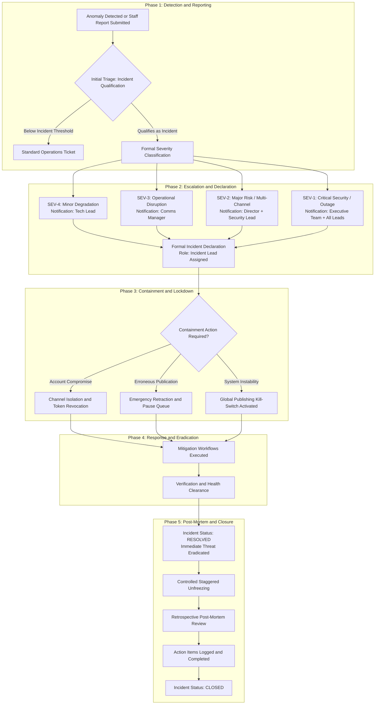
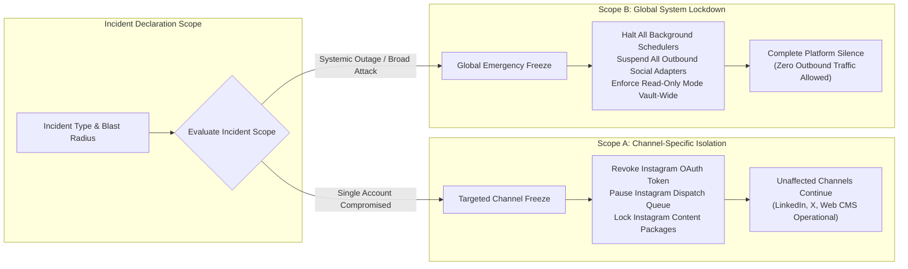
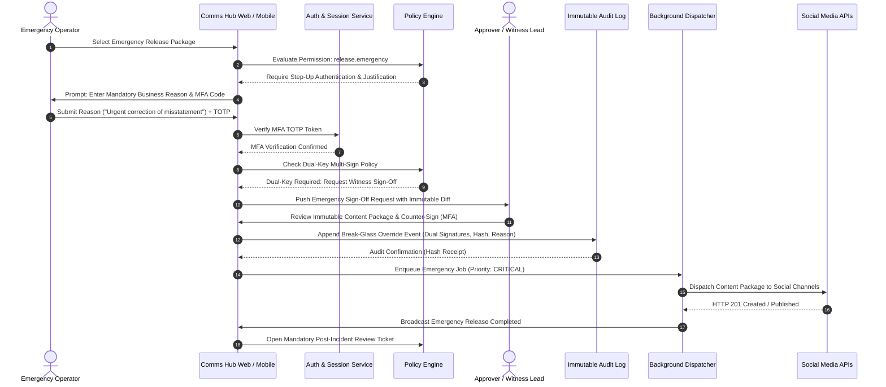
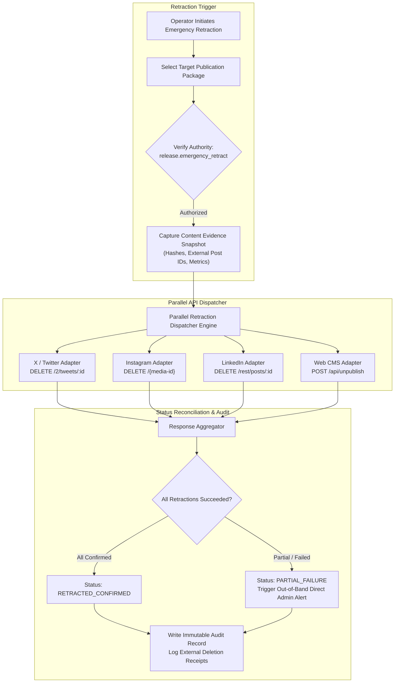
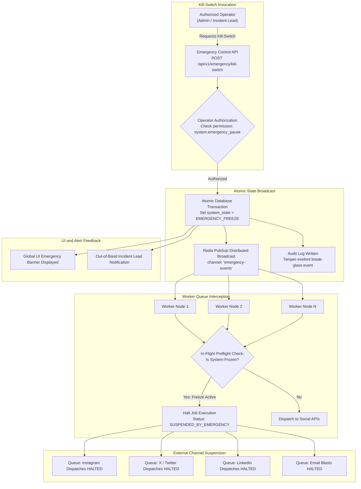
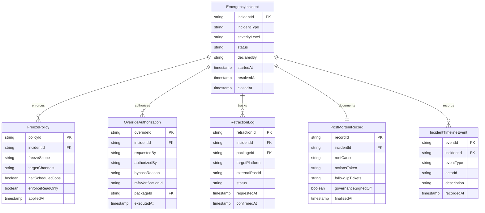

[[Comms Hub|Comms Hub Overview]] | [[MVP_draft|MVP UI Shell Draft]] | [[discussions_list|Master Discussions Index]] | [[disscussios/security_discussion|Security Architecture]] | [[disscussios/connected_account_secrets_management|Connected Account Secrets Management]] | [[disscussios/approval_policy_design|Approval Policy Design]]

---

# Emergency Workflows — Communication Department Hub

> **Status: Discussion record — not final emergency-response specification**
>
> This document preserves the current discussion about urgent work, emergency incidents, break-glass permissions, containment, recovery, degraded modes, emergency publishing, security incidents, system outages, and continuity.
>
> The concepts below are architectural directions only. Exact emergency permissions, severity levels, escalation rules, incident roles, continuity procedures, and recovery behavior are still under discussion.

---

---

## Structure Tree & Document Map

- [[#Emergency Workflows — Communication Department Hub|Overview & Governance Scope]]
- **Part I: Crisis Governance, Incident Classification & Severity Matrix**
  - [[#1. Urgent and Emergency Are Different|1. Urgent and Emergency Are Different]]
  - [[#2. Emergency Categories|2. Emergency Categories]]
  - [[#3. Incident as a First-Class Object|3. Incident as a First-Class Object]]
  - [[#4. Incident Severity|4. Incident Severity]]
  - [[#5. Report vs Declare|5. Report vs Declare]]
  - [[#6. Emergency Powers Must Be Scoped|6. Emergency Powers Must Be Scoped]]
- **Part II: Break-Glass Authorization & Emergency Publishing Protocols**
  - [[#7. Break-Glass Permissions|7. Break-Glass Permissions]]
  - [[#8. Step-Up Authentication|8. Step-Up Authentication]]
  - [[#9. Emergency Release Still Uses an Immutable Version|9. Emergency Release Still Uses an Immutable Version]]
  - [[#10. Record What Was Bypassed|10. Record What Was Bypassed]]
  - [[#11. Mandatory Follow-Up Review|11. Mandatory Follow-Up Review]]
  - [[#12. Emergency Correction Workflow|12. Emergency Correction Workflow]]
  - [[#13. Cross-Platform Incident Control|13. Cross-Platform Incident Control]]
  - [[#14. Preserve Incident Evidence|14. Preserve Incident Evidence]]
- **Part III: Security Containment, Emergency Control Panel & System Operating Modes**
  - [[#15. Security Emergency Workflow|15. Security Emergency Workflow]]
  - [[#16. Containment vs Recovery|16. Containment vs Recovery]]
    - [[#Containment|Containment]]
    - [[#Recovery|Recovery]]
  - [[#17. Emergency Control Panel|17. Emergency Control Panel]]
  - [[#18. Prefer Pause Over Delete|18. Prefer Pause Over Delete]]
  - [[#19. System Operating Modes|19. System Operating Modes]]
  - [[#20. Read-Only Mode|20. Read-Only Mode]]
- **Part IV: Business Continuity, Degraded Operations & Direct Access**
  - [[#21. Hub-Outage Continuity|21. Hub-Outage Continuity]]
  - [[#22. Direct Access Must Remain Available|22. Direct Access Must Remain Available]]
  - [[#23. Reconcile Manual Emergency Actions|23. Reconcile Manual Emergency Actions]]
  - [[#24. Provider Outage = Degraded Integration, Not Whole-System Emergency|24. Provider Outage = Degraded Integration, Not Whole-System Emergency]]
  - [[#25. Publication Consistency Policy|25. Publication Consistency Policy]]
  - [[#26. Pre-Approved Emergency Templates|26. Pre-Approved Emergency Templates]]
  - [[#27. Emergency Contact Groups|27. Emergency Contact Groups]]
- **Part V: Incident Leadership, Priority Scheduling & Lifecycle Governance**
  - [[#28. Incident Leadership|28. Incident Leadership]]
  - [[#29. Incident Roles Are Temporary|29. Incident Roles Are Temporary]]
  - [[#30. Emergency Jobs Receive Priority|30. Emergency Jobs Receive Priority]]
  - [[#31. Emergency Mode Does Not Remove Core Safety|31. Emergency Mode Does Not Remove Core Safety]]
  - [[#32. Emergency Permission Model|32. Emergency Permission Model]]
  - [[#33. Incident Lifecycle|33. Incident Lifecycle]]
  - [[#34. Resolved vs Closed|34. Resolved vs Closed]]
  - [[#35. Post-Incident Review|35. Post-Incident Review]]
  - [[#36. Incident Timeline|36. Incident Timeline]]
- **Part VI: Infrastructure Incidents: Secrets, Sessions, Storage & Database Failures**
  - [[#37. Incident Coordinates Existing Systems|37. Incident Coordinates Existing Systems]]
  - [[#38. Preserve Security Evidence|38. Preserve Security Evidence]]
  - [[#39. Account Compromise Workflow|39. Account Compromise Workflow]]
  - [[#40. Revoke User Sessions vs Revoke All Sessions|40. Revoke User Sessions vs Revoke All Sessions]]
  - [[#41. NAS/Ransomware Incident|41. NAS/Ransomware Incident]]
  - [[#42. NAS Failure Should Degrade, Not Necessarily Stop, the Hub|42. NAS Failure Should Degrade, Not Necessarily Stop, the Hub]]
  - [[#43. Database Emergency|43. Database Emergency]]
  - [[#44. Bad Deployment Rollback|44. Bad Deployment Rollback]]
  - [[#45. Maintenance Is Not an Incident|45. Maintenance Is Not an Incident]]
- **Part VII: Out-of-Band Runbooks, Mobile Controls, UX Safety & Emergency Drills**
  - [[#46. Out-of-Band Contact Tree|46. Out-of-Band Contact Tree]]
  - [[#47. Emergency Documentation Must Exist Outside the Hub|47. Emergency Documentation Must Exist Outside the Hub]]
  - [[#48. Mobile Emergency Controls|48. Mobile Emergency Controls]]
  - [[#49. Emergency UX Must Be Clear|49. Emergency UX Must Be Clear]]
  - [[#50. Confirmation Must Explain Consequences|50. Confirmation Must Explain Consequences]]
  - [[#51. Emergency Templates Need Lifecycle Too|51. Emergency Templates Need Lifecycle Too]]
  - [[#52. Drill / Simulation Mode|52. Drill / Simulation Mode]]
  - [[#53. Emergency Drills|53. Emergency Drills]]
- **Part VIII: AI Incident Assistance, Alert Fan-Out, Escalation & Crisis Communications**
  - [[#54. AI During Emergencies|54. AI During Emergencies]]
  - [[#55. AI Incident Assistant|55. AI Incident Assistant]]
  - [[#56. Critical Incidents May Need Multiple Notification Channels|56. Critical Incidents May Need Multiple Notification Channels]]
  - [[#57. Group Incident Notifications|57. Group Incident Notifications]]
  - [[#58. Needs Attention Can Escalate Into an Incident|58. Needs Attention Can Escalate Into an Incident]]
  - [[#59. Incidents Create Action Items|59. Incidents Create Action Items]]
  - [[#60. Incident Sensitivity|60. Incident Sensitivity]]
  - [[#61. Public Crisis Communication Remains Human-Led|61. Public Crisis Communication Remains Human-Led]]
  - [[#62. Resilience Metrics|62. Resilience Metrics]]
  - [[#63. Recurring Incidents Should Produce Improvement Work|63. Recurring Incidents Should Produce Improvement Work]]
- **Part IX: State Durability, Worker Execution Gates & Safe Resumption Workflows**
  - [[#64. Emergency State Must Be Durable|64. Emergency State Must Be Durable]]
  - [[#65. Jobs Must Check Emergency State Before Execution|65. Jobs Must Check Emergency State Before Execution]]
  - [[#66. Emergency Policy Overrides Automation|66. Emergency Policy Overrides Automation]]
  - [[#67. Resuming Must Not Blindly Release Backlog|67. Resuming Must Not Blindly Release Backlog]]
  - [[#68. Resume Is a Workflow|68. Resume Is a Workflow]]
  - [[#69. Active Emergency Controls Must Stay Visible|69. Active Emergency Controls Must Stay Visible]]
- **Part X: Architectural Synthesis, Foundational Principles & Open Decisions**
  - [[#70. Conceptual Emergency Architecture|70. Conceptual Emergency Architecture]]
  - [[#71. Recommended Early Foundations|71. Recommended Early Foundations]]
  - [[#72. Core Principle|72. Core Principle]]
  - [[#73. Additional Topic Identified|73. Additional Topic Identified]]
  - [[#74. Still Unresolved|74. Still Unresolved]]
- [[#External Architectural & Standards References|External Architectural & Standards References]]

---

# 1. Urgent and Emergency Are Different

A useful distinction is:

```text
NORMAL
Standard workflow

URGENT
Same controls
Higher priority
Faster reminders / escalation

EMERGENCY
Special workflow
Authorized bypasses may become available
Strong audit + follow-up required
```

Marking something urgent should not automatically bypass approval.

Core principle:

> **Bypass bureaucracy, not protection.**

---
> [!important] Governance Principle: Bypass Bureaucracy, Not Protection
> Urgency accelerates priority queues and escalates notification timeouts without skipping verification steps. In contrast, an Emergency activates specialized break-glass controls with dual-authorization and strict retrospective audit trails. Refer to [[disscussios/approval_policy_design#36. Emergency Override|Approval Policy - Emergency Override]] for granular policy rules.

---

# 2. Emergency Categories

Possible categories include:

| Emergency | Example |
|---|---|
| Communication emergency | Incorrect public statement needs correction |
| Operational emergency | Important announcement must go out immediately |
| Security emergency | Social credential/Admin account compromised |
| Integration emergency | Social/mail provider unavailable |
| System emergency | Hub itself unavailable |
| Storage emergency | NAS failure/ransomware |
| Data emergency | Database corruption/mass deletion |
| Business-continuity emergency | Office internet/power unavailable |

Different incidents need different controls.

---

---

# 3. Incident as a First-Class Object

Conceptual record:

```text
Incident #INC-0042

Type:
SOCIAL_ACCOUNT_COMPROMISE

Severity:
HIGH

Status:
ACTIVE

Declared by:
Mohammed

Started:
18 Sep 2026 14:42

Affected systems:
Instagram @organization
Scheduled publications

Incident lead:
Sara

Actions taken:
Publishing paused
Credential revoked

Current state:
Containment
```

An Incident can connect:

```text
alerts
people
decisions
emergency actions
jobs
communications
timeline
recovery
```

---

---

# 4. Incident Severity

Conceptual levels:

```text
SEV-4
Minor degradation

SEV-3
Significant operational issue

SEV-2
Major disruption / external risk

SEV-1
Critical organizational/security incident
```

Severity may control:

```text
notification routing
emergency controls
escalation
incident leadership
```

---


> [!note] Severity Alignment Matrix
> Severity dictates notification fan-out, incident lead selection, and authorization scope. Critical SEV-1 incidents automatically broadcast across out-of-band channels and require executive sign-off before unfreezing.

---

# 5. Report vs Declare

Employees may be allowed to:

```text
REPORT INCIDENT
```

while only authorized users can:

```text
DECLARE INCIDENT
```

Example:

```text
I believe the Instagram account was compromised.

[Report Security Issue]
```

Then a Manager/Admin with `incident.declare` can formally activate emergency behavior.

---

---

# 6. Emergency Powers Must Be Scoped

If Instagram is compromised, relevant controls may include:

```text
Pause Instagram publishing
Revoke Instagram credential
Cancel/hold Instagram jobs
```

This should not automatically unlock unrelated controls.

Conceptually:

```text
Incident Type
      ↓
Allowed Emergency Controls
```

---


> [!warning] Blast Radius Isolation
> Emergency authority is strictly bounded by incident classification. A localized compromise on a single social channel must never unlock system-wide administrative controls or affect independent channels.

---

# 7. Break-Glass Permissions

Possible permissions:

```text
release.emergency
security.emergency_revoke
system.emergency_pause
```

These should be:

```text
rare
highly auditable
strongly authenticated
reason-required
```

and not part of everyday workflow.

---
> [!caution] Break-Glass Control Boundary
> Break-glass permissions (`release.emergency`, `security.emergency_revoke`, `system.emergency_pause`) bypass standard approval matrices but require cryptographic authentication, explicit justification, and immutable event logging. Configure roles via [[MVP_draft#38. Settings Page|MVP Settings Page]] and [[disscussios/approval_policy_design#36. Emergency Override|Approval Policy - Emergency Override]].

---

# 8. Step-Up Authentication

Critical emergency actions may require:

```text
Click emergency action
       ↓
Enter reason
       ↓
Re-authenticate / MFA
       ↓
Show exact consequences
       ↓
Confirm
```

Example:

```text
EMERGENCY PUBLICATION

Normal approval will be bypassed.

Platforms:
Instagram
X

Content version:
Release #R18

Reason:
Correction to incorrect public information
```

---


> [!important] Step-Up Multi-Factor and Dual-Key Authorization
> Single-operator emergency releases require dual-key counter-authorization from a designated incident witness or manager whenever external broadcast impact exceeds SEV-2 thresholds.

---

# 9. Emergency Release Still Uses an Immutable Version

Emergency mode should not mean publishing whatever is currently in an editor.

Example:

```text
Emergency Release Package #ER-14

Text:
Revision 8

Image:
Asset 482 v3

Destinations:
Instagram @organization
X @organization

Declared reason:
Correction to inaccurate announcement
```

Publish exactly that package.

---
> [!note] Immutability Under Emergency Conditions
> Even under extreme time pressure, releases publish an immutable cryptographic bundle (pinned text revision, media asset hashes, target account IDs). Unfrozen drafts or dirty editor buffers are rejected by [[MVP_draft#25. Publishing Tab|MVP Publishing Preflight Tab]].

---

# 10. Record What Was Bypassed

Do not mark an emergency release as normally approved.

Instead record:

```text
NORMAL APPROVAL BYPASSED

Emergency authority:
Mohammed

Reason:
Correction to inaccurate public information

Time:
14:51

Required normal policy:
Manager → Director
```

---
> [!important] Non-Repudiation Audit Invariant
> Emergency releases must explicitly document the bypassed approval stages, recording the operator identity, witness co-signature, justification, and timestamp in [[disscussios/security_discussion#30. Tamper-Evident Immutable Audit Logging Pipeline|Security Audit Logging]].

---

# 11. Mandatory Follow-Up Review

After emergency release:

```text
Emergency publication completed
       ↓
Create follow-up action
```

Example:

```text
POST-EMERGENCY REVIEW REQUIRED

Review:
Content released
Reason for bypass
External result
Any correction required
```

This prevents emergency mode becoming a permanent shortcut.

---

---

# 12. Emergency Correction Workflow

Public-content incident:

```text
PUBLIC CONTENT INCIDENT
        ↓
Identify affected publications
        ↓
Choose response
        ↓
Emergency authorization
        ↓
Execute correction jobs
        ↓
Verify external state
        ↓
Record outcome
```

Possible actions:

```text
Delete existing post
Edit where supported
Publish correction
Publish clarification
Pause related scheduled content
```

---


> [!warning] Retraction Latency and API Degradation
> External platform APIs handle deletion requests asynchronously. The retraction engine polls platform status up to 3 times before escalating partial failures to human operators for direct portal removal.

---

# 13. Cross-Platform Incident Control

Example:

```text
PUBLICATION INCIDENT

Original Publication Bundle:
PUB-882

Instagram    Published
X            Published
LinkedIn     Published
Facebook     Published

Emergency Actions:

[Remove Selected]
[Publish Correction]
[Pause Related Schedule]
```

Each action becomes a background job.

---

---

# 14. Preserve Incident Evidence

Do not erase history after correction.

Example timeline:

```text
14:20  Original post published
14:27  Incident declared
14:31  Post removed from Instagram
14:32  Post removed from X
14:40  Correction published
```

Historical truth should remain intact.

---

---

# 15. Security Emergency Workflow

Example:

```text
SUSPECTED CREDENTIAL COMPROMISE
              ↓
Pause affected publishing
              ↓
Revoke credential
              ↓
Cancel/hold pending jobs
              ↓
Review recent actions
              ↓
Reauthorize securely
              ↓
Reconcile external account
              ↓
Resume publishing
```

---
> [!caution] Immediate Token Quarantine
> Upon suspected account compromise, immediately trigger the quarantine sequence documented in [[disscussios/connected_account_secrets_management#53. Suspected Credential Compromise Workflow|Compromise Workflow]] to revoke tokens and terminate upstream sessions.

---

# 16. Containment vs Recovery

## Containment

Stop damage from getting worse.

Examples:

```text
Pause publishing
Disable automation
Revoke token
Isolate NAS
Revoke sessions
```

## Recovery

Restore trusted operation.

Examples:

```text
Reconnect clean account
Restore files
Verify database
Resume jobs
```

These are distinct phases.

---

---

# 17. Emergency Control Panel

Possible protected panel:

```text
EMERGENCY CONTROLS

External Publishing
ACTIVE
[Pause]

Automation Engine
ACTIVE
[Pause]

Outbound Mail
ACTIVE
[Pause]

External Sharing
ACTIVE
[Disable]

All User Sessions
[Revoke]

System Mode
NORMAL
[Enter Read-Only]
```

Every action should be confirmed and audited.

---


> [!important] Global Kill-Switch and Emergency Controls UI
> The Emergency Control Panel provides coarse-grained and fine-grained switches accessible to emergency administrators. See [[MVP_draft#50. Emergency Mode|MVP Emergency Mode]] and [[MVP_draft#38. Settings Page|MVP Settings Page]].

---

# 18. Prefer Pause Over Delete

During incidents, reversibility matters.

Prefer:

```text
PAUSE publishing
DISABLE integration
READ-ONLY mode
```

over destructive actions wherever possible.

Containment should preserve evidence and ease recovery.

---

---

# 19. System Operating Modes

Possible states:

```text
NORMAL
DEGRADED
READ_ONLY
RECOVERY
SECURITY_LOCKDOWN
```

These describe operational state, not casual user preferences.

---

---

# 20. Read-Only Mode

Possible behavior:

```text
Users can:
✓ View work
✓ Download authorized files
✓ Read status

Users cannot:
✕ Edit
✕ Approve
✕ Publish
✕ Create automation
```

Useful during suspected database or security issues.

---
> [!note] Read-Only Mode Execution Guarantees
> In read-only mode, database write transactions are rejected at the application middleware level. Edge caching and local browser state ensure search, asset inspection, and runbook viewing remain fully operational.

---

# 21. Hub-Outage Continuity

If the Hub itself is unavailable:

```text
Communication Hub unavailable
        ↓
Authorized emergency contacts
        ↓
Use direct official-platform access
        ↓
Use organizational mail directly
        ↓
Record emergency actions externally
        ↓
Hub restored
        ↓
Reconcile actions back into Hub
```

---
> [!tip] Outage Continuity Protocol
> Departmental staff maintain offline exportable emergency operating procedures and direct portal access credentials to ensure social media communications continue even if the Hub infrastructure is completely offline.

---

# 22. Direct Access Must Remain Available

Authorized emergency administrators should retain a secure independent path to:

```text
official social platforms
department mail
critical external services
```

The Hub must not become a single point of operational paralysis.

---

---

# 23. Reconcile Manual Emergency Actions

Example:

```text
Emergency external publication

Platform:
X

Remote post:
...

Performed by:
Mohammed

Reason:
Hub outage

Occurred:
15:22
```

After restoration, import/reconcile it into Hub history and analytics.

---
> [!important] Mandatory Reconciliation Invariant
> Any external social post or deletion performed directly on native platforms during a Hub outage must be reconciled into the Comms Hub repository upon system restoration to maintain historical integrity.

---

# 24. Provider Outage = Degraded Integration, Not Whole-System Emergency

Example:

```text
Instagram unavailable

Affected:
4 scheduled posts

Other platforms:
Operating normally
```

The Hub can continue in degraded mode.

---

---

# 25. Publication Consistency Policy

Possible release behavior during partial platform outages:

```text
INDEPENDENT
Publish available channels

ALL_CHANNELS_REQUIRED
Hold all until every destination is available

MANUAL_DECISION_ON_FAILURE
Ask authorized user
```

This can be a property of a Publication Bundle or campaign.

---

---

# 26. Pre-Approved Emergency Templates

Possible future templates:

```text
Event postponed
Office closed
Service unavailable
Correction notice
Technical outage
```

Templates speed drafting but should not auto-publish.

---

---

# 27. Emergency Contact Groups

Example:

```text
Incident Response Group

Communications Manager
System Admin
Department Director
```

Different incident types may notify different groups.

---

---

# 28. Incident Leadership

Possible roles:

```text
Incident Lead
Technical Lead
Communications Lead
```

One person should own coordination.

---

---

# 29. Incident Roles Are Temporary

Incident-specific authority should be:

```text
temporary
scoped
incident-specific
```

Do not permanently promote someone to Admin just because they lead one incident.

---

---

# 30. Emergency Jobs Receive Priority

Examples:

```text
Restore social account
Publish correction
Verify public posts
```

should outrank:

```text
historical analytics
old thumbnail generation
```

The background-job system can enforce this.

---
> [!tip] Emergency Priority Queue Preemption
> Background worker queues prioritize emergency containment jobs and retraction commands ahead of standard publication schedules. See [[disscussios/failure_handling_background_jobs#25. Cancellation|Failure Handling - Cancellation]].

---

# 31. Emergency Mode Does Not Remove Core Safety

Still enforce:

```text
idempotency
authorization
audit
secret isolation
input validation
```

Emergency workflow may bypass selected approval steps, not fundamental safety properties.

---
> [!caution] Non-Negotiable Safety Checks
> Even under active emergency bypass, the publishing engine strictly enforces idempotency keys, target account existence checks, and media format compliance to prevent corrupt or duplicate dispatches.

---

# 32. Emergency Permission Model

Possible permissions:

```text
incident.report
incident.declare
incident.manage
incident.close

release.emergency
publishing.pause
automation.pause

integration.emergency_revoke

system.read_only
system.security_lockdown

sessions.revoke_all
```

---

---

# 33. Incident Lifecycle

Possible lifecycle:

```text
DETECTED
   ↓
DECLARED
   ↓
CONTAINING
   ↓
RECOVERING
   ↓
MONITORING
   ↓
RESOLVED
   ↓
REVIEWED
   ↓
CLOSED
```

---

---

# 34. Resolved vs Closed

`RESOLVED` means immediate danger is gone.

`CLOSED` means follow-up review and improvement work are complete.

---

---

# 35. Post-Incident Review

Possible structure:

```text
POST-INCIDENT REVIEW

What happened?
What was the impact?
How was it detected?
What actions were taken?
What worked?
What failed?
What should change?

Follow-up actions:
...
```

Focus on system/process improvement.

---


```mermaid
stateDiagram-v2
    [*] --> IncidentResolved: Threat Contained & Mitigated
    
    IncidentResolved --> AuditReconciliation: Initiate Reconciliation Workflow
    
    state AuditReconciliation {
        [*] --> HarvestExternalActions: Detect Out-of-Band Direct Portal Changes
        HarvestExternalActions --> CompareState: Contrast Vault DB vs Live External Platforms
        CompareState --> SyncRecords: Align Package Histories and External IDs
        SyncRecords --> [*]
    }
    
    AuditReconciliation --> PostMortemDrafting: Prepare Incident Report
    
    state PostMortemDrafting {
        [*] --> CompileTimeline: Assemble System Logs & Human Decisions
        CompileTimeline --> AnalyzeRootCause: Determine Contributing Factors
        AnalyzeRootCause --> FormulateActionItems: Define Engineering & Policy Remediations
        FormulateActionItems --> [*]
    }
    
    PostMortemDrafting --> GovernanceSignOff: Executive Review
    
    state GovernanceSignOff {
        [*] --> ReviewLead: Incident Lead Sign-Off
        ReviewLead --> ReviewSecurity: Security Officer Sign-Off
        ReviewSecurity --> ReviewDirector: Communications Director Sign-Off
        ReviewDirector --> [*]
    }
    
    GovernanceSignOff --> StaggeredUnfreeze: Authorization to Resume
    
    state StaggeredUnfreeze {
        [*] --> InspectBacklog: Review Queued / Paused Publications
        InspectBacklog --> PurgeObsolete: Discard Time-Sensitive Outdated Content
        PurgeObsolete --> StaggerExecution: Reschedule Backlog with Rate-Limiting
        StaggerExecution --> [*]
    }
    
    StaggeredUnfreeze --> IncidentClosed: All Mitigations & Audits Complete
    IncidentClosed --> [*]
```

> [!important] Blameless Post-Mortem and Governance Gate
> The post-incident review follows blameless inquiry standards, focusing on systemic resilience, architectural safeguards, and root causes. Unfreezing queues requires explicit governance sign-off.

---

# 36. Incident Timeline

Example:

```text
14:20  Post published
14:24  Incorrect information reported
14:25  Incident declared
14:26  Related scheduled publications paused
14:28  Deletion job started
14:29  Instagram post removed
14:31  X post removed
14:35  Emergency correction prepared
14:37  Correction published
14:45  External state verified
15:05  Incident moved to Monitoring
```

Events, Jobs, Audit, and Approval records can populate this automatically.

---

---

# 37. Incident Coordinates Existing Systems

```text
                     INCIDENT
                         │
       ┌─────────────────┼─────────────────┐
       ▼                 ▼                 ▼
 Emergency Actions     Jobs            Notifications
       │                 │                 │
       ▼                 ▼                 ▼
    Audit Log         Results        Response Team
       │
       └─────────────────┼─────────────────┘
                         ▼
                      Timeline
                         │
                         ▼
                Post-Incident Review
```

Incidents coordinate existing systems rather than replacing them.

---

---

# 38. Preserve Security Evidence

For suspected account compromise:

```text
Revoke session
Disable account if needed
Preserve login history
Preserve audit records
Preserve job history
Preserve access events
```

Containment should not destroy investigation evidence.

---

---

# 39. Account Compromise Workflow

Example:

```text
USER ACCOUNT COMPROMISE
        ↓
Disable high-risk actions
        ↓
Revoke user's sessions
        ↓
Require password/MFA reset
        ↓
Review permission changes
        ↓
Review recent external actions
        ↓
Restore trusted access
```

---
> [!caution] Compromise Containment Procedures
> For suspected staff account breaches, follow [[disscussios/connected_account_secrets_management#53. Suspected Credential Compromise Workflow|Compromise Workflow]] and record all session terminations in [[disscussios/security_discussion#30. Tamper-Evident Immutable Audit Logging Pipeline|Security Audit Logging]].

---

# 40. Revoke User Sessions vs Revoke All Sessions

Normal containment:

```text
Revoke compromised user's sessions
```

Break-glass option:

```text
Revoke ALL sessions
```

These should be clearly distinct.

---

---

# 41. NAS/Ransomware Incident

Possible response:

```text
NAS anomaly detected
        ↓
Pause NAS sync
        ↓
Stop archive/retrieval jobs
        ↓
Mark NAS untrusted/offline
        ↓
Cloud working layer remains available
        ↓
Investigate
        ↓
Restore clean snapshot/backup
        ↓
Verify checksums
        ↓
Re-enable NAS
```

---
> [!caution] Storage Ransomware Isolation
> When storage anomalies or encryption spikes are detected on the NAS, the Hub immediately severs SMB/NFS mount handles and transitions media asset delivery to immutable cloud cold storage replicas.

---

# 42. NAS Failure Should Degrade, Not Necessarily Stop, the Hub

Example:

```text
Cloud-active assets      ✓
Tasks                    ✓
Mail                     ✓
Publishing               ✓ for cloud assets
Archived originals       ✕ temporarily unavailable
```

---

---

# 43. Database Emergency

Possible response:

```text
Stop destructive writes
       ↓
Read-only / recovery mode
       ↓
Pause automation
       ↓
Pause external actions
       ↓
Assess recovery point
       ↓
Restore
       ↓
Reconcile
       ↓
Resume deliberately
```

---

---

# 44. Bad Deployment Rollback

A severe deployment regression should support:

```text
rollback application version
```

without automatically rolling back database state.

Code rollback and data rollback are different operations.

---

---

# 45. Maintenance Is Not an Incident

Use:

```text
MAINTENANCE MODE
```

for planned downtime.

Use incident/recovery modes only for real failures or emergency response.

---

---

# 46. Out-of-Band Contact Tree

The emergency runbook should contain protected contact information for critical roles outside the Hub.

This is necessary if:

```text
Hub down
Mail integration down
```

---

---

# 47. Emergency Documentation Must Exist Outside the Hub

A printable/exportable quick guide may include:

```text
Who has authority
Who to contact
How to pause systems
How to revoke credentials
How to use direct-platform fallback
How to begin recovery
```

---

---

# 48. Mobile Emergency Controls

Mobile may support selected high-value actions:

```text
View incident
Pause scheduled publishing
Revoke compromised integration
Approve emergency correction
```

with strong authentication and clear confirmation.

---

---

# 49. Emergency UX Must Be Clear

Example:

```text
PAUSE ALL INSTAGRAM PUBLISHING

This will stop:
• 4 scheduled publications
• 2 active automation rules

It will NOT:
• delete published posts
• disconnect Instagram

[Cancel]
[Pause Publishing]
```

---

---

# 50. Confirmation Must Explain Consequences

Avoid:

```text
Are you sure?
```

Prefer:

```text
Revoke Instagram authorization?

This will:
- stop publishing
- block 4 scheduled posts
- require reauthorization

Historical publication records will remain.

[Cancel]
[Revoke]
```

---
> [!warning] Friction Design for Emergency Actions
> Critical buttons require explicit confirmation dialogs that summarize exact blast-radius consequences (number of paused jobs, disconnected platforms, and affected campaigns) rather than generic prompts.

---

# 51. Emergency Templates Need Lifecycle Too

Templates may have:

```text
owner
version
last reviewed
valid status
```

Search should prioritize current/canonical emergency templates.

---

---

# 52. Drill / Simulation Mode

Possible future feature:

```text
Simulate:
Instagram account disconnected
```

Then test whether:

```text
Manager receives alert
Needs Attention appears
Scheduled publication is blocked
Runbook link appears
```

without affecting the real integration.

---

---

# 53. Emergency Drills

Possible simulations:

```text
Hub outage
Database recovery
NAS outage
Credential compromise
Social platform outage
```

An untested emergency plan is only theoretical.

---

---

# 54. AI During Emergencies

AI can assist with:

```text
summarize incident timeline
identify affected scheduled posts
draft correction options
summarize provider errors
```

AI should not independently decide:

```text
revoke credentials
delete public posts
enter lockdown
publish emergency statement
```

Human/deterministic authorization remains required.

---

---

# 55. AI Incident Assistant

Possible future feature:

```text
INCIDENT ASSISTANT

Affected:
Instagram
X

Detected:
3 failed publications
Instagram authorization revoked

Suggested checks:
• verify account access
• pause remaining schedule
• inspect last successful publication
```

Assistive, not authoritative.

---

---

# 56. Critical Incidents May Need Multiple Notification Channels

Selected SEV-1 alerts may use:

```text
In-app
Email
Push
Possibly SMS / external channel
```

depending on organizational needs.

---

---

# 57. Group Incident Notifications

Instead of many separate alerts:

```text
INC-0042 — Instagram authorization incident

Current impact:
8 scheduled posts blocked

Status:
Containment

Incident lead:
Mohammed

[Open Incident]
```

---

---

# 58. Needs Attention Can Escalate Into an Incident

Example:

```text
Attention Item:
Instagram authorization failed
```

If impact grows:

```text
[Declare Incident]
```

Not every warning needs full incident-management overhead.

---

---

# 59. Incidents Create Action Items

Example:

```text
Action:
Reconnect Instagram
Assigned: Mohammed

Action:
Review recent posts
Assigned: Sara

Action:
Prepare correction
Assigned: Ahmed
```

Notifications inform; Action Items hold responsibility.

---

---

# 60. Incident Sensitivity

Incident visibility may be classified:

```text
DEPARTMENT
RESTRICTED
SECURITY_ONLY
```

Employees may see:

```text
Instagram publishing temporarily unavailable.
```

while Security/Admin see:

```text
Suspected OAuth token compromise.
```

---

---

# 61. Public Crisis Communication Remains Human-Led

The Hub can support:

```text
Crisis Campaign
Emergency Release Package
Rapid Approval Policy
Cross-channel Publication
Correction Tracking
```

but should not automatically decide communication strategy.

---

---

# 62. Resilience Metrics

Useful metrics include:

```text
Time to detect
Time to acknowledge
Time to contain
Time to recover
Affected publications
Manual interventions
Recovery success
```

The goal is process resilience, not employee ranking.

---

---

# 63. Recurring Incidents Should Produce Improvement Work

Example:

```text
Improvement Action:
Add T-48h token readiness check.
```

Incident history can drive system/process improvement.

---

---

# 64. Emergency State Must Be Durable

States such as:

```text
Publishing paused
READ_ONLY
SECURITY_LOCKDOWN
Integration disabled
```

must survive redeploys/restarts.

They belong in durable state, not server memory.

---

---

# 65. Jobs Must Check Emergency State Before Execution

Before a queued job acts:

```text
Is this action currently allowed?
```

If publishing is paused:

```text
BLOCKED_BY_INCIDENT
```

Do not execute merely because the job was created earlier.

---
> [!caution] Atomic Preflight State Checks
> Every worker job queries the distributed emergency freeze state immediately prior to dispatching network payloads. Jobs caught in freeze state transition to suspended status as outlined in [[disscussios/failure_handling_background_jobs#25. Cancellation|Failure Handling - Cancellation]].

---

# 66. Emergency Policy Overrides Automation

Hierarchy:

```text
Emergency / Security Policy
          ↓
Admin Policy
          ↓
Workflow / Automation
          ↓
Job Execution
```

Emergency policy wins.

---

---

# 67. Resuming Must Not Blindly Release Backlog

After a six-hour publishing pause:

```text
14 blocked publications require review.
```

Possible actions:

```text
publish
reschedule
cancel
```

Do not automatically flood platforms with stale content.

---
> [!warning] Thundering Herd Prevention During Resume
> When an emergency freeze is lifted, queued jobs must not execute simultaneously. An automated triage pass purges expired posts and staggers valid releases using exponential rate-limiting.

---

# 68. Resume Is a Workflow

```text
INCIDENT RESOLVED
       ↓
Verify health
       ↓
Review blocked jobs
       ↓
Reconcile external state
       ↓
Resume selected automation
       ↓
Monitor
       ↓
Return to Normal
```

---
> [!important] Structured Resumption Gate
> Resuming normal operations requires a verified 4-step checklist: Integration health verification, backlog content review, rate-limited job schedule generation, and executive unfreeze confirmation.

---

# 69. Active Emergency Controls Must Stay Visible

Example:

```text
⚠ EXTERNAL PUBLISHING PAUSED

Since:
18 Sep 14:22

Reason:
INC-0042

Activated by:
Mohammed
```

Emergency state should be impossible to forget.

---

---

# 70. Conceptual Emergency Architecture

```text
                     DETECTION / REPORT
                            │
                            ▼
                       ATTENTION ITEM
                            │
                 significant enough?
                      │          │
                     no         yes
                      │          ▼
                      │       INCIDENT
                      │          │
                      │     Severity / Type
                      │          │
                      │     Incident Lead
                      │          │
                      │          ▼
                      │    CONTAINMENT
                      │          │
                      │  Emergency Controls
                      │          │
                      │          ▼
                      │      RECOVERY
                      │          │
                      │    Reconciliation
                      │          │
                      │          ▼
                      │      MONITORING
                      │          │
                      │          ▼
                      └──────► RESOLVED
                                 │
                                 ▼
                         POST-INCIDENT REVIEW
                                 │
                                 ▼
                              CLOSED
```

Supporting systems:

```text
Audit
Jobs
Notifications
Actions
Events
Runbooks
Security
```

---


---

# 71. Recommended Early Foundations

Do not build a giant enterprise incident platform initially.

But preserve:

- durable emergency states
- publishing/automation pause controls
- emergency release with reason + step-up authentication
- immutable emergency release version
- simple Incident record
- severity/type/owner/timeline/status
- links to Jobs, Attention Items, Connected Accounts, and Publications
- external continuity runbook
- deliberate reconciliation/resume workflow

---
> [!tip] Pragmatic Foundation Roadmap
> Early development must prioritize durable pause states and immutable package snapshots before introducing automated multi-channel retraction or AI incident assistance.

---

# 72. Core Principle

> **Normal workflows optimize for quality and consistency. Emergency workflows optimize for speed and containment—but never by removing identity, authorization, versioning, audit, or recovery.**

And:

> **The Hub must help the Communication Department during an emergency, but it must never become the reason the department cannot operate during one.**

---
> [!important] Foundational Resilience Invariant
> The Hub must help the Communication Department during an emergency, but it must never become the reason the department cannot operate during one.

---

# 73. Additional Topic Identified

This discussion highlights a related future topic:

> **Business continuity and degraded/offline operation**

Disaster recovery asks:

> How do we restore the system?

Business continuity asks:

> How does the department keep working while the system is unavailable?

This may deserve a smaller dedicated design pass later.

---

---

# 74. Still Unresolved

We still need to decide:

- exact incident severity model
- who may declare incidents
- emergency permission matrix
- step-up authentication requirements
- emergency publication policy
- mandatory follow-up review rules
- incident-role definitions
- emergency notification channels
- business continuity runbook
- degraded-mode behavior
- partial-platform release policy
- blocked-job resume policy
- simulation/drill frequency
- incident retention and reporting
- post-incident review requirements

This document preserves the emergency-workflow discussion only. It is not yet the final incident-response architecture.

---

---

^emergency-workflows-boundary

> [!important] Emergency Workflows & Crisis Governance Navigation
> Cross-reference with [[discussions_list#9. Emergency Workflows|Discussions List - Emergency Workflows]], [[MVP_draft#50. Emergency Mode|MVP Emergency Mode]], and [[Comms Hub#Master Vault Document Map|Comms Hub Master Map]].

---

## External Architectural & Standards References

- **NIST SP 800-61 Rev. 2**: [Computer Security Incident Handling Guide](https://csrc.nist.gov/publications/detail/sp/800-61/rev-2/final)
- **ISO 22301:2019**: [Security and Resilience — Business Continuity Management Systems](https://www.iso.org/standard/75106.html)
- **CISA Incident Response Guidelines**: [Cybersecurity Incident & Vulnerability Response Playbooks](https://www.cisa.gov/resources-tools/resources/cybersecurity-incident-and-vulnerability-response-playbooks)
- **Mermaid.js Flowchart & Sequence Specifications**: [Mermaid Documentation](https://mermaid.js.org/)
