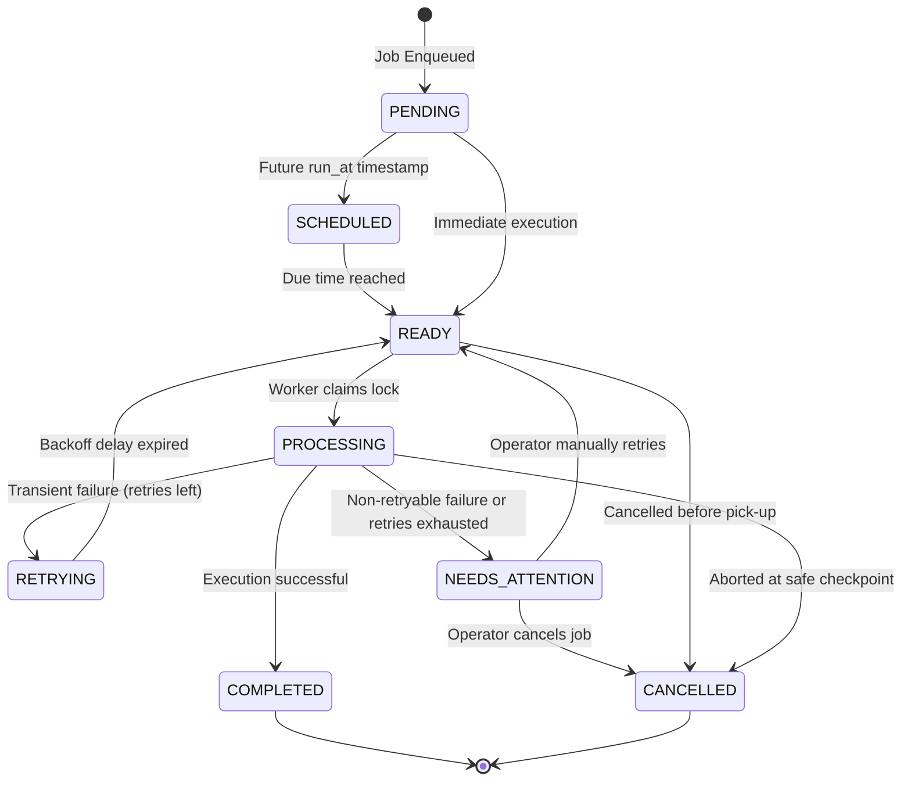
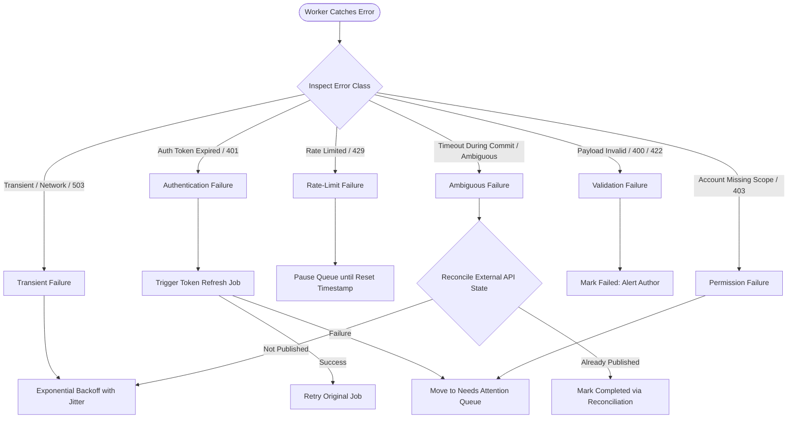
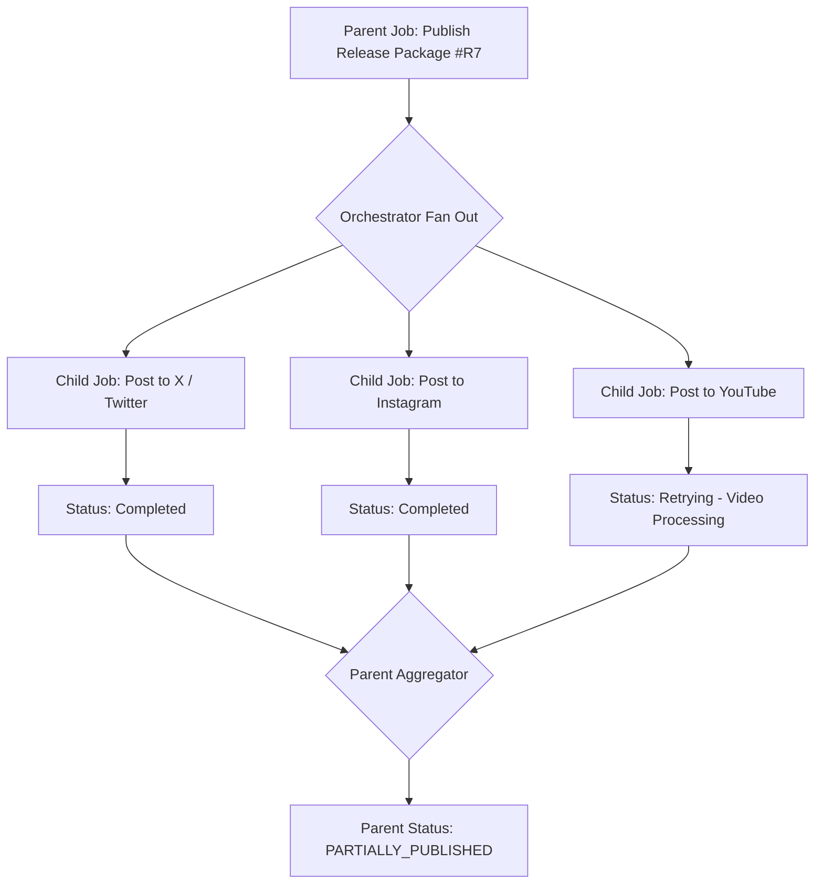
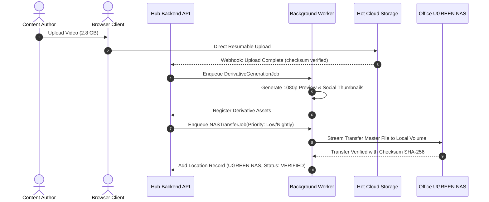
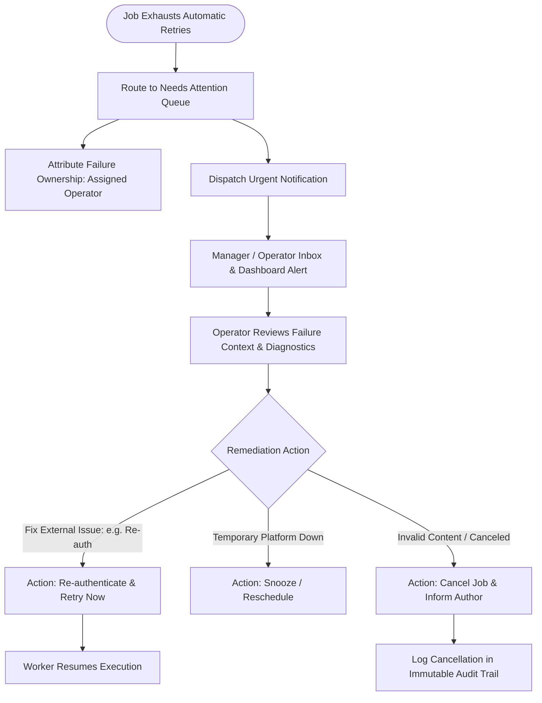
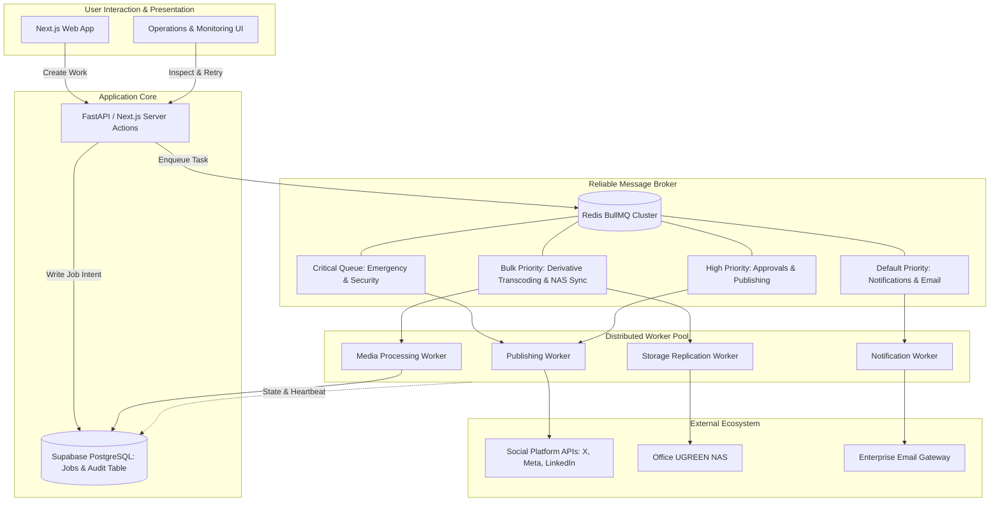

[[Comms Hub|Comms Hub Overview]] | [[MVP_draft|MVP UI Shell Draft]] | [[discussions_list|Master Discussions Index]] | [[disscussios/approval_policy_design|Approval Policy Design]] | [[disscussios/storage_lifecycle_disaster_recovery|Storage Lifecycle and Disaster Recovery]] | [[disscussios/connected_account_secrets_management|Connected Account Secrets Management]]

---

# Failure Handling and Background Jobs — Communication Department Hub

> [!note] Status: Discussion record — not final architecture
> **Status: Discussion record — not final architecture**
>
> This document preserves the current discussion about background jobs, reliability, retries, failure handling, scheduling, and human intervention for the Communication Department Hub.
>
> The concepts below are architectural directions, not yet final implementation requirements.

---

## Structure Tree & Document Map

- [[#Failure Handling and Background Jobs — Communication Department Hub|Overview & Core Purpose]]
- **Part I: Async Execution Foundations & Job Lifecycle**
  - [[#1. Core Principle|1. Core Principle]]
  - [[#2. What Is a Background Job?|2. What Is a Background Job?]]
  - [[#3. Generic Job Model|3. Generic Job Model]]
  - [[#4. Universal Job States|4. Universal Job States]]
- **Part II: Failure Classification, Idempotency & Reconciliation**
  - [[#5. Failure Classes|5. Failure Classes]]
    - [[#Transient Failure|Transient Failure]]
    - [[#Authentication Failure|Authentication Failure]]
    - [[#Validation Failure|Validation Failure]]
    - [[#Rate-Limit Failure|Rate-Limit Failure]]
    - [[#Permission Failure|Permission Failure]]
    - [[#Internal Failure|Internal Failure]]
    - [[#Ambiguous Failure|Ambiguous Failure]]
  - [[#6. Failure Classification Table|6. Failure Classification Table]]
  - [[#7. Idempotency|7. Idempotency]]
  - [[#8. Reconciliation|8. Reconciliation]]
- **Part III: Granular Decomposition, Parent-Child Topologies & Scheduling**
  - [[#9. Multi-Platform Publishing as Separate Jobs|9. Multi-Platform Publishing as Separate Jobs]]
  - [[#10. Small Jobs Are Better Than One Giant Job|10. Small Jobs Are Better Than One Giant Job]]
  - [[#11. Parent and Child Jobs|11. Parent and Child Jobs]]
  - [[#12. Dependencies|12. Dependencies]]
  - [[#13. Scheduled Actions Are Future Jobs|13. Scheduled Actions Are Future Jobs]]
  - [[#14. Automation Creates Jobs|14. Automation Creates Jobs]]
  - [[#15. Combined Job Architecture|15. Combined Job Architecture]]
- **Part IV: Retry Strategies, Timeouts, Throttling & Priority**
  - [[#16. User Experience Should Remain Simple|16. User Experience Should Remain Simple]]
  - [[#17. Manager/Admin Operations View|17. Manager/Admin Operations View]]
  - [[#18. Detailed Technical Logs|18. Detailed Technical Logs]]
  - [[#19. Retry Policy by Failure Type|19. Retry Policy by Failure Type]]
  - [[#20. Retry Backoff|20. Retry Backoff]]
  - [[#21. Retry Storm Protection|21. Retry Storm Protection]]
  - [[#22. Priority|22. Priority]]
  - [[#23. Time Zones|23. Time Zones]]
  - [[#24. Worker Downtime and Late Jobs|24. Worker Downtime and Late Jobs]]
  - [[#25. Cancellation|25. Cancellation]]
  - [[#26. Commit Point / Point of No Return|26. Commit Point / Point of No Return]]
- **Part V: Specialized Job Handlers (Storage, Media, Email & AI)**
  - [[#27. Email Jobs|27. Email Jobs]]
  - [[#28. File Upload and Processing Should Be Separate|28. File Upload and Processing Should Be Separate]]
  - [[#29. Resumable Upload vs Job Retry|29. Resumable Upload vs Job Retry]]
  - [[#30. NAS Transfers as Jobs|30. NAS Transfers as Jobs]]
  - [[#31. Checksums|31. Checksums]]
- **Part VI: Concurrency, Deadlocks, Timeouts & Human Escalation**
  - [[#32. Prevent Duplicate Worker Execution|32. Prevent Duplicate Worker Execution]]
  - [[#33. Stuck Jobs|33. Stuck Jobs]]
  - [[#34. Job-Specific Timeouts|34. Job-Specific Timeouts]]
  - [[#35. Needs Attention Queue|35. Needs Attention Queue]]
  - [[#36. Attempt History|36. Attempt History]]
  - [[#37. Operational Analytics from Jobs|37. Operational Analytics from Jobs]]
  - [[#38. Notification Jobs Should Be Separate|38. Notification Jobs Should Be Separate]]
  - [[#39. Analytics Collection as Future Jobs|39. Analytics Collection as Future Jobs]]
  - [[#40. AI Jobs|40. AI Jobs]]
  - [[#41. Recovery Strategy by Job Type|41. Recovery Strategy by Job Type]]
- **Part VII: Consistency, Distributed Tracing & Operations Model**
  - [[#42. Transactional Consistency|42. Transactional Consistency]]
  - [[#43. Audit vs Job vs Activity|43. Audit vs Job vs Activity]]
    - [[#Audit|Audit]]
    - [[#Job|Job]]
    - [[#Activity|Activity]]
  - [[#44. Duplicate User Clicks|44. Duplicate User Clicks]]
  - [[#45. Correlation IDs|45. Correlation IDs]]
  - [[#46. Actionable User Error Messages|46. Actionable User Error Messages]]
  - [[#47. Failure Ownership|47. Failure Ownership]]
  - [[#48. Business Block vs Technical Failure|48. Business Block vs Technical Failure]]
  - [[#49. Proposed Architecture|49. Proposed Architecture]]
  - [[#50. Important Product Principle|50. Important Product Principle]]
  - [[#51. Still Unresolved|51. Still Unresolved]]

---

# 1. Core Principle

The webpage should not perform long-running or failure-prone work directly.

Simple actions can happen synchronously:

```text
User changes task title
        ↓
Validate
        ↓
Update database
        ↓
Done
```

Long-running actions should become durable background jobs:

```text
User requests action
        ↓
Application validates request
        ↓
Create durable Job
        ↓
Return immediately to user

                JOB SYSTEM
                    ↓
                Execute work
                    ↓
             Record result/state
                    ↓
               Notify user
```

The work must continue even if the user:

- closes the browser
- refreshes the page
- loses internet
- logs out

---

> [!tip] Core Tenet
> The frontend web client is strictly an orchestration interface; all non-trivial state mutations, external calls, and file processing are executed asynchronously by durable workers. See [[MVP_draft#15. Work Page|MVP Work Page]].

# 2. What Is a Background Job?

A job is a durable record that represents work that:

- needs to happen
- is currently happening
- has succeeded
- has failed
- is waiting for retry
- needs human attention

Example:

```text
JOB #18492

Type:
PUBLISH_CONTENT

Status:
RUNNING

Created by:
Mohammed

Created:
18 Sep 2026 17:58

Started:
18:00:01

Work Item:
#842

Attempt:
1 of 3
```

The job must not exist only in server memory.

A server restart should not erase scheduled or active work.

---

# 3. Generic Job Model

A generic job may eventually contain fields such as:

```text
id
type
status

created_by
created_at

scheduled_for
started_at
finished_at

priority

payload
related_entity

attempt_count
max_attempts

last_error
result

idempotency_key
correlation_id
```

Example:

```text
type = SOCIAL_PUBLISH

related_entity =
Publication Bundle #182

scheduled_for =
2026-09-18 18:00

status =
QUEUED
```

---

# 4. Universal Job States

A common state model is preferable to every feature inventing its own terminology.

Possible states:

```text
CREATED
   ↓
SCHEDULED / QUEUED
   ↓
RUNNING
   ↓
┌───────────────┐
↓               ↓
SUCCEEDED      FAILED
                │
          ┌─────┴─────┐
          ↓           ↓
      RETRYING   NEEDS_ATTENTION

Other useful states:
BLOCKED
WAITING
CANCELLED
```

These states can support many job types:

```text
Publishing Job
Email Job
AI Job
Thumbnail Job
Analytics Job
NAS Sync Job
Notification Job
```

---


### Universal Job State Machine


> [!tip] Lifecycle Observability
> For UI representation of job statuses, see [[MVP_draft#15. Work Page|MVP Work Page]] and [[MVP_draft#38. Settings Page|MVP Settings Page]].


# 5. Failure Classes

Not every failure should be treated the same way.

## Transient Failure

Example:

```text
Instagram API temporarily unavailable
```

Typical response:

- retry later

## Authentication Failure

Example:

```text
LinkedIn OAuth token expired
```

Typical response:

- stop
- request reconnection
- notify responsible role

## Validation Failure

Example:

```text
Instagram image dimensions unsupported
```

Typical response:

- stop
- ask user to correct content

## Rate-Limit Failure

Example:

```text
Provider says retry after 14:30
```

Typical response:

- wait until allowed
- retry then

## Permission Failure

Example:

```text
Connected account lacks required publishing permission
```

Typical response:

- stop
- notify Manager/Admin

## Internal Failure

Example:

```text
Application adapter throws an error
```

Typical response:

- limited retry
- log details
- potentially alert Admin/developer

## Ambiguous Failure

Example:

```text
Request sent
    ↓
Remote service performs action
    ↓
Response is lost
```

Typical response:

- do not blindly retry
- reconcile external state first

---

# 6. Failure Classification Table

| Failure Class | Example | Typical Response |
|---|---|---|
| Transient | API temporarily unavailable | Retry |
| Rate limit | Too many requests | Retry later |
| Authentication | Token expired | Stop + reconnect |
| Validation | Invalid media | Stop + user correction |
| Permission | Account cannot publish | Stop + Admin/Manager action |
| Internal | Our code failed | Retry/alert |
| Ambiguous | Response lost | Reconcile external state |

---


### Failure Classification & Handling Engine


> [!important] Error Classification Philosophy
> Never retry blind 400 or 403 errors; retries are exclusively reserved for transient network hiccups and managed token refresh flows. See [[disscussios/connected_account_secrets_management#12. Token Refresh Failures|Token Refresh Failures]].


# 7. Idempotency

A safer engineering principle is:

> Assume a job may execute more than once and make repeated execution safe.

Example:

```text
Job #500
Publish Work Item #82 to X
```

Stable operation identity:

```text
PUB-82-X-20260918-001
```

Before executing, the system checks whether the operation already has a confirmed remote result.

If yes:

```text
Do not publish again.
```

This is critical for:

- publishing
- external email
- payments if ever added
- external calendar actions
- file synchronization
- other non-reversible operations

---

> [!important] Idempotency Keys
> Every external mutation job must carry a unique idempotency key (e.g. `work_item_id + version_number + platform_id`) to prevent duplicate posts during retry loops. See [[disscussios/approval_policy_design#2. Approval Must Bind to a Specific Version|Approval Policy - Version Binding]].

# 8. Reconciliation

Ambiguous failures require checking reality before retrying.

Example:

```text
Publication state:
UNKNOWN

Reconciliation Job:
"Check whether remote post exists."
```

Possible result:

```text
Remote post found
      ↓
Mark SUCCEEDED
      ↓
Store remote ID
```

or:

```text
No remote post found
      ↓
Safe to retry
```

Reconciliation may also apply to:

- email
- file sync
- analytics
- NAS transfers
- calendar integrations

---

# 9. Multi-Platform Publishing as Separate Jobs

The user may see one action:

```text
[Publish to 5 Channels]
```

Internally:

```text
Publication Bundle #700
           │
           ├── Job A → X
           ├── Job B → Instagram
           ├── Job C → Facebook
           ├── Job D → LinkedIn
           └── Job E → YouTube
```

Example state:

```text
Publication Bundle #700

X             SUCCEEDED
Instagram     SUCCEEDED
Facebook      SUCCEEDED
LinkedIn      FAILED
YouTube       RUNNING

Overall:
PARTIALLY PUBLISHED
```

This allows independent retry and prevents one slow provider from blocking all others.

---


### Parent-Child Multi-Platform Job Fan-Out


> [!note] Granular Publishing Isolation
> If YouTube video processing fails or delays, it must never block or roll back successful posts on Instagram or X. See [[disscussios/Second_discussion_draft#19. Publishing Orchestrator Architecture|Publishing Orchestrator Architecture]] and [[MVP_draft#25. Publishing Tab|MVP Publishing Preflight Tab]].


# 10. Small Jobs Are Better Than One Giant Job

Separate jobs give:

```text
independent execution
independent retry
independent failure state
independent logs
independent analytics
```

This is especially useful when different platforms have different response times and failure modes.

---

# 11. Parent and Child Jobs

Some operations naturally contain multiple dependent steps.

Example:

```text
Parent Job
PUBLISH_YOUTUBE

Child:
GENERATE_DERIVATIVE

Child:
UPLOAD_MEDIA

Child:
CREATE_YOUTUBE_VIDEO

Child:
REGISTER_ANALYTICS_JOB
```

The first version does not need a complex workflow engine, but the architecture should allow job dependencies.

---

# 12. Dependencies

Some jobs should not execute before prerequisite jobs succeed.

Example:

```text
TRANSCODE_VIDEO
       ↓
GENERATE_THUMBNAIL
       ↓
PUBLISH_VIDEO
```

If transcoding fails, publication must remain blocked.

Possible future concept:

```text
depends_on
```

or a higher-level workflow coordinator.

---

# 13. Scheduled Actions Are Future Jobs

Scheduled publishing can use the same job system.

Example:

```text
Job

type:
PUBLISH_INSTAGRAM

status:
SCHEDULED

scheduled_for:
25 Sep 2026 18:00
```

At the scheduled time:

```text
SCHEDULED → QUEUED → RUNNING
```

The same engine can therefore support:

```text
Publish now
```

and:

```text
Publish Friday at 18:00
```

The main difference is the scheduled time.

---

> [!note] Scheduled Queuing
> Scheduled publication uses delayed job queues with precise UTC timestamps. See [[disscussios/approval_policy_design#32. Approval Reminders as Background Jobs|Approval Reminders as Background Jobs]].

# 14. Automation Creates Jobs

The automation engine should normally create jobs rather than perform complex work directly.

Example:

```text
Automation:
Approved content → publish

        ↓

Creates publishing jobs
```

Another:

```text
Automation detects:
Task due within 24h

        ↓

Create SEND_NOTIFICATION job
```

This keeps execution consistent.

---

# 15. Combined Job Architecture

```text
                      USER ACTION
                          │
                    AUTOMATION
                          │
                     SCHEDULE
                          │
                          ▼
                    JOB CREATION
                          │
                          ▼
                       QUEUE
                          │
                          ▼
                      WORKERS
                          │
          ┌───────────────┼────────────────┐
          │               │                │
       Storage         Publishing          AI
          │               │                │
          └───────────────┼────────────────┘
                          │
                          ▼
                    JOB RESULT
                          │
             ┌────────────┼────────────┐
             ▼            ▼            ▼
           Audit      Notification   Analytics
```

---

# 16. User Experience Should Remain Simple

Employees should not need to understand queue terminology.

They should see meaningful states such as:

```text
Publishing…
```

then:

```text
✓ Published
```

or:

```text
⚠ Instagram requires attention

Reason:
Account authentication expired

[Reconnect Account]
```

Internal complexity should remain behind the interface.

---

# 17. Manager/Admin Operations View

Possible operational summary:

```text
TODAY

Scheduled       12
Running          3
Succeeded       47
Needs attention  2
```

Needs Attention example:

```text
Instagram publication
National Day Campaign
Token expired
[Reconnect]

NAS archive job
Video-raw-018.mov
Storage unavailable
[Retry]
```

---

# 18. Detailed Technical Logs

Admin/developer troubleshooting may need deeper information.

Example:

```text
Job #8421

Type:
PUBLISH_INSTAGRAM

Started:
18:00:00.481

Attempt:
2

Duration:
1.83s

Input:
Publication #918

Error category:
AUTHENTICATION

Provider response:
...

Correlation ID:
...
```

Employees should not be exposed to raw provider errors.

---

# 19. Retry Policy by Failure Type

Do not use a universal rule such as:

```text
Retry every failure 3 times.
```

Instead:

```text
TRANSIENT
Retry automatically

RATE_LIMIT
Retry when allowed

AUTH
Stop + request reconnection

VALIDATION
Stop + request correction

PERMISSION
Stop + notify Manager/Admin

UNKNOWN
Limited retry or reconciliation
```

---

# 20. Retry Backoff

External services should not be hammered with immediate repeated retries.

Better:

```text
Attempt 1
       ↓
wait
       ↓
Attempt 2
       ↓
longer wait
       ↓
Attempt 3
```

Backoff should normally include jitter.

---


### Exponential Backoff with Jitter & Throttling

```mermaid
flowchart LR
    Attempt1[Attempt 1: Immediate] -->|Fail: Network Timeout| Delay1[Delay: 2s + Jitter]
    Delay1 --> Attempt2[Attempt 2]
    Attempt2 -->|Fail: 503 Service Unavailable| Delay2[Delay: 8s + Jitter]
    Delay2 --> Attempt3[Attempt 3]
    Attempt3 -->|Fail: Rate Limited 429| Delay3[Delay: 32s + Retry-After Header]
    Delay3 --> Attempt4[Attempt 4]
    Attempt4 -->|Fail: Max Attempts Reached| Escalation[Escalate: Needs Attention Queue]
```


> [!tip] Anti-Throttling Guard
> Adding random jitter prevents thousands of delayed worker retries from hammering an external platform simultaneously in a "thundering herd" retry storm.


# 21. Retry Storm Protection

If an external provider is unavailable, many jobs may fail simultaneously.

Workers need protections such as:

```text
rate limiting
concurrency limits
provider-specific throttling
```

Example concept:

```text
Instagram Worker
maximum 10 concurrent jobs

YouTube Worker
maximum 3

NAS Transfer
maximum 2 large transfers
```

Exact limits can be decided later.

---

# 22. Priority

Not all jobs are equally urgent.

Example:

```text
CRITICAL
Emergency public correction

HIGH
Scheduled publication due now

NORMAL
Thumbnail generation

LOW
Historical analytics synchronization
```

Priority prevents low-value background work from delaying time-sensitive communication.

---

# 23. Time Zones

Scheduled actions must store time explicitly.

Possible model:

```text
scheduled_time:
2026-09-23T15:00:00Z

display_timezone:
Asia/Riyadh
```

The user sees:

```text
23 Sep
6:00 PM
Riyadh
```

This avoids future timezone confusion.

---

# 24. Worker Downtime and Late Jobs

If a worker is unavailable during a scheduled time, overdue jobs should not disappear.

The system can detect:

```text
scheduled_for <= now
AND status = SCHEDULED
```

Possible future policies:

```text
Publish automatically if delay < 30 minutes

Require attention if delay > 30 minutes
```

depending on content type.

---

# 25. Cancellation

Cancellation is easy before execution begins, but harder once an external action starts.

Example:

```text
SCHEDULED
→ easy to cancel
```

But:

```text
RUNNING
```

may already have crossed a point of no return.

The system should distinguish:

```text
Cancel requested
```

from:

```text
Cancelled
```

---

# 26. Commit Point / Point of No Return

Important external jobs may have a commit point.

Example:

```text
Preparing
    ↓
Validating
    ↓
Uploading
    ↓
──── COMMIT POINT ────
    ↓
Publishing externally
```

Before the commit point:

```text
Cancel
```

After:

```text
Cannot safely cancel.
```

A later delete/unpublish action may need to be a separate operation.

---

> [!warning] Point of No Return
> Once a worker sends a payload to an external social network API, the job has crossed the commit point. Cancellation cannot pull the post back from the platform; it must transition to post-publication deletion workflows. See [[disscussios/emergency_workflows#17. Emergency Control Panel|Emergency Workflows - Control Panel]].

# 27. Email Jobs

Email has similar external-action behavior.

Possible states:

```text
Queued
Preparing
Sending
Accepted by provider
Sent
```

Once the provider accepts the message, true cancellation may no longer be possible.

---

# 28. File Upload and Processing Should Be Separate

Large media upload should not be one opaque operation.

Possible flow:

```text
UPLOAD SESSION
      ↓
File arrives in storage
      ↓
VERIFY_UPLOAD job
      ↓
EXTRACT_METADATA job
      ↓
GENERATE_THUMBNAIL job
      ↓
GENERATE_PREVIEW job
      ↓
Optional malware scan
      ↓
Asset READY
```

The original may be available even while the preview is still processing.

Example UI:

```text
video.mov

Original:
✓ Available

Preview:
⏳ Processing
```

---

# 29. Resumable Upload vs Job Retry

These are different concepts.

```text
Upload retry
```

means continuing or restarting the file transfer.

```text
Background job retry
```

means rerunning processing after the upload exists.

The architecture should keep them separate.

---

# 30. NAS Transfers as Jobs

Future NAS movement should happen asynchronously.

Example:

```text
User:
Archive to NAS

        ↓

ARCHIVE_TO_NAS job
        ↓
Worker/service transfers
        ↓
Checksum verification
        ↓
Database updates storage state
```

Possible states:

```text
Cloud only
Syncing to NAS
Cloud + NAS
NAS verified
Archive complete
```

---


### Asynchronous Media Processing & NAS Transfer Pipeline


> [!note] Storage Decoupling
> Heavy NAS transfers and derivative generation execute entirely out-of-band without degrading user responsiveness. See [[disscussios/storage_lifecycle_disaster_recovery#15. Originals and Derivatives Need Different Protection|Storage Lifecycle - Derivatives Protection]] and [[disscussios/storage_lifecycle_disaster_recovery#17. Checksums|Storage Lifecycle - Checksums]].


# 31. Checksums

Checksums can verify that important files moved correctly.

```text
Source checksum
       =
Destination checksum
```

Useful for:

```text
NAS migration
backup
archive
large video transfer
```

---

# 32. Prevent Duplicate Worker Execution

Two workers must not both execute the same queued job.

The queue needs atomic claiming/locking:

```text
Worker A:
claims Job #123

Worker B:
cannot claim it
```

This is especially critical for publishing and sending email.

---

> [!caution] Distributed Locks
> Use Redis redlock or PostgreSQL advisory locks to guarantee only one worker executes a specific job instance at any given millisecond.

# 33. Stuck Jobs

Workers may crash while jobs remain marked RUNNING.

The system needs concepts such as:

```text
heartbeat
lease
timeout
```

If a worker disappears:

```text
RUNNING
      ↓
STALE
      ↓
Retry/recover
```

---

# 34. Job-Specific Timeouts

Different jobs need different timeout expectations.

Examples:

```text
Thumbnail generation
seconds

Large NAS archive
hours
```

A single timeout for all jobs is inappropriate.

---

# 35. Needs Attention Queue

Some jobs should stop retrying and require human intervention.

Example:

```text
Attempts:
5 / 5

Last error:
Account authorization revoked
```

Final state:

```text
NEEDS_ATTENTION
```

Human-facing example:

```text
Needs Attention — 3

Instagram account disconnected
NAS unavailable
Invalid YouTube video format
```

This should be a first-class concept in the product.

---


### Needs Attention Queue & Human Remediation Flow


> [!warning] Human Intervention Required
> The "Needs Attention" queue ensures technical failures never silently rot in a black hole. See [[disscussios/notification_model#12. Urgent vs Digest Routing|Notification Model - Urgent Routing]] and [[MVP_draft#38. Settings Page|MVP Settings Page]].


# 36. Attempt History

A successful retry should not erase previous failures.

Example:

```text
Job #512

Attempt 1
18:00
Timeout

Attempt 2
18:01
HTTP 503

Attempt 3
18:04
Success
```

Final state can be SUCCEEDED while attempt history remains available.

---

# 37. Operational Analytics from Jobs

A well-designed job system automatically provides useful operational metrics.

Examples:

```text
Average publishing latency
Failure rate by platform
Most common errors
Average AI processing time
NAS transfer throughput
Number of jobs retried
Automation success rate
```

---

# 38. Notification Jobs Should Be Separate

Publication success should not depend on notification delivery.

Example:

```text
Publishing job
       ↓
Create Notification job
```

Possible outcome:

```text
Post published successfully.
Notification failed.
```

The publication remains successful.

---

# 39. Analytics Collection as Future Jobs

After publishing:

```text
PUBLISH
✓
```

the system may schedule:

```text
Collect analytics after 1 hour
Collect analytics after 24 hours
Collect analytics after 7 days
```

These can use the same job/scheduling system.

---

# 40. AI Jobs

Lightweight AI interactions may remain synchronous.

Heavy work such as:

> Analyze 300 posts and generate a monthly report

should become a job.

Example:

```text
AI_ANALYSIS job

Processing…
```

The user can leave and return later.

This also supports:

```text
AI concurrency
budgets
rate limits
cancellation
audit
```

---

# 41. Recovery Strategy by Job Type

Different jobs may use different recovery strategies.

```text
RESTARTABLE
Re-run from beginning

RESUMABLE
Continue from checkpoint

RECONCILABLE
Check external state before deciding

MANUAL
Requires human action
```

---

# 42. Transactional Consistency

Database writes and job creation may fail independently.

Example:

```text
Create scheduled publication in DB
        ↓
Create scheduling job
```

Possible failure:

```text
Database record succeeds
but job creation fails
```

Then the system believes something is scheduled even though no job will execute.

The final architecture needs a reliable pattern to keep related database state and job creation consistent.

---

> [!note] Transactional Outbox Pattern
> Save job records inside the same database transaction as the business object mutation, then publish to Redis asynchronously to ensure zero lost jobs.

# 43. Audit vs Job vs Activity

These are separate concepts.

## Audit

Who authorized or changed something?

```text
Mohammed clicked Confirm Publish.
```

## Job

What background work is executing?

```text
Instagram publication job executed.
```

## Activity

What happened in the business workflow?

```text
Instagram post published successfully.
```

Keeping these separate will make the system easier to debug and understand.

---

# 44. Duplicate User Clicks

The backend must prevent repeated button presses from creating duplicate external actions.

Example:

```text
Publish
Publish
Publish
```

should not create three publication bundles.

The backend should recognize the same intended operation and reuse or reject duplicates.

---

# 45. Correlation IDs

Related jobs, errors, approvals, and external operations should share a correlation identifier.

Example:

```text
PUB-2026-09-18-00882
```

This can connect:

```text
approval
jobs
platform requests
errors
notifications
audit events
```

and simplify troubleshooting.

---

> [!tip] Distributed Tracing
> Pass a unique `correlation_id` through every HTTP request, job payload, worker log, and audit record for instant cross-tier debugging.

# 46. Actionable User Error Messages

Raw provider errors should be translated into useful messages.

Bad:

```text
HTTP 401
invalid_grant
OAuthException 190
```

Better:

```text
Instagram connection expired.

Publishing could not continue.

A Manager or Admin needs to reconnect
the Instagram account.

[Reconnect]
```

Raw errors remain available in technical logs.

---

# 47. Failure Ownership

Failures should identify who can fix them.

Examples:

```text
Invalid caption
→ Employee

Approval missing
→ Manager

OAuth expired
→ Manager/Admin

Job worker unavailable
→ Admin/System

Code bug
→ Developer
```

This prevents notifying everyone about every problem.

---

# 48. Business Block vs Technical Failure

Not every inability to continue is a technical failure.

Example:

```text
Approval missing
```

should be:

```text
BLOCKED
```

not:

```text
FAILED
```

Likewise:

```text
Waiting for source video
```

may be:

```text
WAITING
```

This makes operational dashboards more truthful.

---

# 49. Proposed Architecture

```text
                   APPLICATION
                        │
          ┌─────────────┼─────────────┐
          │             │             │
      User Action    Schedule     Automation
          │             │             │
          └─────────────┼─────────────┘
                        ▼
                  COMMAND / INTENT
                        │
                Validate Permission
                        │
                  Create Records
                        │
                    JOB QUEUE
                        │
        ┌───────────────┼────────────────┐
        ▼               ▼                ▼
 Publishing Worker   Media Worker      AI Worker
        │               │                │
 Social APIs        Storage/NAS      AI Provider
        │               │                │
        └───────────────┼────────────────┘
                        ▼
                  RESULT / EVENT
                        │
        ┌───────────────┼────────────────┐
        ▼               ▼                ▼
    Database          Audit        Notifications
                        │
                        ▼
                    Analytics
```

---


### End-to-End Distributed Background Job Architecture


> [!important] Architectural Synthesis
> Decoupling queue transport (Redis) from durable state persistence (PostgreSQL) ensures resilience against container restarts and network partitions. See [[discussions_list#2. Background Jobs and Failure Handling|Discussions List - Background Jobs]].


# 50. Important Product Principle

A strong product-level model is:

> **Humans create intentions. Jobs execute them. Events record what happened. Failures either recover automatically or surface as Needs Attention.**

“Needs Attention” should likely become a first-class concept in the Communication Hub.

Example Manager Home:

```text
Needs Attention                          4

Instagram account needs reconnection     1
Scheduled publication failed             1
Approval blocked                         1
Large media upload incomplete            1
```

This directly supports the original goal of making departmental situation monitoring easier.

---

> [!important] Product Principle
> Make the happy path invisible, the failure path actionable, and the technical logs exhaustive. See [[MVP_draft#15. Work Page|MVP Work Page]].

# 51. Still Unresolved

We still need to decide:

- Exact queue technology
- Worker hosting strategy
- Retry limits
- Backoff rules
- Priority model
- Scheduling implementation
- Job retention
- Job log retention
- Reconciliation strategies per provider
- Timeout values per job type
- Concurrency limits
- Dead/stale worker detection
- Parent-child workflow implementation
- Transactional job creation strategy
- Admin operations UI
- Which failures create alerts
- Which failures surface only in Needs Attention
- Which jobs can be cancelled
- Which jobs support checkpoints/resume

This document preserves the reliability discussion only and is not yet the final implementation architecture.

---

^failure-handling-jobs-boundary

> [!important] Reliability & Background Operations Hub
> Cross-reference with [[discussions_list#2. Background Jobs and Failure Handling|Discussions List - Background Jobs]], [[MVP_draft#38. Settings Page|MVP Settings Page]], and [[Comms Hub#Master Vault Document Map|Comms Hub Master Map]].

---

## External Architectural & Standards References

- **BullMQ Distributed Queue Architecture**: [BullMQ Documentation](https://docs.bullmq.io/)
- **Redis Reliable Message Streaming**: [Redis Message Queues](https://redis.io/docs/latest/develop/data-types/streams/)
- **AWS Reliability Pillar — Exponential Backoff & Jitter**: [AWS Architecture Blog](https://aws.amazon.com/blogs/architecture/exponential-backoff-and-jitter/)
- **RFC 7807 Problem Details for HTTP APIs**: [RFC 7807 Specification](https://datatracker.ietf.org/doc/html/rfc7807)
- **Transactional Outbox Pattern**: [Microservices.io Transactional Outbox](https://microservices.io/patterns/data/transactional-outbox.html)
- **Mermaid Sequence & State Documentation**: [Mermaid.js Official Docs](https://mermaid.js.org/)

