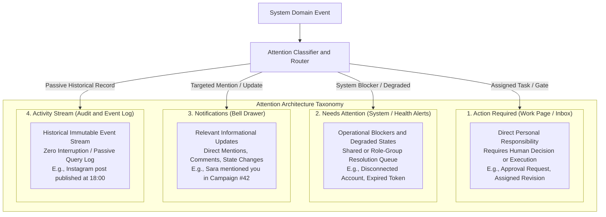
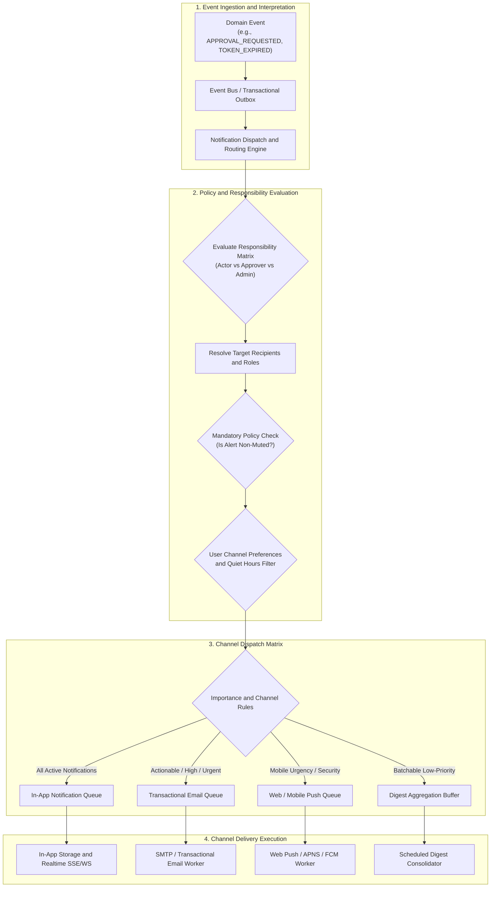
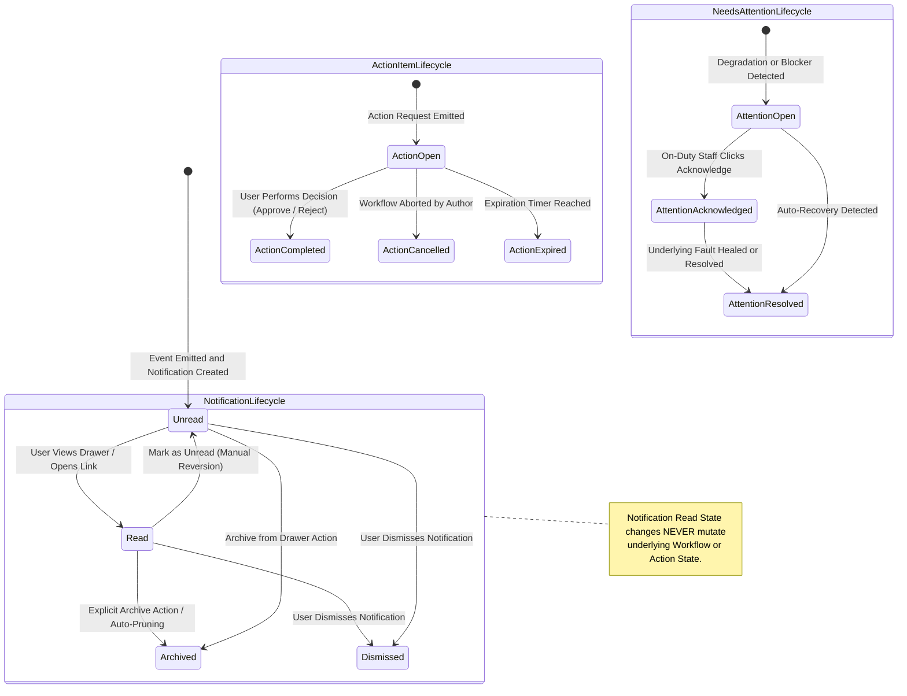
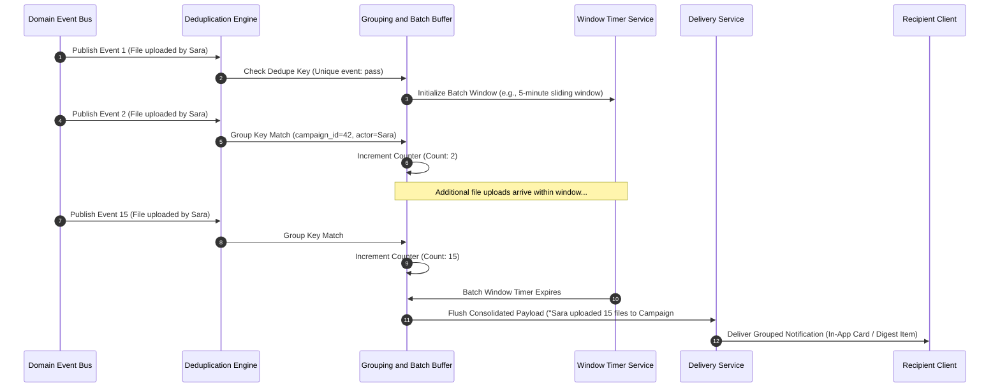
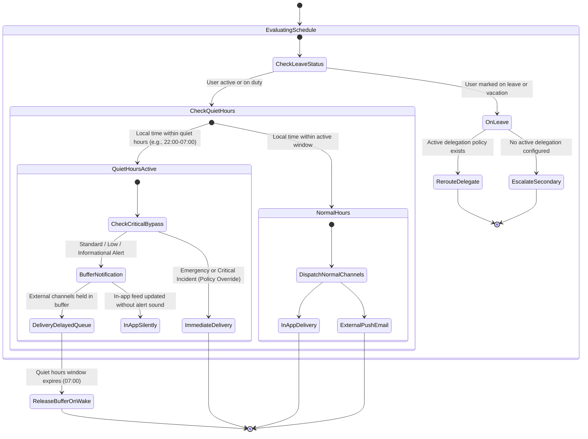
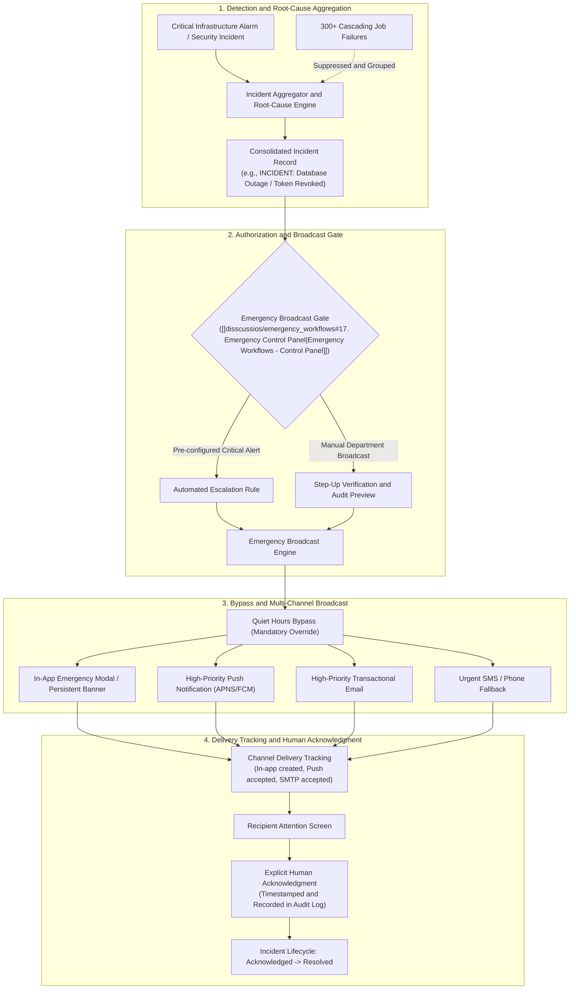
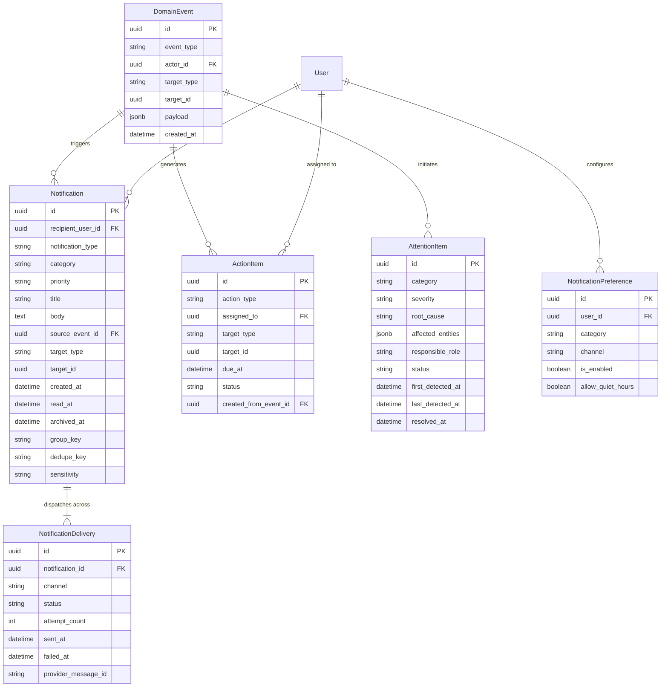

[[Comms Hub|Comms Hub Overview]] | [[MVP_draft|MVP UI Shell Draft]] | [[discussions_list|Master Discussions Index]] | [[disscussios/approval_policy_design|Approval Policy Design]] | [[disscussios/failure_handling_background_jobs|Failure Handling Background Jobs]] | [[disscussios/search_and_metadata|Search and Metadata]]

---

# Notification Model — Communication Department Hub

> [!note] Status: Discussion record — not final notification specification
> **Status: Discussion record — not final notification specification**
>
> This document preserves the current discussion about notifications, actions, Needs Attention, activity, reminders, escalation, delivery channels, preferences, grouping, deduplication, incident handling, localization, and mobile behavior.
>
> The concepts below are architectural directions only. Exact notification categories, mandatory alerts, email behavior, reminder timing, quiet hours, escalation rules, delivery providers, and MVP boundaries are still under discussion.

---

## Structure Tree & Document Map

- [[#Notification Model — Communication Department Hub|Overview & Scope]]
- **Part I: Attention Model Foundations & Taxonomy**
  - [[#1. Notification, Action, and Activity Are Different|1. Notification, Action, and Activity Are Different]]
  - [[#2. Needs Attention Is a Fourth Concept|2. Needs Attention Is a Fourth Concept]]
  - [[#3. Notifications Should Originate From Events|3. Notifications Should Originate From Events]]
  - [[#4. Events and Notifications Remain Separate|4. Events and Notifications Remain Separate]]
  - [[#5. Do Not Notify Everyone About Everything|5. Do Not Notify Everyone About Everything]]
  - [[#6. Notifications Should Follow Responsibility|6. Notifications Should Follow Responsibility]]
  - [[#7. Importance Levels|7. Importance Levels]]
  - [[#8. Category and Priority Are Different|8. Category and Priority Are Different]]
- **Part II: Notification Center UX, Lifecycles & State Decoupling**
  - [[#9. Notification Center|9. Notification Center]]
  - [[#10. Action Required Should Also Be Prominent Elsewhere|10. Action Required Should Also Be Prominent Elsewhere]]
  - [[#11. Read State and Workflow State Are Separate|11. Read State and Workflow State Are Separate]]
  - [[#12. Lifecycle States|12. Lifecycle States]]
  - [[#13. Acknowledgment for Critical Warnings|13. Acknowledgment for Critical Warnings]]
  - [[#14. Grouping|14. Grouping]]
  - [[#15. Deduplication|15. Deduplication]]
  - [[#16. Update Existing Attention Items|16. Update Existing Attention Items]]
- **Part III: Reminders, Background Timers & Escalation Policies**
  - [[#17. Reminders Are Different From Notifications|17. Reminders Are Different From Notifications]]
  - [[#18. Reminder Jobs Should Cancel Automatically|18. Reminder Jobs Should Cancel Automatically]]
  - [[#19. Escalation Policies|19. Escalation Policies]]
  - [[#20. Escalation Does Not Always Mean Notify the Boss|20. Escalation Does Not Always Mean Notify the Boss]]
- **Part IV: Governance, Preferences, Quiet Hours & Delivery Channels**
  - [[#21. User Preferences Within Organizational Policy|21. User Preferences Within Organizational Policy]]
  - [[#22. Mandatory Notifications|22. Mandatory Notifications]]
  - [[#23. Delivery Channels|23. Delivery Channels]]
  - [[#24. In-App Should Be the Primary Channel|24. In-App Should Be the Primary Channel]]
  - [[#25. Email Should Not Mirror Every Notification|25. Email Should Not Mirror Every Notification]]
  - [[#26. Digests|26. Digests]]
  - [[#27. Urgent Events Should Not Wait for a Digest|27. Urgent Events Should Not Wait for a Digest]]
  - [[#28. Quiet Hours|28. Quiet Hours]]
  - [[#29. Future Work-Schedule Awareness|29. Future Work-Schedule Awareness]]
- **Part V: Content Framing, Sensitivity, Push Rules & Localization**
  - [[#30. Deep Links|30. Deep Links]]
  - [[#31. Enough Context, Not Too Much|31. Enough Context, Not Too Much]]
  - [[#32. Sensitivity-Aware Notifications|32. Sensitivity-Aware Notifications]]
  - [[#33. Push Notifications Need the Same Sensitivity Rules|33. Push Notifications Need the Same Sensitivity Rules]]
  - [[#34. Localization|34. Localization]]
  - [[#35. Time Localization|35. Time Localization]]
  - [[#36. Notification Template History|36. Notification Template History]]
- **Part VI: Realtime Delivery, Actor Filtering, Social & Workflow Signals**
  - [[#37. Realtime Delivery and Persistence Are Separate|37. Realtime Delivery and Persistence Are Separate]]
  - [[#38. Toasts and Notifications Are Different|38. Toasts and Notifications Are Different]]
  - [[#39. Do Not Notify Users About Their Own Actions by Default|39. Do Not Notify Users About Their Own Actions by Default]]
  - [[#40. Mentions|40. Mentions]]
  - [[#41. Following / Watching|41. Following / Watching]]
  - [[#42. Aggregate Child Job Events|42. Aggregate Child Job Events]]
  - [[#43. Notify on Stable Parent Workflow State|43. Notify on Stable Parent Workflow State]]
- **Part VII: Incident Handling, Security Routing & Delivery Assurance**
  - [[#44. Incident Grouping|44. Incident Grouping]]
  - [[#45. Root-Cause Alerts|45. Root-Cause Alerts]]
  - [[#46. Security Routing|46. Security Routing]]
  - [[#47. Delivery Confirmation for Critical Alerts|47. Delivery Confirmation for Critical Alerts]]
  - [[#48. Read Receipts Should Not Become Surveillance|48. Read Receipts Should Not Become Surveillance]]
  - [[#49. Notification Delivery Jobs|49. Notification Delivery Jobs]]
- **Part VIII: Domain Data Model, Keys, Admin Policies & Broadcasts**
  - [[#50. Notification Data Model|50. Notification Data Model]]
  - [[#51. Action Items Should Be Separate|51. Action Items Should Be Separate]]
  - [[#52. Needs Attention Records|52. Needs Attention Records]]
  - [[#53. Connected Model|53. Connected Model]]
  - [[#54. Dedupe and Group Keys|54. Dedupe and Group Keys]]
  - [[#55. User-Friendly Preference Categories|55. User-Friendly Preference Categories]]
  - [[#56. Admin Notification Policy|56. Admin Notification Policy]]
  - [[#57. Mass Notifications Should Be Intentional|57. Mass Notifications Should Be Intentional]]
  - [[#58. Broadcast Announcements Are a Separate Product Feature|58. Broadcast Announcements Are a Separate Product Feature]]
- **Part IX: Observability, Correlation, Loops & Mobile Experience**
  - [[#59. Notification Analytics Should Improve the System|59. Notification Analytics Should Improve the System]]
  - [[#60. Notification System Health|60. Notification System Health]]
  - [[#61. Correlation IDs|61. Correlation IDs]]
  - [[#62. Prevent Recursive Notification Loops|62. Prevent Recursive Notification Loops]]
  - [[#63. Notification Policy Changes Should Be Auditable|63. Notification Policy Changes Should Be Auditable]]
  - [[#64. Some Reminder Rules Belong to Workflow Policies|64. Some Reminder Rules Belong to Workflow Policies]]
  - [[#65. Mobile Notification Design|65. Mobile Notification Design]]
  - [[#66. Home Dashboard Should Summarize|66. Home Dashboard Should Summarize]]
- **Part X: Architectural Synthesis, MVP Boundaries & Unresolved Decisions**
  - [[#67. Conceptual Architecture|67. Conceptual Architecture]]
  - [[#68. Recommended MVP|68. Recommended MVP]]
  - [[#69. Core Principle|69. Core Principle]]
  - [[#70. Still Unresolved|70. Still Unresolved]]

---

# 1. Notification, Action, and Activity Are Different

The system should distinguish:

```text
ACTION / INBOX
Something requires me to do something.

NOTIFICATION
Something happened that I should know about.

ACTIVITY
A historical record of what happened.
```

Examples:

```text
ACTION REQUIRED

National Day Post
Approval requested from you.

[Review]
```

```text
NOTIFICATION

Sara mentioned you in Campaign #42.
```

```text
ACTIVITY

Instagram post published successfully
at 18:00.
```

Combining all three into one notification stream would create noise.

> [!note] Semantic Separation of Concerns
> Merging actionable obligations with passive informational notifications destroys prioritization. Action items represent workflow commitments requiring user decisions, while notifications represent ambient situational awareness. Cross-reference: [[discussions_list#6. Three-Tier Attention Architecture|Discussions List - Attention Architecture]] and [[MVP_draft#15. Work Page|MVP Work Page]].

---

# 2. Needs Attention Is a Fourth Concept

A system or workflow problem may need resolution without being a normal assigned action.

Example:

```text
LinkedIn account disconnected.
```

Possible model:

```text
ACTION REQUIRED
Assigned responsibility requiring a person

NEEDS ATTENTION
Problem blocking/degrading the system or workflow

NOTIFICATION
Useful informational update

ACTIVITY
Complete historical event stream
```

Examples:

```text
Approval request
→ ACTION REQUIRED
```

```text
Instagram token expired
→ NEEDS ATTENTION
```

```text
Sara commented on your task
→ NOTIFICATION
```

```text
Sara uploaded Version 4
→ ACTIVITY
```

> [!important] Attention Taxonomy and Classification Flow
> Operational health blockers (such as expired OAuth tokens or stalled queues) must not hide in informational streams, nor can they always be mapped to an individual user's task inbox. They constitute shared operational debt requiring explicit resolution.



---

# 3. Notifications Should Originate From Events

Avoid feature code directly creating arbitrary text messages.

Prefer:

```text
EVENT
  ↓
Notification Policy
  ↓
Who should receive it?
  ↓
What kind of message?
  ↓
Which channels?
  ↓
Create notifications
```

Example source event:

```text
APPROVAL_REQUESTED

actor:
Sara

target:
Release Package #81

approver:
Mohammed

campaign:
National Day
```

The notification system interprets structured events.

> [!tip] Event-Driven Notification Engine Architecture
> Direct notification invocation from domain services couples features to messaging channels. Instead, domain services emit structured immutable events into an event bus. The notification dispatch engine applies recipient resolution, policy matrix checks, and multi-channel routing asynchronously.



---

# 4. Events and Notifications Remain Separate

An event describes what happened.

A notification decides who needs to know about it.

Example:

```text
POST_PUBLISHED
```

may remain visible in Activity even if a Manager disabled publication-success notifications.

Principle:

> Events describe reality. Notifications decide who needs to hear about that reality.

---

# 5. Do Not Notify Everyone About Everything

Recipient selection should be deliberate.

Potential relationships:

```text
task creator
assignee
campaign owner
manager
followers/watchers
mentioned users
```

Example policy:

```text
TASK_COMPLETED

Notify:
Task creator
Campaign owner if task is critical

Do not notify:
Completing employee
Entire department
Admin
```

---

# 6. Notifications Should Follow Responsibility

Principle:

> Notify the person who can act, not everyone who might be interested.

Examples:

```text
Caption invalid
→ Content author
```

```text
OAuth token expired
→ Manager/Admin with integrations.manage
```

```text
System backup failed
→ Admin
```

This follows failure ownership.

> [!important] Role-Aware Responsibility Routing
> Broadcast notification flooding causes alert fatigue. Alerts must pinpoint the exact role and capability responsible for taking remediation action. See [[disscussios/organizational_role_discussion#30. Role-Aware Notification Routing|Role-Aware Notification Routing]] for granular mapping of role permissions to operational events.

---

# 7. Importance Levels

Possible classification:

| Level | Meaning | Example |
|---|---|---|
| Info | Useful update | Comment added |
| Action | User needs to act | Approval requested |
| Warning | Problem may affect work | Token expiring |
| Critical | Immediate operational/security risk | Major outage/security incident |

Critical should remain rare.

---

# 8. Category and Priority Are Different

Examples:

```text
ACTION REQUIRED
Priority: Normal
```

Routine approval.

```text
ACTION REQUIRED
Priority: High
```

Emergency public correction.

Likewise:

```text
WARNING
Priority: Low
```

Storage nearing threshold.

```text
WARNING
Priority: High
```

Integration expiring before a major campaign.

Keep:

```text
category
```

separate from:

```text
priority
```

---

# 9. Notification Center

Possible UI:

```text
NOTIFICATIONS

All | Action | Attention | Mentions
```

Example feed:

```text
ACTION REQUIRED
National Day Reel
Mohammed requested your revision.
[Open]

MENTION
Sara mentioned you in Campaign #28.
[View comment]

WARNING
LinkedIn needs reconnection before
tomorrow's scheduled publication.
[Reconnect]

INFO
Your Instagram post published successfully.
[View]
```

> [!note] In-App Notification Center Drawer Specification
> The Notification Center UI serves as the primary notification hub across the application shell. See detailed drawer UI specifications, tabs, and action integration in [[MVP_draft#40. Notification Center Drawer|MVP Notification Center Drawer]].

---

# 10. Action Required Should Also Be Prominent Elsewhere

Do not hide operational responsibilities under a bell icon.

Home may show:

```text
YOUR ACTIONS

3 approvals
2 requested revisions
1 overdue task
```

Manager:

```text
NEEDS YOUR ATTENTION

4 approvals
1 failed publication
1 disconnected account
```

> [!important] Action Visibility Beyond the Bell
> Bell icons are easily ignored or dismissed. Real operational workload items (approvals, revisions, assignments) must be rendered prominently on the dedicated [[MVP_draft#15. Work Page|MVP Work Page]] and executive dashboard widgets.

---

# 11. Read State and Workflow State Are Separate

Opening a notification must not complete the underlying responsibility.

Example:

```text
Notification:
READ
```

while:

```text
Approval Request:
PENDING
```

Only the real workflow action changes the workflow state.

> [!caution] Non-Destructive Read State Rule
> A notification read event is strictly a viewport tracking event, indicating the user's client rendered or opened the notification item. It does NOT constitute workflow task completion, acknowledgment of duty, or resolution of an operational blocker.

---

# 12. Lifecycle States

Notification:

```text
UNREAD
READ
ARCHIVED
DISMISSED
```

Action Item:

```text
OPEN
COMPLETED
CANCELLED
EXPIRED
```

Needs Attention:

```text
OPEN
ACKNOWLEDGED
RESOLVED
```

These should remain distinct.

> [!important] Tripartite Lifecycle Separation and State Machine
> Conflating notification states with domain workflow states creates dangerous phantom task completions. The system enforces three distinct lifecycle state machines operating in complete isolation.



Cross-reference: Integrates directly with the [[MVP_draft#40. Notification Center Drawer|MVP Notification Center Drawer]].

---

# 13. Acknowledgment for Critical Warnings

Example:

```text
CRITICAL

External publishing has been paused
because suspicious account activity
was detected.

[Acknowledge]
```

Then:

```text
Acknowledged by:
Mohammed — 02:13
```

The issue stays open until resolved.

---

# 14. Grouping

Avoid one notification per repetitive action.

Bad:

```text
Sara uploaded file 1.
Sara uploaded file 2.
...
```

Better:

```text
Sara uploaded 15 files
to National Day Campaign.
```

Similarly:

```text
5 new comments in
National Day Campaign
```

> [!tip] Grouping and Debouncing Sequence
> Rapid-fire consecutive actions on the same entity should be debounced and consolidated within a sliding batch window rather than flooding user channels with individual events.



---

# 15. Deduplication

Repeated health checks should not create duplicate warnings.

Bad:

```text
09:00 warning
09:15 warning
09:30 warning
...
```

Better:

```text
Needs Attention:
LinkedIn requires reconnection

First detected:
09:00

Last checked:
12:45
```

---

# 16. Update Existing Attention Items

Example:

```text
NAS unavailable
```

creates one Attention Item.

Further failures update the same issue.

When resolved:

```text
Attention Item
→ RESOLVED
```

Optional informational notice:

```text
NAS connection restored.
```

---

# 17. Reminders Are Different From Notifications

Notification:

```text
EVENT
→ immediate information
```

Reminder:

```text
OPEN ACTION
+
TIME CONDITION
→ re-surface unresolved work
```

Example:

```text
Approval requested
10:00
```

No response later:

```text
Reminder:
Approval still waiting.
```

> [!note] Scheduled Reminder Decoupling
> Reminders are not generated spontaneously; they are registered as scheduled background jobs linked to a parent workflow entity. See [[disscussios/approval_policy_design#32. Approval Reminders as Background Jobs|Approval Reminders as Background Jobs]].

---

# 18. Reminder Jobs Should Cancel Automatically

If approval is completed before scheduled reminders:

```text
cancel remaining reminder jobs
```

This prevents stale reminders.

> [!tip] Automatic Job Cancellation Pattern
> Whenever the lifecycle state of an Action Item transitions to `COMPLETED` or `CANCELLED`, the system publishes a state-change event that triggers immediate cancellation of any pending background reminder jobs registered for that entity. See [[disscussios/approval_policy_design#32. Approval Reminders as Background Jobs|Approval Reminders as Background Jobs]].

---

# 19. Escalation Policies

Example:

```text
Approval waiting 12 hours
→ remind approver

24 hours
→ remind again

48 hours
→ escalation
```

Another:

```text
Integration disconnected T-24h
→ Manager warning

Still disconnected T-1h
→ High-priority warning

Publish time reached
→ Needs Attention + blocked job
```

---

# 20. Escalation Does Not Always Mean Notify the Boss

Possible sequence:

```text
same user
      ↓
designated substitute
      ↓
manager
```

Escalation should follow workflow policy.

---

# 21. User Preferences Within Organizational Policy

Possible user preferences:

```text
Comments:
In-app only

Mentions:
In-app + email

Task assigned:
In-app + email

Publication success:
In-app only
```

Hierarchy:

```text
ADMIN NOTIFICATION POLICY
        ↓
TEAM / MANAGER POLICY
        ↓
USER PREFERENCES
```

Lower levels cannot suppress mandatory alerts defined above them.

---

# 22. Mandatory Notifications

Potential mandatory categories for responsible users:

```text
Account role changed
MFA disabled
Official account disconnected
Critical publication failure
Security incident
Emergency override used
Backup failure over threshold
```

Mandatory means the intended recipient cannot mute it.

It does not mean everyone receives it.

> [!warning] Mandatory Alert Policy Boundary
> Critical security alerts, emergency announcements, and blocking compliance tasks must be designated non-suppressible at the organizational policy tier. Users may configure delivery channels (e.g., mobile push vs email) where permitted, but cannot mute the notification itself.

---

# 23. Delivery Channels

Initial channels may be:

```text
IN_APP
EMAIL
```

Future:

```text
PUSH
SMS
```

Architecture:

```text
Notification
      ↓
Delivery Policy
      ↓
 ┌────┼────┐
 ▼    ▼    ▼
InApp Email Push
```

---

# 24. In-App Should Be the Primary Channel

Ordinary work should primarily live inside the Hub.

Example notification:

```text
Mohammed requested changes to
National Day Post.
```

can deep-link directly to the affected work item.

Email becomes a secondary channel.

---

# 25. Email Should Not Mirror Every Notification

Avoid dozens of notification emails every day.

Email may be useful for:

```text
direct assignment
approval request
important mention
high-priority failure
digest
```

Routine updates remain in-app.

---

# 26. Digests

Possible daily summary:

```text
Daily Communication Hub Summary

3 tasks completed
2 new comments
4 publications succeeded
1 item needs your review

[Open Hub]
```

Manager summary:

```text
TODAY

6 scheduled publications
4 pending approvals
2 overdue tasks
1 integration warning
```

---

# 27. Urgent Events Should Not Wait for a Digest

Example policy:

```text
Routine info
→ digest

Scheduled publication failed
→ immediate

Security alert
→ immediate
```

Possible delivery modes:

```text
IMMEDIATE
DIGEST
IN_APP_ONLY
SUPPRESSED
```

---

# 28. Quiet Hours

Example:

```text
Quiet hours:
22:00–07:00
```

Ordinary external alerts may be delayed.

Critical notifications may still be delivered according to organizational policy.

> [!warning] Quiet Hours and Escalation Boundary State Machine
> The notification subsystem must respect off-duty hours without blinding the organization to emergency outages. Critical incident policies override user quiet-hour mutes, while non-critical alerts are buffered until the quiet-hours window concludes.



---

# 29. Future Work-Schedule Awareness

Future routing may account for:

```text
leave
weekends
shifts
delegation
```

Example:

```text
Manager on leave
→ route approval to delegated approver
```

---

# 30. Deep Links

Avoid:

```text
Something changed.

[Open Dashboard]
```

Prefer:

```text
Sara requested your review
on Image 3.

[Open Image 3 Review]
```

Useful target data:

```text
target_type
target_id
target_subcontext
comment_id
version_id
approval_request_id
```

---

# 31. Enough Context, Not Too Much

Good notification:

```text
Mohammed requested changes to
"National Day Instagram Reel"

Comment:
"Replace image 2."

[Review Changes]
```

Avoid embedding entire discussions into notifications.

---

# 32. Sensitivity-Aware Notifications

Sensitive material should not leak through email or lock-screen previews.

Instead of:

```text
CONFIDENTIAL CAMPAIGN:
...
```

use:

```text
You have a new high-priority review
in Communication Hub.

[Open Securely]
```

Notification templates should support sensitivity-aware rendering.

> [!caution] Information Leakage Prevention
> Push notifications and unencrypted transactional emails travel through third-party infrastructure (APNs, FCM, SMTP relays) and render on lock screens. High-sensitivity notifications must omit confidential draft content, preview images, or embargoed campaign titles, providing only an opaque reference and deep link.

---

# 33. Push Notifications Need the Same Sensitivity Rules

Mobile lock screens may expose message text.

Sensitive content classification may decide between:

```text
full preview
```

and:

```text
generic secure notification
```

---

# 34. Localization

Notification business logic should not hard-code text.

Use templates.

Example:

```text
event:
APPROVAL_GRANTED

template:
notification.approval_granted
```

Then render in:

```text
Arabic
English
```

according to user preference.

---

# 35. Time Localization

Dates and times should display according to organizational/user timezone and locale while preserving one canonical underlying timestamp.

---

# 36. Notification Template History

For audit-sensitive notifications, preserve what the user actually received.

Possible approaches:

```text
rendered title/body
```

or:

```text
template version
+
render data
```

---

# 37. Realtime Delivery and Persistence Are Separate

Persist important notifications first.

Realtime can then tell the UI:

> A new durable notification exists.

If the user is offline, the notification remains available next login.

---

# 38. Toasts and Notifications Are Different

Toast:

```text
✓ Draft saved.
```

Ephemeral.

Notification:

```text
Mohammed requested changes.
```

Durable.

Do not create permanent notifications for obvious self-confirming actions.

> [!note] Ephemeral vs Persistent Interaction Surfaces
> Toasts represent ephemeral feedback confirming immediate synchronous user interaction within the active browser session. Notifications represent durable state changes delivered asynchronously that persist until explicitly addressed.

---

# 39. Do Not Notify Users About Their Own Actions by Default

Example:

```text
Sara completes task
```

Sara usually does not need:

```text
You completed the task.
```

Potentially notify other responsible parties instead.

Significant external actions may justify confirmation.

---

# 40. Mentions

`@Sara` should reliably create a notification.

The notification should link directly to the source comment.

If the comment is edited later, the historical notification may remain while reflecting that the source changed.

---

# 41. Following / Watching

Future feature:

```text
Follow this campaign
```

Receive selected updates without being assigned.

This should be opt-in and configurable.

Not required for MVP.

---

# 42. Aggregate Child Job Events

For a five-platform publish, avoid five success notifications.

Prefer:

```text
Publication completed on 5 channels.
```

If one fails:

```text
Published to 4 of 5 channels.

LinkedIn needs attention.

[View Publication]
```

---

# 43. Notify on Stable Parent Workflow State

Child updates may remain in Activity.

Create a meaningful user notification when the parent workflow reaches:

```text
SUCCEEDED
PARTIAL_FAILURE
FAILED
```

This reduces noise.

---

# 44. Incident Grouping

If a platform outage causes hundreds of job failures, create one incident rather than hundreds of alerts.

Example:

```text
INCIDENT

Database connectivity issue

Affected:
300 background operations

First detected:
14:03

Current status:
Recovering
```

> [!caution] Critical Incident Blast Radius Control
> A downstream platform outage (such as an API rate limit or database blip) must never trigger an alert storm of individual failure notifications. The incident aggregator groups child failures under a unified incident entity, routed via [[disscussios/emergency_workflows#17. Emergency Control Panel|Emergency Workflows - Control Panel]].

---

# 45. Root-Cause Alerts

Example:

```text
Instagram credential expired
```

may block eight scheduled jobs.

Prefer:

```text
Primary Attention Item:

Instagram connection expired

Affected:
8 scheduled publications

[Reconnect]
```

instead of nine urgent notifications.

---

# 46. Security Routing

Security notifications may route differently.

Example:

```text
Admin role changed
```

Recipients:

```text
security/admin users
affected user
```

Routing can depend on:

```text
role
relationship to event
security responsibility
```

---

# 47. Delivery Confirmation for Critical Alerts

For critical events, track delivery infrastructure:

```text
In-app created ✓
Email accepted ✓
Push accepted ✓
```

This does not prove a human read it, but confirms channel delivery.

> [!important] Multi-Channel Broadcast and Verification Pipeline
> For critical emergency declarations and security alerts, the notification system initiates a multi-channel broadcast with explicit delivery verification, bypassing user quiet-hours and tracking downstream channel acceptance.



---

# 48. Read Receipts Should Not Become Surveillance

Ordinary notifications do not need managerial read tracking.

Use explicit acknowledgment when a workflow genuinely requires it.

```text
Read
```

is mostly personal UI state.

```text
Acknowledged
```

is an intentional workflow action.

> [!important] Privacy and Trust Boundary
> Read receipts should be reserved for high-severity emergency broadcasts and auditable legal compliance workflows. Implementing universal read surveillance on routine team interactions undermines organizational trust and distorts communication patterns.

---

# 49. Notification Delivery Jobs

Notification and delivery are separate.

```text
Notification #100
      │
      ├── InApp Delivery
      ├── Email Delivery
      └── Future Push Delivery
```

If email fails, the in-app notification still exists.

> [!important] Worker Isolation for Notification Deliveries
> Notification delivery jobs must never block core transaction threads or share worker pools with resource-heavy media processing. See [[disscussios/failure_handling_background_jobs#38. Notification Jobs Should Be Separate|Notification Jobs Separation]] for dedicated queue isolation patterns.

---

# 50. Notification Data Model

Conceptual model:

```text
Notification

id
recipient_user_id

type
category
priority

title
body

source_event_id

target_type
target_id

created_at

read_at
archived_at

group_key
dedupe_key
sensitivity
```

Delivery records:

```text
NotificationDelivery

notification_id

channel
status

attempt_count

sent_at
failed_at

provider_message_id
```

---

# 51. Action Items Should Be Separate

Concept:

```text
ActionItem

id
type
assigned_to
target
due_at
status
created_from_event
```

Examples:

```text
APPROVE_CONTENT
REVISE_CONTENT
RECONNECT_INTEGRATION
RESOLVE_FAILED_PUBLICATION
```

Notifications inform users about the action.

The Action Item is the durable responsibility.

---

# 52. Needs Attention Records

Concept:

```text
AttentionItem

id

category
severity

root_cause

affected_entities

owner / responsible role

status

first_detected_at
last_detected_at
resolved_at
```

This supports aggregation and root-cause handling.

---

# 53. Connected Model

```text
EVENT
What happened?

ACTION ITEM
What must someone do?

ATTENTION ITEM
What problem needs resolution?

NOTIFICATION
Who should be informed?

ACTIVITY
Historical view of events
```

> [!note] Domain Schema Relationships and Entity Architecture
> The data model bridges domain events, actionable workload obligations, system attention items, and notification dispatches across delivery channels.



---

# 54. Dedupe and Group Keys

Example:

```text
dedupe_key:
INTEGRATION-17-REAUTH_REQUIRED
```

Repeated checks update existing state instead of creating duplicate messages.

---

# 55. User-Friendly Preference Categories

Possible settings:

```text
NOTIFICATIONS

Tasks
Assignments               Email + In-app
Due reminders             In-app

Approvals
Approval requests         Email + In-app
Approval results          In-app

Comments
Mentions                  Email + In-app
Other comments            In-app

Publishing
Failures                   Email + In-app
Success                    In-app

System
Critical alerts           Required
```

Do not expose technical internal event names to users.

---

# 56. Admin Notification Policy

Possible Admin configuration:

```text
NOTIFICATION POLICY

Security alerts
Mandatory                ON
Email                    ON
Push                     ON

Publishing failures
Mandatory for Managers   ON

Approval reminders
After                    12 hours

Escalation
After                    24 hours
```

Team policies and user preferences operate within Admin boundaries.

> [!warning] Administrative Governance Boundary
> Global notification policies established by administrators override team and user-level defaults to ensure regulatory compliance, SLA enforcement, and business continuity during operational disruptions.

---

# 57. Mass Notifications Should Be Intentional

`Notify all employees` should be a deliberate broadcast capability with:

- proper permission
- preview
- confirmation
- audit

It should not happen accidentally through ordinary notification rules.

---

# 58. Broadcast Announcements Are a Separate Product Feature

Example:

```text
Department Announcement

"Tomorrow's event has moved to 10:00."

Audience:
All Communication employees
```

This is intentional communication, not a system-generated event notification.

It may reuse delivery infrastructure underneath.

---

# 59. Notification Analytics Should Improve the System

Useful metrics:

```text
Number of unresolved action items
Average time to resolve attention items
Notifications generated by category
Frequently muted optional categories
Email delivery failure rate
```

Avoid turning notification behavior into employee productivity scoring.

---

# 60. Notification System Health

Possible Admin view:

```text
NOTIFICATION HEALTH

In-app
✓ Healthy

Email
✓ Healthy

Push
Not configured

Failed deliveries today
3

Queued
12
```

Delivery failures feed system health monitoring.

---

# 61. Correlation IDs

Related items should share a common correlation identifier.

Example:

```text
PUB-882
```

could connect:

```text
Attention item
Action item
Manager notification
Admin notification
Email delivery
```

---

# 62. Prevent Recursive Notification Loops

Do not allow:

```text
Notification delivery failed
→ notification about failure
→ delivery fails
→ another notification
→ ...
```

Channel failure handling must avoid recursive alert creation.

> [!caution] Cascading Loop Prevention
> A notification delivery failure or delivery event must NEVER trigger another standard notification. Failure handling must be routed strictly to dedicated error-tracking logs or consolidated operational dashboards to prevent catastrophic recursive loops.

---

# 63. Notification Policy Changes Should Be Auditable

Example:

```text
Mohammed changed Approval Reminder
12h → 6h
```

Heavy versioning may not be needed initially, but policy changes should be traceable.

---

# 64. Some Reminder Rules Belong to Workflow Policies

Example:

```text
Approval Policy

Reminder after:
12h

Escalate after:
24h
```

belongs with approval workflow.

Whereas:

```text
Email delivery enabled
```

belongs with notification infrastructure.

---

# 65. Mobile Notification Design

Mobile notifications should have:

```text
clear title
one-line context
primary action
deep link
```

Example:

```text
Approval requested

National Day Reel
Due today

[Review]
```

---

# 66. Home Dashboard Should Summarize

Home may show:

```text
YOUR WORK

Actions              4
Needs Attention      1
Unread Mentions      2
```

Then users open the relevant queue.

Avoid duplicating the full notification feed on Home.

---

# 67. Conceptual Architecture

```text
                         SYSTEM EVENT
                              │
                              ▼
                    NOTIFICATION POLICY
                              │
         ┌────────────────────┼────────────────────┐
         ▼                    ▼                    ▼
 Recipient Resolution    Classification       Group/Dedupe
         │                    │                    │
         └────────────────────┼────────────────────┘
                              ▼
                ┌──────────────────────────┐
                │                          │
          ACTION / ATTENTION          NOTIFICATION
                │                          │
                │                  Delivery Policy
                │                          │
                │                 ┌────────┼────────┐
                │                 ▼        ▼        ▼
                │              In-App    Email    Push
                │
                ▼
          Workflow remains open
          until actually resolved

Everything
     ↓
Activity / Audit where appropriate
```

Reminders:

```text
Open Action / Attention
          │
          ▼
Background Job Scheduler
          │
          ▼
Reminder / Escalation Event
          │
          ▼
Notification Policy
```

> [!tip] Conceptual System Architecture Integration
> The notification model forms an integral pillar of the overall communications platform. For high-level architectural interactions, cross-reference [[discussions_list#6. Three-Tier Attention Architecture|Discussions List - Attention Architecture]].

---

# 68. Recommended MVP

Start with:

```text
IN-APP NOTIFICATIONS
Primary channel

EMAIL
Selected important categories
```

Primary concepts:

```text
Actions
Needs Attention
Notifications
Activity
```

Initial categories:

```text
Task assignment
Approval requested
Changes requested
Direct mentions
Upcoming deadlines
Publishing failure
Integration problem
Important publishing success
Security events for appropriate users
```

Include grouping, deduplication, reminder cancellation, and deep links early.

---

# 69. Core Principle

> **A notification should have a reason to interrupt somebody.**

If it does not:

- put it in Activity
- include it in a digest
- show it on the relevant dashboard

rather than making the notification bell light up.

Notifications are not the source of truth.

The source of truth remains the underlying:

```text
Task
Approval
Job
Connected Account
Attention Item
etc.
```

Reading or deleting a notification must never delete the underlying responsibility.

^notification-model-boundary

> [!important] Attention Model Governance Anchor
> Cross-reference with [[Comms Hub#Master Vault Document Map|Comms Hub Master Map]] and [[MVP_draft#40. Notification Center Drawer|MVP Notification Center Drawer]].

---

# 70. Still Unresolved

We still need to decide:

- Exact notification categories
- Mandatory alert rules
- Email provider
- Push notification provider
- Digest schedule
- Quiet-hours behavior
- Escalation timing
- Acknowledgment requirements
- Notification retention
- Grouping/deduplication rules
- Sensitivity classifications
- Localization details
- Notification template architecture
- Mobile push scope
- Broadcast announcement design
- Which user preferences are configurable
- Which security alerts cannot be muted

This document preserves the notification-model discussion only. It is not yet the final notification architecture.


---

## External Architectural & Standards References

- **W3C Web Notifications API Specification**: [W3C Web Notifications Spec](https://www.w3.org/TR/notifications/)
- **IETF RFC 8030 Generic Event Delivery Using Web Push**: [RFC 8030 Specification](https://datatracker.ietf.org/doc/html/rfc8030)
- **Courier Multi-Channel Notification Architecture Patterns**: [Courier Architecture Guide](https://www.courier.com/docs/)
- **Novu Open-Source Notification Infrastructure**: [Novu Engineering Handbook](https://docs.novu.co/)
- **Mermaid.js Flowchart, State, and ER Specifications**: [Mermaid Documentation](https://mermaid.js.org/)
