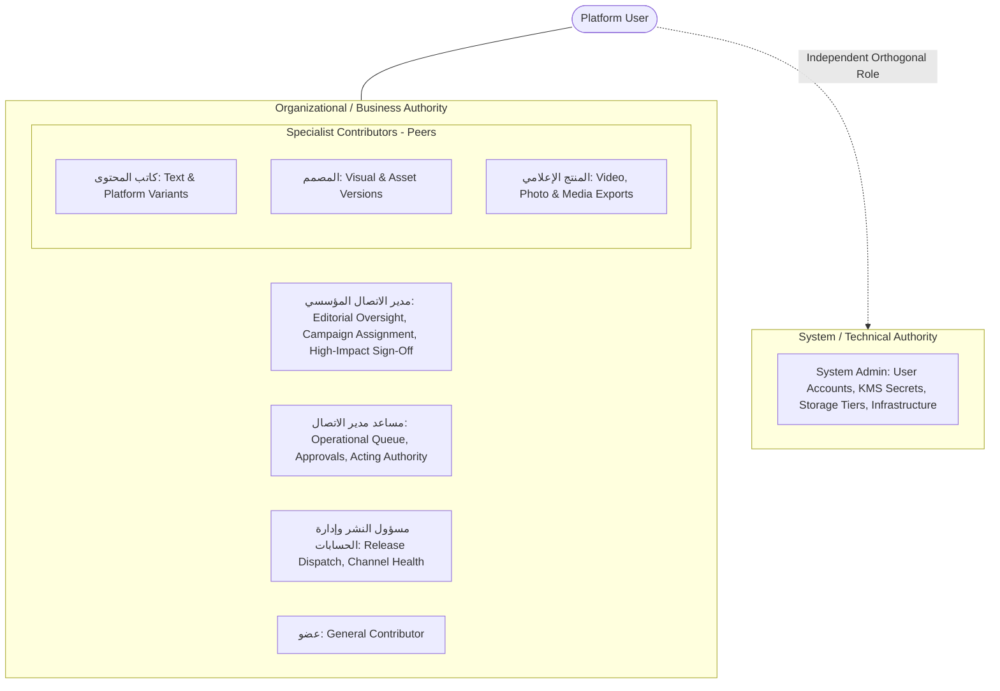
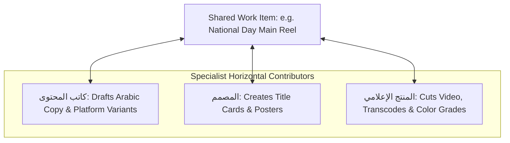
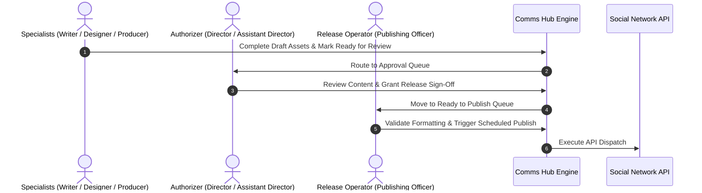
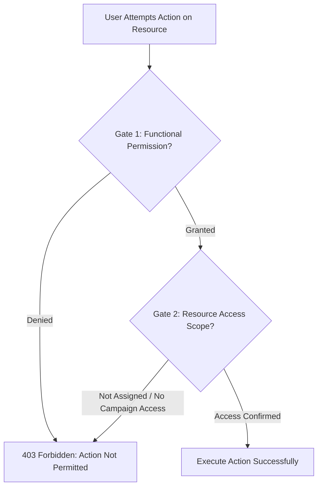
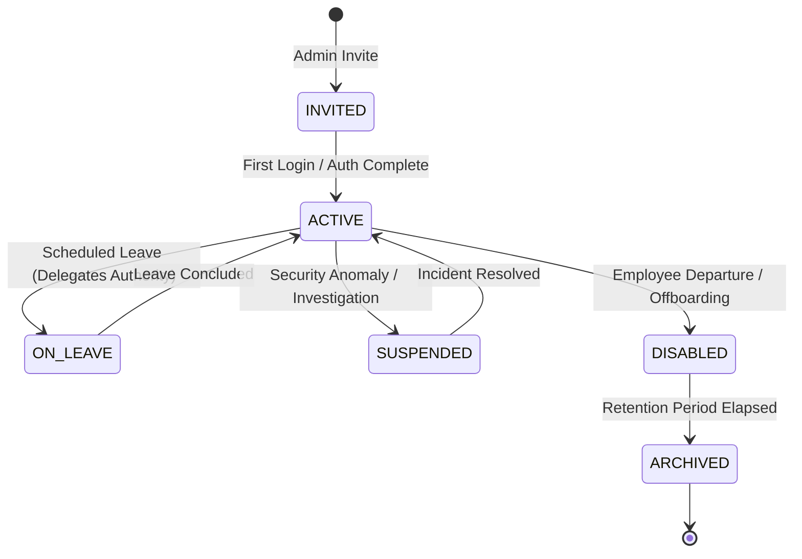
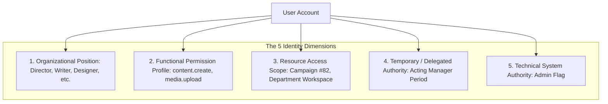

[[Comms Hub|Comms Hub Overview]] | [[MVP_draft|MVP UI Shell Draft]] | [[discussions_list|Master Discussions Index]] | [[disscussios/approval_policy_design|Approval Policy Design]] | [[disscussios/Second_discussion_draft|Second Discussion Draft]]

---

# Organizational Role Discussion — Communication Department Hub

> [!note] Status: Discussion record — not final permission specification
> **Status: Discussion record — not final permission specification**
>
> This document preserves the current discussion about the real Communication Department roles provided by management, plus the additional system Admin role.
>
> The goal is to separate organizational position, system permissions, resource access, temporary authority, and technical administration so the future platform can reflect the real department without hard-coding the application around simplistic role levels.

---


## Structure Tree & Document Map

- [[#Organizational Role Discussion — Communication Department Hub|Overview & Role Separation Context]]
- **Part I: Confirmed Roles & Authority Separation**
  - [[#1. Confirmed Organizational Roles|1. Confirmed Organizational Roles]]
  - [[#2. Organizational Role Is Not the Same as System Authority|2. Organizational Role Is Not the Same as System Authority]]
  - [[#3. Two Different Kinds of Authority|3. Two Different Kinds of Authority]]
  - [[#4. مدير الاتصال المؤسسي — Business Authority|4. مدير الاتصال المؤسسي — Business Authority]]
  - [[#5. مساعد مدير الاتصال المؤسسي — Operational Leadership|5. مساعد مدير الاتصال المؤسسي — Operational Leadership]]
- **Part II: Specialist Contributors & Peer Model**
  - [[#6. Specialist Roles Are Peers, Not Levels|6. Specialist Roles Are Peers, Not Levels]]
  - [[#7. كاتب المحتوى — Content Writer|7. كاتب المحتوى — Content Writer]]
  - [[#8. المصمم — Designer|8. المصمم — Designer]]
  - [[#9. المنتج الإعلامي — Media Producer|9. المنتج الإعلامي — Media Producer]]
  - [[#10. مسؤول النشر وإدارة الحسابات — High-Risk Operational Role|10. مسؤول النشر وإدارة الحسابات — High-Risk Operational Role]]
  - [[#11. Publishing Officer as Release Operator|11. Publishing Officer as Release Operator]]
  - [[#12. عضو — General Member|12. عضو — General Member]]
  - [[#13. Admin — System Administration|13. Admin — System Administration]]
- **Part III: Permissions, Resource Access & Scoping**
  - [[#14. Default Permission Profiles|14. Default Permission Profiles]]
  - [[#15. Role Permission and Resource Access Are Separate|15. Role Permission and Resource Access Are Separate]]
  - [[#16. Campaign Teams|16. Campaign Teams]]
  - [[#17. Organizational Role and Campaign Responsibility Are Different|17. Organizational Role and Campaign Responsibility Are Different]]
  - [[#18. Direct Manager Relationships|18. Direct Manager Relationships]]
- **Part IV: Approval Integration & Duty Separation**
  - [[#19. Approval Policies with Real Roles|19. Approval Policies with Real Roles]]
  - [[#20. Self-Approval|20. Self-Approval]]
  - [[#21. Publishing Officer and Post-Approval Editing|21. Publishing Officer and Post-Approval Editing]]
  - [[#22. Specialist “Ready” States|22. Specialist “Ready” States]]
  - [[#23. Work Items May Need Multiple Participants|23. Work Items May Need Multiple Participants]]
  - [[#24. One User May Hold Multiple Positions|24. One User May Hold Multiple Positions]]
- **Part V: Lifecycle, Delegation & Account Governance**
  - [[#25. Temporary Position Assignment|25. Temporary Position Assignment]]
  - [[#26. Employee Departure|26. Employee Departure]]
  - [[#27. Possible User States|27. Possible User States]]
  - [[#28. Multiple Admins|28. Multiple Admins]]
  - [[#29. Organizational and System Roles Must Not Self-Escalate|29. Organizational and System Roles Must Not Self-Escalate]]
- **Part VI: Contextual Workflows & Identity Model**
  - [[#30. Role-Aware Notification Routing|30. Role-Aware Notification Routing]]
  - [[#31. Role-Aware Home Dashboards|31. Role-Aware Home Dashboards]]
  - [[#32. Preferred Identity Model|32. Preferred Identity Model]]
  - [[#33. Avoid Numeric Role Levels|33. Avoid Numeric Role Levels]]
  - [[#34. The Eight Roles Are Enough as Global Roles|34. The Eight Roles Are Enough as Global Roles]]
  - [[#35. Core Principle|35. Core Principle]]
  - [[#36. Still Unresolved|36. Still Unresolved]]

---

# 1. Confirmed Organizational Roles

The Communication Department currently has these roles:

1. **مدير الاتصال المؤسسي** — Director / Manager of Corporate Communication
2. **مساعد مدير الاتصال المؤسسي** — Assistant Director / Assistant Manager of Corporate Communication
3. **كاتب المحتوى** — Content Writer
4. **المصمم** — Designer
5. **المنتج الإعلامي** — Media Producer
6. **مسؤول النشر وإدارة الحسابات** — Publishing & Account Management Officer
7. **عضو** — Member

The system also adds:

8. **Admin** — System Administrator

The first seven are organizational roles.

`Admin` is a system-administration role and should be treated differently.

---

# 2. Organizational Role Is Not the Same as System Authority

A user’s job position should not directly define every action they can perform.

Example:

```text
User:
Sara

Organizational Position:
Designer

Possible Permissions:
✓ View assigned campaigns
✓ Create/update design work
✓ Upload assets
✓ Create asset versions
✓ Submit for review
✓ Comment

Not automatically:
✕ Approve own external release
✕ Manage social credentials
✕ Change users
✕ Change security policy
```

The system should therefore separate:

```text
USER
 │
 ├── Organizational Position
 │
 └── Permission Set
```

Avoid hard-coded checks such as:

```text
if role == "designer"
```

throughout the application.

---

# 3. Two Different Kinds of Authority

There are two broad authority families.

## Organizational / Business Authority

Examples:

```text
مدير الاتصال المؤسسي
مساعد المدير
كاتب المحتوى
المصمم
المنتج الإعلامي
مسؤول النشر
عضو
```

## System / Technical Authority

Example:

```text
Admin
```

A person may hold both.

Example:

```text
Mohammed

Organizational Position:
مدير الاتصال المؤسسي

System Authority:
Admin
```

But neither role should automatically imply the other.

### Dual Authority Model Architecture



---

# 4. مدير الاتصال المؤسسي — Business Authority

This role is the highest normal authority inside Communication operations.

Likely responsibilities may include:

```text
Department-wide visibility
Campaign oversight
Work assignment
Final approval where policy requires
Publishing authorization
Emergency communication authority
Department analytics
Operational monitoring
Delegation
```

This does not automatically imply technical privileges such as:

```text
View raw OAuth tokens
Modify encryption keys
Disable database security
Delete audit logs
Manage production infrastructure
```

Those belong to system administration.

---

# 5. مساعد مدير الاتصال المؤسسي — Operational Leadership

The Assistant Manager can handle significant operational responsibility.

Possible normal capabilities:

```text
Assign work
Review submissions
Coordinate campaigns
Monitor operational workload
Approve selected workflow types
Handle routine escalations
```

The role may also act temporarily on behalf of the Director.

Example:

```text
Acting Assignment

Principal:
مدير الاتصال المؤسسي

Delegate:
مساعد مدير الاتصال المؤسسي

Period:
Defined start/end dates

Authority:
✓ Routine approvals
✓ Campaign decisions
✓ Publishing approval

Not automatically delegated:
✕ Security administration
✕ User administration
✕ Emergency credential revocation
```

Delegation should be scoped rather than granting every possible Manager capability.

---

# 6. Specialist Roles Are Peers, Not Levels

The following roles should not be treated as a hierarchy:

```text
كاتب المحتوى
المصمم
المنتج الإعلامي
```

They are specialist contributors.

A Work Item may involve one or several of them.

Example:

```text
WORK ITEM
    │
    ├── Content Writer
    ├── Designer
    └── Media Producer
```

Workflow determines who participates.

The system should not assume one fixed specialist pipeline.

### Specialist Peer Collaboration Model



---

# 7. كاتب المحتوى — Content Writer

Likely capabilities:

```text
Create textual content
Edit drafts
Create platform-specific text variants
Attach references
Comment
Respond to requested changes
Submit work for approval
Use permitted AI writing assistance
```

Not automatically:

```text
Final approve own external content
Publish to official accounts
Manage connected accounts
Change approval policies
```

A clean default separation is:

```text
CREATE
Content Writer

AUTHORIZE
Manager / Assistant according to policy

RELEASE
Publishing Officer
```

---

# 8. المصمم — Designer

Likely responsibilities:

```text
Create visual assets
Upload design files
Create asset versions
Attach visuals to Work Items
Respond to design revisions
Submit design work for review
```

Important ownership rule:

> Organizational work belongs to the organization, not personally to the employee who created it.

Example:

```text
Created by:
Sara

Role:
Designer

Owned by:
Communication Department
```

If Sara later leaves the organization:

```text
Her account can be disabled
Her assets remain
Her historical actions remain
Her assignments are transferred
```

---

# 9. المنتج الإعلامي — Media Producer

This role may work heavily with:

```text
Video
Photography
Audio
Raw media
Edited media
Proxies
Project files
Final exports
```

Possible capabilities:

```text
Upload large media
Create versions
Manage working media
Attach media to campaigns
Create previews/proxies
Mark production complete
Submit deliverables for review
Archive according to policy
```

This role should not automatically control:

```text
Permanent deletion
Retention policy
Backup policy
System storage configuration
```

---

# 10. مسؤول النشر وإدارة الحسابات — High-Risk Operational Role

This is likely the most security-sensitive non-management role.

Possible responsibilities:

```text
Schedule approved releases
Publish approved releases
Monitor publication state
Monitor account/integration health
Handle routine platform operations
Review publishing failures
Possibly reauthorize accounts where policy allows
```

Important permission separation:

```text
publishing.execute
✓

publishing.schedule
✓

integration.view_health
✓

integration.reauthorize
maybe

integration.disconnect
possibly Manager/Admin only

integration.view_secret
never
```

Publishing authority and credential-management authority should not be treated as the same permission.

---

# 11. Publishing Officer as Release Operator

A strong default workflow is:

```text
Writer / Designer / Media Producer
        ↓
Create work

Manager / Assistant
        ↓
Approve release

Publishing Officer
        ↓
Schedule / Publish
```

Example audit trail:

```text
National Day Reel

Created:
Media Producer

Caption:
Content Writer

Design:
Designer

Approved:
Assistant Manager

Published:
Publishing Officer
```

Exceptions can still exist through permissions and policy.

### Tripartite Separation of Duties Sequence



> [!tip] In-Depth Policy Binding
> How multi-tier approvals, SLAs, and release authorizers interact in code is defined in [[disscussios/approval_policy_design|Approval Policy Design]].

---

# 12. عضو — General Member

Until management defines a more specific meaning, `عضو` can be treated as a general Communication Department member without a specialist position.

Conservative default permissions:

```text
Can:
✓ View authorized work
✓ Participate in assigned tasks
✓ Comment
✓ Upload to assigned Work Items
✓ Complete assigned tasks
✓ View relevant calendar items

Cannot by default:
✕ Approve
✕ Publish
✕ Manage integrations
✕ Manage users
✕ View department-wide monitoring
✕ Use emergency controls
```

Additional permissions can be assigned when needed.

---

# 13. Admin — System Administration

Admin should not automatically mean “highest Communication Manager.”

Likely system responsibilities:

```text
Manage users
Manage roles and permissions
Configure integrations
View system health
Manage security configuration
Manage storage configuration
Handle infrastructure/job issues
Manage notification policies
Configure system-level automation
```

Admin does not automatically gain business authority such as:

```text
Approve press releases
Decide campaign messaging
Judge creative quality
Authorize organizational communication
```

unless the same person also holds the corresponding organizational role.

Core principle:

```text
ADMIN
System authority

DIRECTOR
Business authority
```

---

# 14. Default Permission Profiles

Each confirmed role can have a default permission profile.

| Role | Primary Purpose | Typical Authority |
|---|---|---|
| مدير الاتصال المؤسسي | Department leadership | Oversight, approval, assignment, emergency authority |
| مساعد مدير الاتصال المؤسسي | Operational leadership | Assignment, review, selected approvals, acting authority |
| كاتب المحتوى | Text/content production | Create/edit copy, revise, submit |
| المصمم | Visual production | Design assets, versions, submit |
| المنتج الإعلامي | Video/photo/media production | Media assets, production, revisions |
| مسؤول النشر وإدارة الحسابات | Release/channel operations | Schedule/publish approved releases, account health |
| عضو | General participant | Assigned work, comments, limited uploads |
| Admin | System administration | Users, permissions, infrastructure, security/configuration |

These are defaults, not rigid hard-coded limits.

---

# 15. Role Permission and Resource Access Are Separate

A role may permit a type of action, while resource access determines where the user may perform it.

Example:

```text
media.view
✓

Campaign #44 access
✕

Result:
DENY
```

Authorization therefore asks:

```text
1. Does the user have permission for this action?
2. Is the user allowed to access this specific resource?
```

Both must succeed.

### Dual-Gate Authorization Evaluation Model



---

# 16. Campaign Teams

Campaigns may have temporary teams.

Example:

```text
Campaign:
National Day 2027

Team:
Assistant Manager
Content Writer
Designer
Media Producer
Publishing Officer
```

Campaign membership may grant access to:

```text
Work Items
Assets
Comments
Calendar
Release packages
```

This can be simpler than manually sharing every item.

---

# 17. Organizational Role and Campaign Responsibility Are Different

Example:

```text
Organizational Position:
Designer

Campaign Responsibility:
Creative Lead
```

`Creative Lead` does not need to become a new global role.

Likewise:

```text
Media Producer
```

may temporarily be:

```text
Campaign Owner
```

Contextual responsibilities should not create global role explosion.

---

# 18. Direct Manager Relationships

Escalation and notification should not rely only on assumptions about role hierarchy.

The identity model may include:

```text
direct_manager_user_id
```

or another explicit reporting relationship.

This allows the system to answer:

```text
Who is responsible for this employee?
Who receives escalation?
Who handles leave/delegation?
```

without guessing from job title.

---

# 19. Approval Policies with Real Roles

The confirmed roles make approval design more concrete.

Routine external content might be:

```text
Creator
Writer / Designer / Producer

        ↓

Approval
Assistant Director
or Director

        ↓

Release
Publishing Officer
```

Higher-risk work might use:

```text
Creator
        ↓
Assistant Director review
        ↓
Director approval
        ↓
Publishing Officer
```

Exact organizational policy still needs management confirmation.

---

# 20. Self-Approval

Self-approval should remain policy-driven.

Examples:

```text
Content Writer creates
→ cannot final approve own work
```

```text
Assistant Director creates
→ Director approval may be required
```

```text
Director creates routine work
→ policy decides whether self-approval is allowed
```

Avoid one global self-approval rule.

---

# 21. Publishing Officer and Post-Approval Editing

A conservative starting rule:

> The Publishing Officer may prepare platform formatting, but substantive public-content changes create a new revision and require reapproval.

Examples of potentially substantive changes:

```text
Public wording
Meaning
Visual/media selection
Destination account
Publication schedule where policy includes timing
```

Minor platform formatting rules can be defined later.

---

# 22. Specialist “Ready” States

Instead of treating specialist completion as approval:

```text
COPY READY FOR REVIEW
DESIGN READY FOR REVIEW
MEDIA READY FOR REVIEW
```

A Release Package can require all necessary components to be ready before Manager review.

Example:

```text
Copy     ✓
Design   ✓
Video    N/A
```

---

# 23. Work Items May Need Multiple Participants

One `assigned_to` field will often be insufficient.

Example:

```text
National Day Main Reel

Owner:
Media Producer

Contributors:
Content Writer
Designer

Approver:
Assistant Director

Publisher:
Publishing Officer
```

Future implementation may need a participant/responsibility model.

---

# 24. One User May Hold Multiple Positions

Avoid creating combined roles such as:

```text
WriterPublisher
```

Instead:

```text
User
   ├── Content Writer
   └── Publishing Officer
```

Permissions can be combined while policy still enforces separation of duties where needed.

---

# 25. Temporary Position Assignment

Example:

```text
Ahmed

Normal:
Member

Temporary:
Publishing Officer

Starts:
...

Ends:
...
```

Temporary authority should expire automatically rather than permanently changing identity.

---

# 26. Employee Departure

User lifecycle should preserve organizational work.

Example:

```text
ACTIVE
   ↓
DISABLED
```

Then:

```text
Sessions revoked
Assignments reassigned
Open actions transferred
Delegations cancelled
Campaign membership updated
Historical actions retained
Assets retained
Comments retained
Approvals retained
```

Do not delete the user record.

---

# 27. Possible User States

Conceptual states:

```text
INVITED
ACTIVE
ON_LEAVE
SUSPENDED
DISABLED
ARCHIVED
```

`ON_LEAVE` may later trigger:

```text
Approval delegation
Task reassignment prompts
Notification routing changes
```

### User Lifecycle & Account State Machine



> [!warning] Account Compromise Protocols
> Rapid session revocation and break-glass disablement for departing or compromised users are detailed in [[disscussios/emergency_workflows#39. Account Compromise Workflow|Emergency Workflows]].

---

# 28. Multiple Admins

Do not design the application around one hard-coded Admin account.

Possible structure:

```text
Primary Admin
Backup Admin
```

or multiple authorized Admins.

Assigning Admin authority should itself be a high-risk, audited action.

---

# 29. Organizational and System Roles Must Not Self-Escalate

Director should not silently make themselves Admin.

Admin should not silently make themselves Director.

Role changes should be audited.

Example:

```text
Admin Ahmed changed:
Sara

Organizational Position:
Member
→ Designer
```

High-impact roles may require stronger confirmation.

---

# 30. Role-Aware Notification Routing

Examples:

```text
Design revision request
→ Designer

Copy revision
→ Content Writer

Video issue
→ Media Producer

Publishing failure
→ Publishing Officer

Approval required
→ Assistant Director / Director

Storage service down
→ Admin
```

This is better than notifying the Manager about everything.

---

# 31. Role-Aware Home Dashboards

The same underlying application can provide different default views.

```text
Director
→ Department overview

Assistant Director
→ Operational queue / approvals / workload

Writer
→ Copy tasks / revisions / deadlines

Designer
→ Design tasks / review

Media Producer
→ Production / uploads / processing

Publishing Officer
→ Approved releases / schedules / integration health

Member
→ Assigned work

Admin
→ System health / security / integrations / users
```

---

# 32. Preferred Identity Model

Conceptually:

```text
                 USER
                   │
        ┌──────────┼──────────┐
        ▼          ▼          ▼
 ORGANIZATIONAL  PERMISSION  RESOURCE
   POSITION       PROFILE     ACCESS
        │          │          │
 Designer       media.*    Campaign #82
 Writer         content.*  Work Item #19
 Director       approval.*
        │
        ▼
TEMPORARY / DELEGATED AUTHORITY
```

System administration exists as a separate authority dimension.

### Five-Dimension Preferred Identity Model



---

# 33. Avoid Numeric Role Levels

Do not model roles as:

```text
Admin = 8
Director = 7
Assistant = 6
...
```

Authority is not one-dimensional.

Examples of bad consequences:

```text
Director gets infrastructure secrets
because Director is "higher"

Publishing Officer edits every design
because Publishing Officer is "higher"
```

Use capabilities and resource access instead.

---

# 34. The Eight Roles Are Enough as Global Roles

Do not create extra permanent global roles such as:

```text
Reviewer
Campaign Owner
Creative Lead
Incident Lead
Approver
Publisher
```

Those are better modeled as:

```text
permissions
workflow responsibility
campaign responsibility
temporary assignment
delegation
```

The seven real organizational roles plus Admin are enough for the global role vocabulary.

---

# 35. Core Principle

> **Organizational position describes who the person is in the department. Permissions describe what they may do. Resource access describes where they may do it. Delegation describes temporary authority. Admin describes technical system authority.**

Keeping these separate gives the system flexibility without losing clarity.

---

# 36. Still Unresolved

We still need management/process discovery to confirm:

- Exact default permissions for each role
- Direct reporting relationships
- Whether Assistant Manager can approve routine work by default
- Which content requires Director approval
- Whether Director may self-approve certain work
- Which connected-account actions the Publishing Officer may perform
- Exact meaning and responsibilities of `عضو`
- Whether users commonly hold multiple positions
- How temporary assignments are approved
- Who may assign/remove Admin authority
- Which campaigns are restricted
- Which specialist roles can own Work Items vs contribute only

This document preserves the organizational-role discussion only. It is not yet the final permission matrix. ^org-roles-governance-model

---

## Technical Framework References
- Role-Based Access Control Standard: [NIST RBAC Standard](https://csrc.nist.gov/projects/role-based-access-control)
- Attribute-Based Access Control Architecture: [NIST ABAC Guide](https://www.nist.gov/publications/guide-attribute-based-access-control-abac-definition-and-considerations)
- Database Security & Row Level Security: [Supabase RLS Documentation](https://supabase.com/docs/guides/database/postgres/row-level-security)
- Diagrams & Visual Modeling: [Mermaid.js Documentation](https://mermaid.js.org/)

