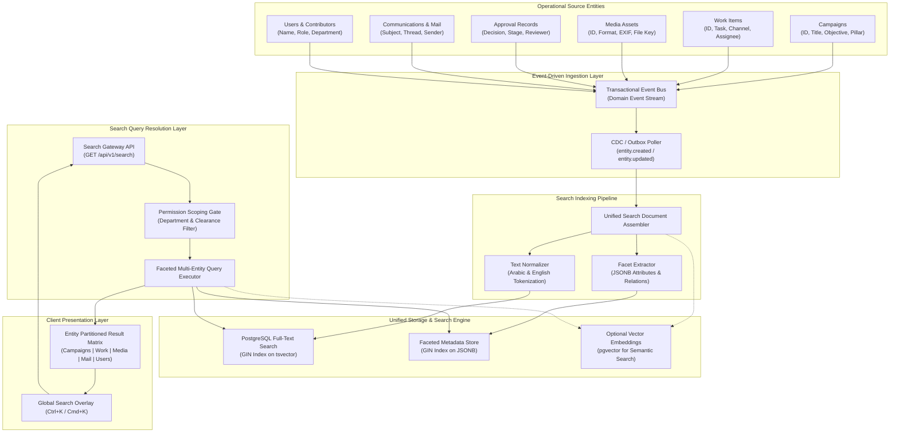
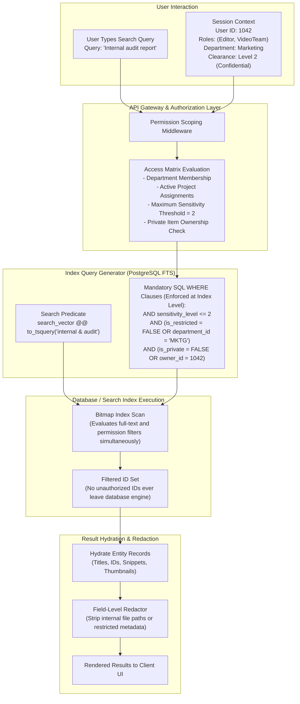
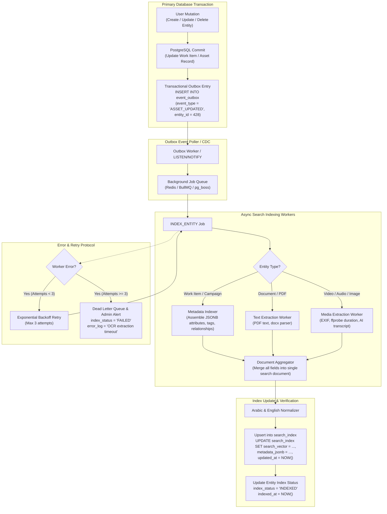
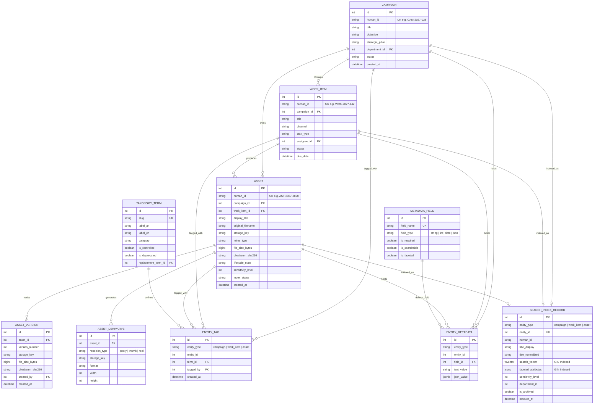
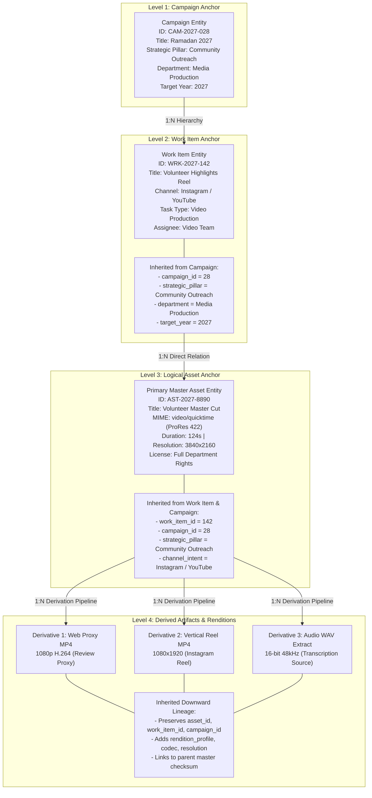
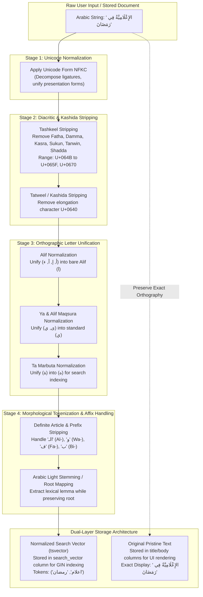

[[Comms Hub|Comms Hub Overview]] | [[MVP_draft|MVP UI Shell Draft]] | [[discussions_list|Master Discussions Index]] | [[disscussios/notification_model|Notification Model]] | [[disscussios/storage_lifecycle_disaster_recovery|Storage Lifecycle and Disaster Recovery]] | [[disscussios/security_discussion|Security Architecture]]

---

# Search and Metadata — Communication Department Hub

> [!note] Status: Discussion record — not final search/metadata specification
> **Status: Discussion record — not final search/metadata specification**
>
> This document preserves the current discussion about global search, structured metadata, taxonomy, Arabic-friendly search, indexing, relationships, asset provenance, derived metadata, archived search, semantic search, and future rights/sensitivity metadata.
>
> The concepts below are architectural directions only. Exact search technology, indexing engine, taxonomy, required fields, Arabic normalization rules, semantic-search scope, and metadata governance are still under discussion.

---

## Structure Tree & Document Map

- [[#Search and Metadata — Communication Department Hub|Overview & Status]]
- **Part I: Core Discovery & Global Search Foundations**
  - [[#1. Search Becomes Essential as the Hub Grows|1. Search Becomes Essential as the Hub Grows]]
  - [[#2. Global Search with Entity-Aware Results|2. Global Search with Entity-Aware Results]]
  - [[#3. Search Must Respect Permissions|3. Search Must Respect Permissions]]
  - [[#4. Search Is a Derived Layer, Not the Source of Truth|4. Search Is a Derived Layer, Not the Source of Truth]]
  - [[#5. Search Indexing as Background Jobs|5. Search Indexing as Background Jobs]]
  - [[#6. Different Search Modes|6. Different Search Modes]]
    - [[#Exact / Identifier Search|Exact / Identifier Search]]
    - [[#Keyword Search|Keyword Search]]
    - [[#Filtered Search|Filtered Search]]
    - [[#Content Search|Content Search]]
    - [[#Semantic Search|Semantic Search]]
  - [[#7. Filters Are Essential|7. Filters Are Essential]]
- **Part II: Metadata Taxonomy, Governance & Inheritance Architecture**
  - [[#8. Metadata Has Different Sources|8. Metadata Has Different Sources]]
  - [[#9. Automate Metadata Where Possible|9. Automate Metadata Where Possible]]
  - [[#10. Keep Metadata Forms Short|10. Keep Metadata Forms Short]]
  - [[#11. Relationships Are Stronger Than Tags|11. Relationships Are Stronger Than Tags]]
  - [[#12. Tags Still Have Value|12. Tags Still Have Value]]
  - [[#13. Controlled vs Freeform Tags|13. Controlled vs Freeform Tags]]
  - [[#14. Human-Readable Metadata Labels|14. Human-Readable Metadata Labels]]
  - [[#15. Campaign as a Major Metadata Anchor|15. Campaign as a Major Metadata Anchor]]
  - [[#16. Work Item as a Major Metadata Anchor|16. Work Item as a Major Metadata Anchor]]
  - [[#17. Metadata Inheritance|17. Metadata Inheritance]]
  - [[#18. “Belongs To” vs “Used By”|18. “Belongs To” vs “Used By”]]
  - [[#19. Provenance|19. Provenance]]
- **Part III: Search Representation, Versioning & Result Interaction**
  - [[#20. Search Logical Assets, Not Every Version by Default|20. Search Logical Assets, Not Every Version by Default]]
  - [[#21. Advanced Search Can Include Historical Versions|21. Advanced Search Can Include Historical Versions]]
  - [[#22. Archived Content Should Remain Searchable|22. Archived Content Should Remain Searchable]]
  - [[#23. Search Should Show Storage Availability|23. Search Should Show Storage Availability]]
  - [[#24. Search Results Can Offer Contextual Actions|24. Search Results Can Offer Contextual Actions]]
  - [[#25. Search + Command Palette|25. Search + Command Palette]]
  - [[#26. Search Ranking|26. Search Ranking]]
  - [[#27. Personal Relevance|27. Personal Relevance]]
  - [[#28. Recent and Pinned Items|28. Recent and Pinned Items]]
- **Part IV: Arabic Morphology, Multilingual Taxonomy & Content Extraction**
  - [[#29. Arabic Search Needs Deliberate Normalization|29. Arabic Search Needs Deliberate Normalization]]
  - [[#30. Normalize for Search, Preserve Original Text|30. Normalize for Search, Preserve Original Text]]
  - [[#31. Bilingual Aliases and Synonyms|31. Bilingual Aliases and Synonyms]]
  - [[#32. Multilingual Controlled Taxonomy|32. Multilingual Controlled Taxonomy]]
  - [[#33. Search Inside Documents|33. Search Inside Documents]]
  - [[#34. Image Search|34. Image Search]]
  - [[#35. Video Search|35. Video Search]]
  - [[#36. AI-Derived Transcripts Need Provenance|36. AI-Derived Transcripts Need Provenance]]
  - [[#37. Derived Metadata Needs Provenance|37. Derived Metadata Needs Provenance]]
- **Part V: Taxonomy Governance, Asset Identity & Duplicate Detection**
  - [[#38. Taxonomy Governance|38. Taxonomy Governance]]
  - [[#39. Deprecation Is Better Than Deletion|39. Deprecation Is Better Than Deletion]]
  - [[#40. Taxonomy Merge|40. Taxonomy Merge]]
  - [[#41. Display Title, Original Filename, and Storage Key Are Different|41. Display Title, Original Filename, and Storage Key Are Different]]
  - [[#42. Filenames Are Not Identifiers|42. Filenames Are Not Identifiers]]
  - [[#43. Duplicate Detection with Checksums|43. Duplicate Detection with Checksums]]
  - [[#44. Duplicate Bytes Do Not Always Mean Same Logical Asset|44. Duplicate Bytes Do Not Always Mean Same Logical Asset]]
  - [[#45. Near-Duplicate Detection|45. Near-Duplicate Detection]]
- **Part VI: Rights, Security, Automation & Query Privacy**
  - [[#46. Rights and Usage Restrictions as Metadata|46. Rights and Usage Restrictions as Metadata]]
  - [[#47. Sensitivity Classification|47. Sensitivity Classification]]
  - [[#48. Metadata Can Drive Automation|48. Metadata Can Drive Automation]]
  - [[#49. Search Queries Can Be Sensitive|49. Search Queries Can Be Sensitive]]
  - [[#50. Aggregate Search Analytics|50. Aggregate Search Analytics]]
- **Part VII: Search Engine Mechanics, Semantics & Operational Lifecycle**
  - [[#51. Typo Tolerance|51. Typo Tolerance]]
  - [[#52. Match Explanation|52. Match Explanation]]
  - [[#53. Semantic Search as an Enhancement Layer|53. Semantic Search as an Enhancement Layer]]
  - [[#54. Semantic Search Must Respect Permissions|54. Semantic Search Must Respect Permissions]]
  - [[#55. Purge Must Remove Derived Search Data|55. Purge Must Remove Derived Search Data]]
  - [[#56. Archived Metadata Can Stay Searchable|56. Archived Metadata Can Stay Searchable]]
  - [[#57. Indexing Failures|57. Indexing Failures]]
  - [[#58. Index Status|58. Index Status]]
  - [[#59. Lifecycle Labels in Search|59. Lifecycle Labels in Search]]
  - [[#60. Canonical Assets|60. Canonical Assets]]
- **Part VIII: Views, Schema Evolution, Field Identifiers & Mobile**
  - [[#61. Saved Views|61. Saved Views]]
  - [[#62. Team Views|62. Team Views]]
  - [[#63. Metadata Changes Have Different Audit Sensitivity|63. Metadata Changes Have Different Audit Sensitivity]]
  - [[#64. Some Metadata Should Be Immutable|64. Some Metadata Should Be Immutable]]
  - [[#65. Metadata Schema Must Be Extensible|65. Metadata Schema Must Be Extensible]]
  - [[#66. Human-Friendly IDs|66. Human-Friendly IDs]]
  - [[#67. Future QR-Code Uses|67. Future QR-Code Uses]]
  - [[#68. Mobile Search|68. Mobile Search]]
- **Part IX: Architecture Synthesis, Roadmap & Open Questions**
  - [[#69. Conceptual Architecture|69. Conceptual Architecture]]
  - [[#70. Recommended MVP|70. Recommended MVP]]
  - [[#71. Core Metadata Principle|71. Core Metadata Principle]]
  - [[#72. Core Search Principle|72. Core Search Principle]]
  - [[#73. New Blind Spot Identified|73. New Blind Spot Identified]]
  - [[#74. Still Unresolved|74. Still Unresolved]]

---

# 1. Search Becomes Essential as the Hub Grows

Over time the Hub may contain:

```text
30,000+ assets
8,000+ work items
5,000+ published posts
20,000+ email messages
hundreds of campaigns
thousands of comments
years of approval history
```

At that scale, navigation and folders alone are not enough.

A user should be able to search:

```text
Ramadan 2027 volunteer video
```

and get relevant results across:

```text
CAMPAIGN
WORK ITEM
VIDEO
EMAIL
PUBLICATION
```

Search should operate across the department's operational knowledge, not only filenames.

### Unified Cross-Entity Discovery Architecture


> [!note] Cross-Entity Discovery Boundary
> Departmental knowledge in the Hub spans multiple distinct operational domains. Rather than maintaining siloed search endpoints for each entity type, the search subsystem aggregates searchable projections into a unified inverted index while preserving relational references. Cross-vault tracking is maintained in [[discussions_list#7. Search and Metadata|Discussions List - Search and Metadata]].

---

# 2. Global Search with Entity-Aware Results

A global search could be available almost everywhere:

```text
Ctrl + K
```

or:

```text
⌘ + K
```

Results may be grouped by object type:

```text
CAMPAIGNS
National Day 2027

WORK
National Day Main Reel

MEDIA
national-day-drone-master.mov

MAIL
Drone permit confirmation

PEOPLE
Ahmed ...
```

Each result should open the correct object and context.

The global search UI pattern and shortcut binding are defined in [[MVP_draft#41. Search Overlay / Global Search|MVP Search Overlay]].

> [!tip] Keyboard Navigation Standard
> Global search acts as a unified quick-switcher across the application shell. Pressing `Ctrl + K` (Windows/Linux) or `Cmd + K` (macOS) invokes the overlay immediately, maintaining focus-trapped instant keyboard navigation.

---

# 3. Search Must Respect Permissions

Search must never reveal objects the current user is not authorized to know about.

Example:

```text
Search
     ↓
Permission-aware retrieval
     ↓
Only authorized results
```

Not:

```text
Search everything
     ↓
Return everything
     ↓
Hide restricted results in UI
```

Permission enforcement belongs on the server/search layer.

Even the existence or title of a restricted item may be sensitive.

### Search Query Resolution & Permission Scoping Gate


> [!important] Permission Enforcement Barrier
> Search filtering is not a UI display filter. Permission constraints must be injected directly into the SQL query or search index query prior to execution. Leaking existence, titles, or counts of unauthorized documents violates privacy and organizational security boundaries.

---

# 4. Search Is a Derived Layer, Not the Source of Truth

The authoritative object remains in the database/storage.

Conceptually:

```text
DATABASE / STORAGE
Source of Truth
       ↓
Indexing
       ↓
SEARCH INDEX
```

If the search index is stale, the database wins.

Search should be treated as a derived representation. ^search-metadata-boundary

> [!note] Derived Layer Invariant
> Because the search index is a derived projection of authoritative relational database tables and object storage registries, any index corruption, desynchronization, or cache invalidation can be resolved through an asynchronous bulk re-index without risking transactional data loss.

---

# 5. Search Indexing as Background Jobs

Indexing should fit the background-job architecture.

Example:

```text
Work Item updated
      ↓
WORK_ITEM_UPDATED event
      ↓
INDEX_WORK_ITEM job
      ↓
Search index refreshed
```

Documents may require additional processing:

```text
PDF uploaded
      ↓
extract text
      ↓
INDEX_ASSET job
```

The user should not have to wait for expensive indexing before ordinary save operations complete.

### Metadata Versioning & Async Re-Indexing Worker Pipeline


> [!tip] Decoupled Indexing Lifecycle
> By leveraging the transactional outbox pattern and asynchronous workers, write latency for interactive user operations remains under 50ms, while heavy text extraction and search vector generation execute out-of-band with automatic retry resilience.

---

# 6. Different Search Modes

Search may eventually combine several techniques.

## Exact / Identifier Search

```text
CAM-2027-048
PUB-882
```

## Keyword Search

```text
national day
```

## Filtered Search

```text
Campaign = National Day
Type = Video
Status = Approved
Year = 2027
```

## Content Search

Across:

```text
documents
emails
captions
comments
transcripts
```

## Semantic Search

Future example:

```text
videos about volunteers helping families
```

Semantic search should enhance strong deterministic search, not replace it.

### Full-Text vs Metadata Faceted Search Pipeline
```mermaid
flowchart TD
    subgraph INCOMING["Search Request Ingestion"]
        REQ["Search Request<br/>Query: 'Ramadan 2027 volunteer video'<br/>Filters: type=video, campaign=28, status=approved"]
        PARSER["Query Parser & AST Builder"]
    end

    subgraph SPLIT["Dual Pipeline Dispatch"]
        FT_PATH["Full-Text Predicate Path"]
        META_PATH["Faceted Metadata Path"]
    end

    subgraph FULLTEXT["Full-Text Processing (PostgreSQL FTS)"]
        NORM["Arabic & English Normalizer<br/>(Strip Tashkeel, Unify Alif/Ya, Stemming)"]
        TSQ["Generate tsquery<br/>to_tsquery('arabic_hub', 'رمضان & 2027 & تطوع & فيديو')"]
        GIN_TS["GIN Index Scan on search_vector<br/>(Fast inverted index lookup)"]
        RANK["Ranking Calculation<br/>ts_rank_cd(search_vector, query)"]
    end

    subgraph FACETED["Faceted Metadata Filtering (JSONB)"]
        JSON_OPS["JSONB Path Operators<br/>attributes @> '{"type": "video"}'"]
        REL_OPS["Relational Foreign Key Guards<br/>campaign_id = 28 AND status = 'APPROVED'"]
        GIN_JSON["GIN Index Scan on metadata_jsonb<br/>(jsonb_path_ops index)"]
    end

    subgraph MERGE["Execution Plan Merge & Permission Verification"]
        BITMAP["Bitmap AND Intersect Engine<br/>(Full-Text Candidates INTERSECT Metadata Matches)"]
        PERM["Row-Level Permission Scoping Gate<br/>(Filter by user clearance and department)"]
        SORT["Combined Relevance & Recency Scorer"]
    end

    subgraph OUT["Result Hydration"]
        HYDRATE["Authoritative Row Hydration<br/>(Select titles, thumbnails, and human IDs)"]
        SNIPPET["ts_headline() Keyword Highlighting"]
        RESPONSE["JSON API Response Payload"]
    end

    REQ --> PARSER
    PARSER --> FT_PATH
    PARSER --> META_PATH

    FT_PATH --> NORM
    NORM --> TSQ
    TSQ --> GIN_TS
    GIN_TS --> RANK

    META_PATH --> JSON_OPS
    META_PATH --> REL_OPS
    JSON_OPS --> GIN_JSON
    REL_OPS --> GIN_JSON

    RANK --> BITMAP
    GIN_JSON --> BITMAP
    BITMAP --> PERM
    PERM --> SORT
    SORT --> HYDRATE
    HYDRATE --> SNIPPET
    SNIPPET --> RESPONSE
```

> [!note] Architectural Reference: PostgreSQL Full Text Search & GIN Indexing
> In PostgreSQL, full-text queries compile into `tsquery` expressions evaluated against indexed `tsvector` columns using Generalized Inverted Index (GIN) scans. Concurrently, structured attributes stored in `jsonb` columns are filtered using JSON path operators (`@>`, `?`, `->>`) supported by `jsonb_path_ops` GIN indexes. The query planner performs a fast bitmap index intersection to yield precise results in sub-millisecond execution times.
>
> Operational search indexing patterns synthesize principles from Apache Lucene and Meilisearch, combining inverted index tokenization with deterministic relational scoping. Document topology and system data flows are rendered natively via Mermaid.js.

---

# 7. Filters Are Essential

Example:

```text
Search:
Ramadan
```

with filters:

```text
Type:
Video

Campaign:
Ramadan 2027

Status:
Approved

Created:
Mar–Apr 2027

Channel:
Instagram

Creator:
Sara
```

Different modules should expose filters relevant to their domain.

Media Library:

```text
file type
resolution
duration
campaign
usage
archive state
```

Work:

```text
assignee
priority
status
due date
campaign
```

Contextual filtering surfaces across dedicated module views, including the [[MVP_draft#27. Media Library|MVP Media Library]] and [[MVP_draft#15. Work Page|MVP Work Page]].

> [!tip] Faceted Filtering Paradigm
> Rather than exposing generic unconstrained filters, search views expose domain-specific facets tailored to each operational module (such as video codec and duration in Media, or assignee and sprint milestone in Work).

---

# 8. Metadata Has Different Sources

At least five metadata families are useful:

| Metadata Type | Example |
|---|---|
| System | Created date, size, MIME type |
| User-entered | Title, description, tags |
| Relational | Campaign, Work Item, creator |
| Workflow | Approval status, publication state |
| Derived | Dimensions, duration, transcript |

System and workflow metadata should not depend on manual entry.

### Search & Metadata Conceptual Data Model


---

# 9. Automate Metadata Where Possible

On upload, the system may automatically know:

```text
File type
Size
Upload time
Uploader
Checksum
Storage location
Video duration
Resolution
Codec
```

Potential future derived metadata:

```text
Thumbnail
Transcript
Detected language
Technical quality information
```

Users should mainly enter information machines cannot know reliably:

```text
Campaign
Meaningful title
Category
Description
People/event context
Usage restrictions
```

---

# 10. Keep Metadata Forms Short

Overly complex forms will be ignored.

Classify fields as:

```text
Automatic
Required
Recommended
Optional
```

Example:

```text
Title        Required
Campaign     Required when applicable
Type         Automatic
Uploader     Automatic
Tags         Optional
Description  Recommended
```

The goal is minimum structured information that produces real value.

> [!tip] Low-Friction Metadata Capture
> Lengthy mandatory metadata forms cause operational fatigue, leading users to enter dummy values. Capturing system and relational metadata automatically keeps manual intake forms to three fields or fewer.

---

# 11. Relationships Are Stronger Than Tags

If an asset belongs to Campaign #28, use a real relationship.

Prefer:

```text
asset.campaign_id = 28
```

over merely:

```text
#national-day
```

Use relationships for structured business facts such as:

```text
Campaign
Work Item
Publication
Creator
Approval
```

Use tags for flexible descriptive meaning.

> [!tip] Relational Integrity Over Freeform Tags
> Relational foreign keys (`campaign_id`, `work_item_id`) enforce referential integrity, eliminate spelling variations, and support cascading lifecycle workflows. Freeform tags should supplement, never replace, entity foreign keys.

---

# 12. Tags Still Have Value

Useful tags may include:

```text
drone
volunteers
night
interview
mosque
aerial
vertical
family
```

But tag governance is important to avoid fragmentation.

---

# 13. Controlled vs Freeform Tags

Possible future model:

```text
CONTROLLED TAGS
Managed by organization

Event
Volunteer
Beneficiary Story
Executive
Drone
```

and optionally:

```text
FREEFORM TAGS
Created by users
```

The project must balance governance with convenience.

---

# 14. Human-Readable Metadata Labels

Avoid exposing technical internal codes such as:

```text
COMMS_EXT_PUB_SOC_STD_01
```

Show:

```text
Content Type
Social Post

Audience
Public

Category
Event Coverage
```

Technical IDs can exist underneath.

---

# 15. Campaign as a Major Metadata Anchor

A Campaign can connect:

```text
Tasks
Files
Content
Approvals
Calendar
Mail
Publications
Analytics
Ideas
```

Searching a Campaign can expose its whole operational history.

Campaign should be more than a folder.

---

# 16. Work Item as a Major Metadata Anchor

A Work Item can connect:

```text
Brief
Assignee
Source files
Edited versions
Comments
Approval request
Release package
Publication
Analytics
```

Search should help users arrive at the logical Work Item rather than disconnected file records.

Work item tracking and task metadata anchors are coordinated through the [[MVP_draft#15. Work Page|MVP Work Page]].

---

# 17. Metadata Inheritance

Assets may inherit metadata from their parent Work Item or Campaign.

Example:

```text
Campaign:
National Day
```

Assets attached to a Work Item in that campaign may inherit the relationship.

Inheritance should not silently overwrite explicit choices.

### Asset Taxonomy & Tagging Inheritance Model


> [!tip] Metadata Inheritance Efficiency
> By allowing child assets to inherit high-level campaign and task taxonomy automatically, content creators are spared from re-typing campaign names, target years, or department codes. If a campaign is subsequently retitled, the relational pointer automatically reflects the update across all associated work items and media assets without batch data migrations.

---

# 18. “Belongs To” vs “Used By”

Example:

```text
photo-001.jpg

Created for:
Ramadan 2027

Used in:
Ramadan 2027 Instagram Post
Annual Report 2027
Volunteer Website Page
```

Origin and usage are different relationships.

Reusing a file should not rewrite its origin.

> [!note] Disambiguating Asset Relationships
> A production asset "belongs to" exactly one primary parent Work Item or Campaign that funded and produced it. However, the same asset can be "used by" multiple sibling campaigns or social posts over its operational lifetime. Separating primary ownership from secondary usage associations prevents circular dependency deadlocks.

---

# 19. Provenance

Important assets should preserve origin metadata.

Example:

```text
Asset:
volunteer-interview.mov

Uploaded by:
Sara

Captured by:
Ahmed

Created:
14 Mar 2027

Imported from:
Event Coverage Task #182

Original filename:
A003_C014_0314.MOV

Original checksum:
...
```

This provenance becomes valuable at scale.

---

# 20. Search Logical Assets, Not Every Version by Default

Instead of showing six unrelated results:

```text
v1
v2
v3
v4
v5
v6
```

prefer:

```text
National Day Hero Image
Current: v6
Approved: v5
6 versions
```

Historical versions can remain accessible through the asset.

Primary asset indexing and version collapsing are integrated with the [[MVP_draft#27. Media Library|MVP Media Library]].

> [!important] Logical Entity vs Storage Rendition
> In search results, users seek the logical asset (such as "National Day Anthem Master"), not seventeen intermediate render files or thumbnail variants. Search queries must return the top-level logical entity by default, with version and rendition selectors available in the detail pane.

---

# 21. Advanced Search Can Include Historical Versions

Default:

```text
Current versions only
```

Advanced:

```text
Include historical versions
```

This keeps normal search clean while preserving audit access.

---

# 22. Archived Content Should Remain Searchable

Archived items should remain discoverable but visually marked.

Example:

```text
Ramadan Reel 2025
ARCHIVED
```

Useful lifecycle filters:

```text
Active
Archived
Trash
```

Trash should normally be excluded unless explicitly requested.

Archived asset retention rules and searchable cold metadata policies are detailed in [[disscussios/storage_lifecycle_disaster_recovery#44. Archived Assets Should Remain Searchable|Storage Lifecycle - Searchable Archives]].

> [!note] Searchable Cold Storage
> Even when underlying heavy media files are migrated to offline cold tiers or unmounted NAS archives, metadata records, low-resolution proxy thumbnails, and text transcripts remain warm and fully searchable in the database.

---

# 23. Search Should Show Storage Availability

Example:

```text
Volunteer Raw Interview
VIDEO
Archived on NAS

[Retrieve]
```

versus:

```text
Volunteer Web Cut
VIDEO
Available now

[Open]
```

Users do not need the physical storage key.

---

# 24. Search Results Can Offer Contextual Actions

Example:

```text
national-day-main-reel.mp4

Approved Video
National Day 2027

[Preview]
[Open Work Item]
[Copy Link]
```

Actions depend on permissions.

---

# 25. Search + Command Palette

A future command palette can combine search and navigation.

Example:

```text
new post
```

results:

```text
ACTION
Create Social Post

PAGE
Create

RECENT
National Day Social Post
```

Initially, search/navigation should come before advanced command execution.

---

# 26. Search Ranking

Possible ranking signals:

```text
Exact title match
Active status
Recency
User relationship
Campaign relevance
Object importance
Approved/current version
```

Active, authoritative objects should rank above old unrelated records.

---

# 27. Personal Relevance

Search may rank:

```text
your assigned Work Item
```

above unrelated archived content.

Simple deterministic ranking is sufficient initially.

---

# 28. Recent and Pinned Items

Before typing, search/command UI may eventually show:

```text
RECENT
National Day Campaign
Weekly Content Calendar
Volunteer Video
```

Potential future sections:

```text
Pinned
Recent
Suggested
```

---

# 29. Arabic Search Needs Deliberate Normalization

Arabic search should account for common orthographic variation such as:

```text
أ
إ
ا
```

and:

```text
ى
ي
```

and diacritics:

```text
الدَّيْن
الدين
```

Operational search should match these reasonably without requiring exact diacritics.

### Arabic Morphological Normalization & Search Pipeline


> [!warning] Arabic Orthography & Search Drift
> Standard Arabic text entry frequently alternates between different orthographic representations of Alif, Ya, and Ta Marbuta depending on operating system keyboards and authoring habits. Full-text search must normalize orthography in the indexing vector while preserving original text in the database to guarantee pristine visual presentation.

---

# 30. Normalize for Search, Preserve Original Text

Maintain:

```text
SEARCH REPRESENTATION
normalized
```

separately from:

```text
ORIGINAL CONTENT
preserved exactly
```

Example:

```text
أحمد → احمد
```

for matching, while displaying:

```text
أحمد
```

> [!note] Architectural Reference: Unicode Normalization
> Normalization follows Unicode Standard Annex #15 (UAX #15) and Unicode Normalization Forms (NFKC). Text stored in PostgreSQL is indexed via custom text search dictionaries configured with Arabic snowball stemming and custom unaccent rules.

---

# 31. Bilingual Aliases and Synonyms

Future search may support:

```text
volunteers
```

and:

```text
متطوعين
```

resolving to the same controlled concept.

This can be implemented through taxonomy aliases rather than relying solely on AI.

---

# 32. Multilingual Controlled Taxonomy

Possible model:

```text
Tag ID:
TAG_182

English:
Volunteer

Arabic:
متطوع

Aliases:
Volunteers
متطوعين
```

The underlying ID remains stable.

Display labels are localized.

---

# 33. Search Inside Documents

Full-text indexing can eventually support:

```text
PDFs
Word documents
text files
emails
```

Example:

```text
Search:
مبادرة الشتاء
```

returns a PDF with a matching excerpt and possibly page location.

---

# 34. Image Search

Images may be enriched with:

Manual metadata:

```text
tags
description
campaign
event
```

Automatic metadata:

```text
EXIF
OCR text
AI-generated descriptions
```

AI-generated labels should be treated as derived suggestions, not authoritative classification.

---

# 35. Video Search

Videos may eventually expose:

```text
title
description
duration
technical metadata
transcript
chapters
detected spoken language
manual tags
```

Future search could jump to relevant timestamps within a transcript.

---

# 36. AI-Derived Transcripts Need Provenance

A transcript should know:

```text
Generated by
Model/version
Generated at
Edited by human?
Review state
```

Search may use it without pretending the transcript is perfect.

> [!caution] AI Provenance & Hallucination Guardrails
> Transcripts and automated image labels generated by AI models must be stamped with model version, extraction date, and confidence scores. Users must be able to distinguish verified human metadata from machine inferences.

---

# 37. Derived Metadata Needs Provenance

Example:

```text
AI tags:
["event", "volunteers", "food distribution"]
```

with:

```text
source:
AI

status:
unreviewed
```

Authoritative metadata should remain distinguishable from AI-derived suggestions.

---

# 38. Taxonomy Governance

Admin/Settings may manage vocabularies such as:

```text
Content Types

Social Post
Video
Photo
Press Release
Email
Announcement
Website Article
Event Coverage
```

Possible actions:

```text
Add
Rename
Deprecate
Merge
```

Already-used categories should not be casually deleted.

---

# 39. Deprecation Is Better Than Deletion

If:

```text
Graphic Post
```

becomes:

```text
Static Social Post
```

historical records should remain valid.

Terms can be renamed or deprecated without breaking history.

---

# 40. Taxonomy Merge

Example:

```text
Volunteer
Volunteers
```

can be merged into one canonical concept.

References update to the canonical tag.

---

# 41. Display Title, Original Filename, and Storage Key Are Different

Example:

```text
DISPLAY TITLE
National Day Main Reel
```

```text
ORIGINAL FILENAME
A004_C019_0923.mov
```

```text
STORAGE KEY
assets/01882/versions/4/original.mov
```

Users should not manage raw storage paths.

---

# 42. Filenames Are Not Identifiers

Two files may both be named:

```text
final.mp4
```

Real identity should use:

```text
Asset ID
Version ID
```

Names remain metadata.

> [!caution] Filename Fragility
> Filenames provided by operating systems and cameras (`IMG_0042.MOV`, `final_v2_edit.mp4`) are notoriously fragile, prone to collisions, and easily altered during transit. The Hub assigns immutable UUIDs and content-addressable storage keys to all ingested binaries.

---

# 43. Duplicate Detection with Checksums

If the same bytes already exist:

```text
checksum match
```

the system can warn:

```text
This file already exists.

[Use Existing Asset]
[Upload Anyway]
```

This can reduce duplicate storage and clutter.

Cryptographic verification and deduplication mechanisms are detailed in [[disscussios/storage_lifecycle_disaster_recovery#17. Checksums|Storage Lifecycle - Checksums]].

---

# 44. Duplicate Bytes Do Not Always Mean Same Logical Asset

The same physical file may legitimately be reused in several workflows.

Deduplication should warn rather than make destructive assumptions.

---

# 45. Near-Duplicate Detection

Future possibilities:

```text
perceptual hashes
AI similarity
```

to find resized/re-encoded/similar media.

Not required for MVP.

---

# 46. Rights and Usage Restrictions as Metadata

Potential future metadata:

```text
Internal only
External allowed
Social allowed
Website only
Expires after date
Requires attribution
```

Publishing preflight may eventually verify whether an asset is allowed on a selected channel.

This suggests a future dedicated discussion about asset rights and consent.

> [!important] Rights & Usage Governance
> Assets featuring external talent, commercial music, or restricted geographic licenses must carry machine-readable rights metadata. Attempting to attach an expired or restricted asset to an outgoing publication workflow must trigger an automated warning.

---

# 47. Sensitivity Classification

Possible classes:

```text
PUBLIC
INTERNAL
CONFIDENTIAL
RESTRICTED
```

Sensitivity may affect:

- permissions
- notification previews
- external sharing
- approval requirements
- retention

Downgrading sensitivity should require appropriate permission.

> [!caution] Confidentiality & Access Clearance
> Documents marked with sensitivity classifications (such as "Embargoed" or "Leadership Confidential") must be strictly excluded from search candidate sets for users lacking the necessary clearance tier.

---

# 48. Metadata Can Drive Automation

Examples:

```text
IF
Content Type = Social Post
AND
Channel includes Instagram

THEN
run Instagram preflight
```

```text
IF
Asset lifecycle = Archived
AND
Cloud copy = temporary

THEN
schedule cloud cleanup
```

```text
IF
Sensitivity = Confidential

THEN
disable external share
```

Metadata therefore supports workflows, not only search.

Metadata-driven notification routing and attention management are coordinated with [[disscussios/notification_model#1. Core Principle|Notification Model - Attention Architecture]].

---

# 49. Search Queries Can Be Sensitive

Search history should be handled carefully.

Recent searches may be:

```text
personal
short-lived
```

Admin should not casually inspect individual search terms.

Search should not become a surveillance feature.

> [!caution] Search Query Privacy & Audit Redaction
> Search query logs can inadvertently leak confidential investigations or sensitive executive topics. Query analytics must be aggregated and anonymized, and raw query strings must be purged or hashed after short retention windows.

---

# 50. Aggregate Search Analytics

Useful aggregate metrics:

```text
Most common zero-result searches
Frequently searched categories
```

These help improve navigation and taxonomy without monitoring individual behavior unnecessarily.

---

# 51. Typo Tolerance

Search should eventually handle common typos and spelling variation.

Example:

```text
Natinal Day
```

could suggest:

```text
National Day
```

Fuzzy matching can do much of this without AI.

---

# 52. Match Explanation

Search results should indicate why they matched.

Example:

```text
Annual Report 2027.pdf

"... National Day campaign reached ..."
```

or:

```text
Matched tag:
drone
```

This builds trust in search results.

---

# 53. Semantic Search as an Enhancement Layer

Recommended progression:

```text
Layer 1
Exact IDs + metadata filters

Layer 2
Full-text search

Layer 3
Fuzzy matching

Layer 4
Semantic search
```

Do not depend on AI search as the only retrieval method.

---

# 54. Semantic Search Must Respect Permissions

Embeddings and semantic retrieval must use the same authorization rules as ordinary search.

Restricted titles, snippets, and concepts must not leak through a vector index.

---

# 55. Purge Must Remove Derived Search Data

When an asset is purged, lifecycle operations may also need to remove:

```text
search index
vector embedding
OCR cache
transcript index
```

unless retention policy says otherwise.

Example:

```text
PURGE ASSET
    ↓
Delete storage copies
    ↓
Delete search document
    ↓
Delete embedding
    ↓
Delete derived transcript where required
```

> [!caution] Data Purge & Search Index Erasure
> When an entity is permanently purged in compliance with retention mandates or GDPR/legal requests, the purge worker must delete the primary record, clear binary storage, and synchronously remove all corresponding entries from the search index and cache layers.

---

# 56. Archived Metadata Can Stay Searchable

An archived original may live on NAS while its searchable metadata stays in the cloud database/index.

This enables search without waking or scanning the archive every time.

Metadata persistence during archival transitions aligns with [[disscussios/storage_lifecycle_disaster_recovery#44. Archived Assets Should Remain Searchable|Storage Lifecycle - Searchable Archives]].

---

# 57. Indexing Failures

One file failing indexing may simply mean:

```text
File available
Search inside file unavailable
```

A system-wide indexer outage may create an Admin health warning.

Not every indexing failure is a critical operational incident.

> [!warning] Index Pipeline Resilience & DLQ
> If text extraction on a corrupted PDF or malformed video file fails, the indexing worker must isolate the failure into a Dead Letter Queue (DLQ), mark the entity's `index_status` as `EXTRACTION_FAILED`, and allow the primary entity to remain accessible rather than blocking the worker queue.

---

# 58. Index Status

Useful states for searchable assets:

```text
✓ Indexed
⏳ Processing
⚠ Text extraction unavailable
```

Especially useful for documents and transcripts.

---

# 59. Lifecycle Labels in Search

Search should indicate:

```text
DRAFT
APPROVED
PUBLISHED
ARCHIVED
TRASHED
```

to prevent users from accidentally using obsolete material.

---

# 60. Canonical Assets

Admin may mark key resources as:

```text
CURRENT / CANONICAL
```

Examples:

```text
Current Letterhead
Current Logo
Current Brand Guide
Current Press Boilerplate
```

Search should rank these strongly.

---

# 61. Saved Views

Many useful pages can be saved filtered searches.

Examples:

```text
My Active Tasks
Publishing This Week
Unapproved External Content
Overdue Work
```

This creates flexibility without duplicating data models.

---

# 62. Team Views

Managers may eventually create shared filtered views such as:

```text
Pending approvals
National Day assets
Posts scheduled this week
Items needing revision
```

Not necessary for MVP.

---

# 63. Metadata Changes Have Different Audit Sensitivity

Changing:

```text
Description
```

may be ordinary.

Changing:

```text
Sensitivity:
Confidential → Public
```

may require stronger audit.

Other high-impact metadata may include:

```text
Usage rights
Retention class
Approved asset state
```

---

# 64. Some Metadata Should Be Immutable

Examples:

```text
original checksum
original upload timestamp
created_by
provider remote ID
```

These should not be ordinary editable fields.

Corrections should preserve original history.

---

# 65. Metadata Schema Must Be Extensible

Recommended balance:

```text
CORE STRUCTURED FIELDS
strongly modeled

+

EXTENSIBLE METADATA
for future attributes
```

Avoid both extremes:

- hardcoding every imaginable property
- putting the whole application into one giant JSON field

Core business concepts deserve real schema.

---

# 66. Human-Friendly IDs

Major objects may receive IDs such as:

```text
WRK-0184
CAM-0032
PUB-0882
AST-1440
```

Users can search or share them easily.

Raw database UUIDs remain internal.

---

# 67. Future QR-Code Uses

Potential long-term extension:

```text
QR → Campaign / Asset / Event
```

This may help physical-event workflows later.

Not MVP.

---

# 68. Mobile Search

Desktop:

```text
Ctrl + K
```

Mobile:

```text
Search icon
```

Mobile results should be concise and filters should remain accessible.

---

# 69. Conceptual Architecture

```text
                    SOURCE OBJECTS
                          │
       ┌──────────────────┼──────────────────┐
       ▼                  ▼                  ▼
    Work Items          Assets             Mail
       │                  │                  │
       └──────────────────┼──────────────────┘
                          │
                     METADATA
                          │
           ┌──────────────┼──────────────┐
           ▼              ▼              ▼
      Structured       Derived        Relations
       fields          metadata
           │              │              │
           └──────────────┼──────────────┘
                          ▼
                   INDEXING EVENTS
                          │
                          ▼
                  BACKGROUND JOBS
                          │
                          ▼
                     SEARCH INDEX
                          │
              ┌───────────┼───────────┐
              ▼           ▼           ▼
          Exact/ID     Full Text    Semantic
                                      later
                          │
                          ▼
                 PERMISSION-AWARE RETRIEVAL
                          │
                          ▼
                      USER RESULTS
```

Permission filtering should happen as early as technically practical.

The overarching architectural blueprint for all Hub subsystems is maintained in the [[Comms Hub#Master Vault Document Map|Comms Hub Master Map]].

---

# 70. Recommended MVP

Start with:

```text
Global search
Search by title/name
Human-readable IDs
Basic full-text fields
Permission-aware results
Filters
Campaign relationships
Work Item relationships
Asset type
Status
Creator
Dates
Controlled core categories
Optional tags
Arabic-friendly normalization
Current versions by default
Archived content clearly marked
```

Later:

```text
Document content indexing
OCR
Transcripts
Advanced fuzzy matching
Saved searches
Semantic search
AI-generated metadata
Near-duplicate detection
Multilingual taxonomy aliases
```

---

# 71. Core Metadata Principle

> **Use relationships for facts, controlled metadata for classification, tags for flexible description, and AI metadata only as derived assistance.**

Examples:

```text
Campaign = National Day 2027
→ relationship
```

```text
Content Type = Video
→ controlled metadata
```

```text
drone / night / interview
→ tags
```

```text
AI detected: outdoor crowd
→ derived metadata
```

> [!tip] Metadata Architecture Rule
> Relationships capture hard operational facts; controlled taxonomy establishes formal organizational classification; freeform tags provide ad-hoc descriptive context; and AI extraction acts as assistive, reviewable enrichment.

---

# 72. Core Search Principle

> **Search should help users find the current, authoritative object—not bury them under every technical copy and historical version.**

Old versions remain accessible when needed, but normal users should generally land on the latest relevant logical asset or Work Item.

> [!important] Search Architecture Rule
> Search is designed to collapse noise and surface the authoritative, currently active representation of an object, keeping technical versions and derivative proxies tucked cleanly beneath the surface.

---

# 73. New Blind Spot Identified

This discussion surfaced a future topic:

> **Asset rights, consent, and usage restrictions**

The Hub may eventually need to know not only what an asset is, but where it is allowed to be used.

This should be discussed before finalizing the Media Library architecture.

---

# 74. Still Unresolved

We still need to decide:

- Search engine/technology
- Indexing architecture
- Arabic normalization rules
- Full-text indexing scope
- Metadata required fields
- Controlled taxonomy
- Freeform-tag permissions
- Tag merge/deprecation behavior
- Search ranking rules
- Search-result actions
- Human-readable ID format
- Semantic-search timing
- OCR/transcription providers
- Derived-metadata review rules
- Search retention/history
- Sensitivity and rights metadata
- Search indexing retention
- Saved-search/view scope

This document preserves the search-and-metadata discussion only. It is not yet the final search architecture.
